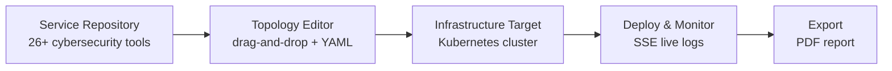
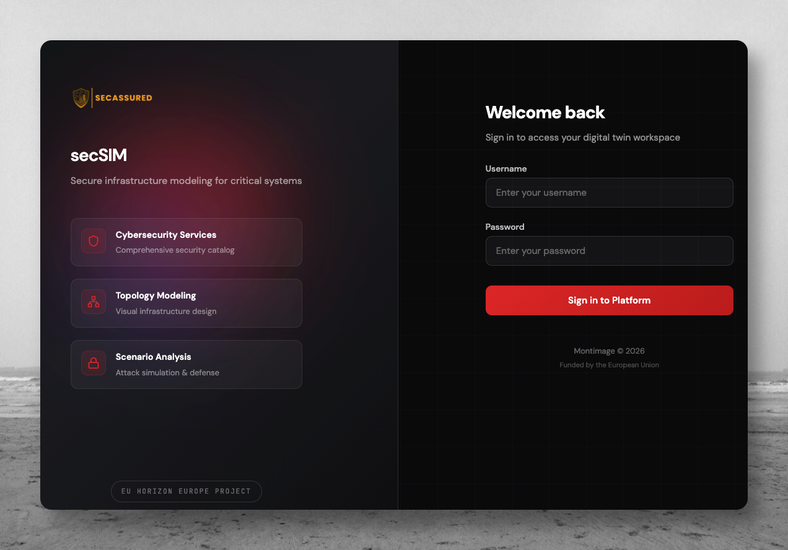
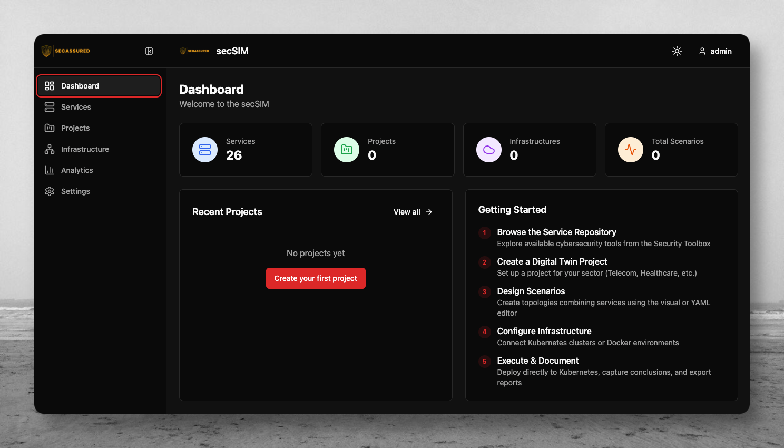
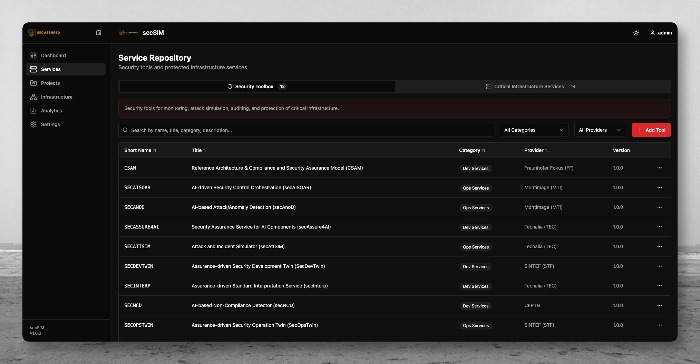
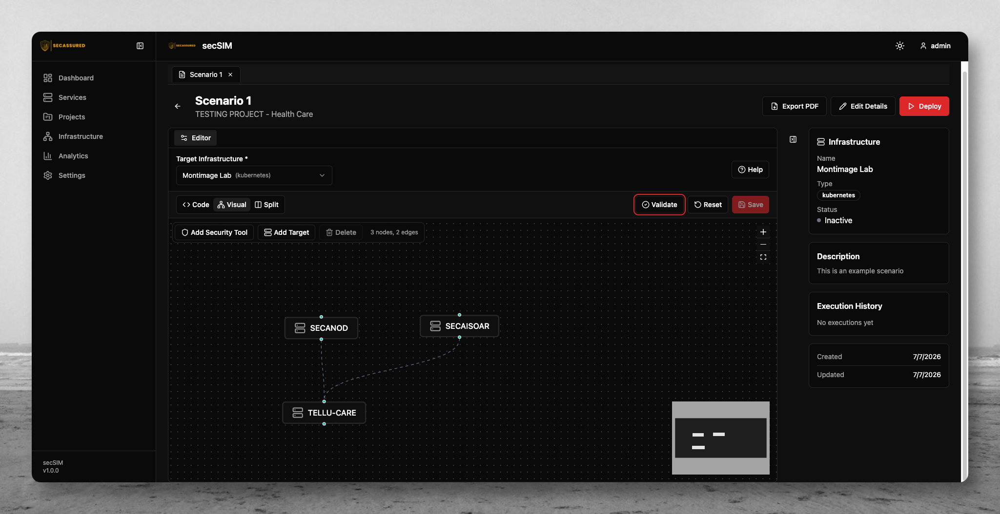
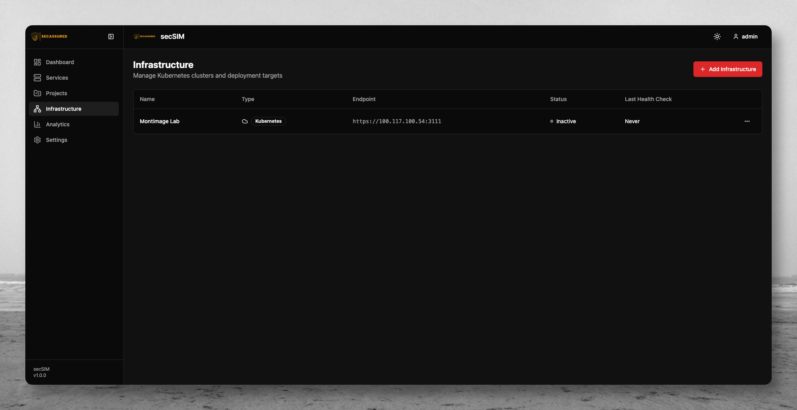
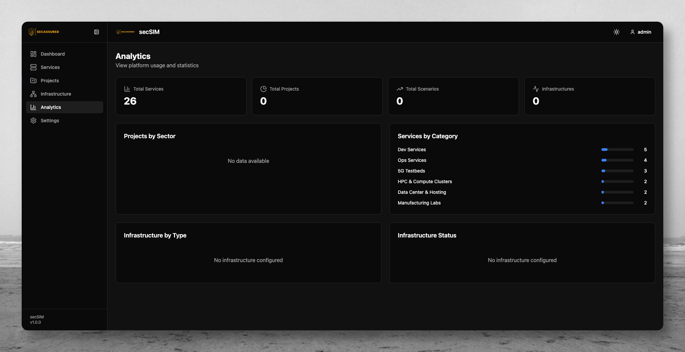

# MI Digital Twin Management Service

[](https://github.com/montimage-projects/mi-digitaltwin-management-service/actions/workflows/ci.yml)
[](LICENSE)
[](https://github.com/montimage-projects/mi-digitaltwin-management-service/releases/tag/v0.1.0)
[]()
[](CONTRIBUTING.md)

# Design and deploy cybersecurity Digital Twins on Kubernetes

secSIM is a centralized platform for building cybersecurity scenarios against critical infrastructure — Telecom, Healthcare, Transportation, Nuclear — and running them on real Kubernetes clusters. Drag services onto a canvas, wire the topology, deploy, and watch execution stream live.

[**Quick Start ->**](#quick-start) · [**Screenshots ->**](#screenshots)

## How It Works



Services come from a shared catalog, get composed into a scenario graph, and deploy directly to a registered Kubernetes target. Execution status, pod logs, and teardown are all live over server-sent events.

## Screenshots

| Login                           | Dashboard                               |
| ------------------------------- | --------------------------------------- |
|  |  |

| Service Repository                              | Scenario Editor                              |
| ----------------------------------------------- | -------------------------------------------- |
|  |  |

| Infrastructure Targets                   | Analytics                               |
| ---------------------------------------- | --------------------------------------- |
|  |  |

## Key Features

| Feature                | What you get                                                               |
| ---------------------- | -------------------------------------------------------------------------- |
| Service Repository     | 26+ cybersecurity tools searchable by category, sector, provider, and TRL  |
| Visual Topology Editor | React Flow canvas with a synced Monaco YAML editor                         |
| Kubernetes Execution   | One-click deploy, live SSE progress, pod log streaming, one-click teardown |
| Sector-aware Projects  | Organize scenarios by Telecom, Healthcare, Transportation, Nuclear         |
| Analytics              | Aggregate stats on services, projects, sectors, and infrastructure status  |
| Role-based Access      | JWT auth, user CRUD, password reset                                        |
| PDF Export             | Scenario designs and execution results as shareable reports                |
| Configurable Branding  | Per-deployment app name, organization, and logo                            |

## Quick Start

Start MongoDB:

```bash
docker-compose up -d mongodb
```

Start the backend (Express API on `:3000`):

```bash
cd server
cp .env.example .env
npm install && npm run seed && npm run dev
```

Start the frontend in a new terminal (React on `:5173`):

```bash
cd client
cp .env.example .env
npm install && npm run dev
```

Open `http://localhost:5173` — sign in with `admin` / `intact2025`.

### Unified Docker deployment

```bash
docker-compose -f docker-compose.prod.yml up -d
```

For MongoDB Atlas:

```bash
docker-compose -f docker-compose.atlas.yml up -d
```

## Usage

1. **Login** at `/login` — JWT tokens expire after 24 hours.
2. **Dashboard** — aggregate counts for services, projects, infrastructures, and active deployments.
3. **Service Catalog** — browse the INTACT Toolbox and Critical Infrastructure Services tabs; filter by category, provider, or sector.
4. **Projects** — create a project under a critical infrastructure sector, then add scenarios.
5. **Topology Editor** — drag services onto the canvas and connect them; the YAML view updates in real time.
6. **Deploy** — assign a Kubernetes target, execute, monitor live progress and pod logs, tear down with one click.

## Documentation

| Document                                                         | Description                                           |
| ---------------------------------------------------------------- | ----------------------------------------------------- |
| [Documentation Index](docs/README.md)                            | Complete documentation hub with role-based navigation |
| [Architecture Overview](docs/architecture/overview.md)           | System design, components, request flow               |
| [API Reference](docs/API.md)                                     | All REST endpoints with request/response examples     |
| [Component Reference](docs/COMPONENTS.md)                        | UI components, props, and usage patterns              |
| [Development Guide](docs/DEVELOPMENT.md)                         | Local environment setup and workflow                  |
| [Deployment Guide](docs/DEPLOYMENT.md)                           | Production deployment, Docker, K8s, monitoring        |
| [Database Schema](docs/database/schema.md)                       | MongoDB collections and relationships                 |
| [Kubernetes Execution](docs/integration/kubernetes-execution.md) | Direct deployment to Kubernetes                       |
| [Troubleshooting](docs/troubleshooting/common-issues.md)         | Common issues and solutions                           |

## Contributing

Contributions are welcome — see [CONTRIBUTING.md](CONTRIBUTING.md) for branch strategy, commit conventions (Conventional Commits), pull request process, and coding standards (ESLint, Prettier, TypeScript strict mode).

All contributors are expected to adhere to the [Code of Conduct](CODE_OF_CONDUCT.md).

## Support

- **Issues & Feature Requests** — [GitHub Issues](https://github.com/montimage-projects/mi-digitaltwin-management-service/issues)
- **Security Vulnerabilities** — see [SECURITY.md](SECURITY.md) for responsible disclosure
- **Changelog** — see [CHANGELOG.md](CHANGELOG.md)

## License

Apache License, Version 2.0. See [LICENSE](LICENSE) for the full text. Copyright 2026 Montimage.

<details>
<summary>Full description</summary>

The MI Digital Twin Management Service is a full-stack web application developed by Montimage for the INTACT project. It provides a centralized catalog of 44+ cybersecurity services and tools, enabling security professionals to design Digital Twin scenarios via a drag-and-drop topology editor, deploy them directly to Kubernetes clusters, and monitor execution in real time through server-sent events (SSE).

The platform supports multiple critical infrastructure sectors (Telecom, Healthcare, Transportation, Nuclear) and offers project-based organization, role-based access control, infrastructure targeting, and comprehensive analytics. Built with a modern React frontend and an Express/TypeScript API backed by MongoDB, it serves as the management plane for cybersecurity Digital Twin operations.

</details>

<details>
<summary>Tech Stack</summary>

### Frontend

| Technology                | Purpose                   |
| ------------------------- | ------------------------- |
| **React 18**              | UI library                |
| **TypeScript**            | Type-safe development     |
| **Vite**                  | Build tool and dev server |
| **Tailwind CSS**          | Utility-first styling     |
| **shadcn/ui + Radix**     | Accessible UI components  |
| **TanStack React Query**  | Server state management   |
| **Zustand**               | Client state management   |
| **React Flow (xyflow)**   | Topology visualization    |
| **React Router v6**       | Client-side routing       |
| **react-hook-form + Zod** | Form validation           |
| **Axios**                 | HTTP client               |
| **Monaco Editor**         | YAML code editor          |
| **Lucide React**          | Icon library              |
| **jsPDF**                 | PDF export                |

### Backend

| Technology                  | Purpose                    |
| --------------------------- | -------------------------- |
| **Node.js 20+**             | Runtime                    |
| **TypeScript**              | Type-safe development      |
| **Express.js**              | HTTP framework             |
| **MongoDB 7**               | Document database          |
| **Mongoose**                | ODM and schema validation  |
| **Zod**                     | Request validation         |
| **JWT + bcrypt**            | Authentication             |
| **@kubernetes/client-node** | Kubernetes API integration |
| **Helmet**                  | HTTP security headers      |
| **Compression**             | gzip response compression  |
| **Morgan**                  | HTTP request logging       |

</details>

<details>
<summary>API Overview</summary>

| Method          | Endpoint                                            | Description                    |
| --------------- | --------------------------------------------------- | ------------------------------ |
| POST            | `/api/auth/login`                                   | Authenticate and receive JWT   |
| GET             | `/api/auth/me`                                      | Current user info              |
| POST            | `/api/auth/logout`                                  | Invalidate session             |
| GET             | `/api/health`                                       | Health check (DB status)       |
| GET/POST        | `/api/services`                                     | List / create services         |
| GET/PUT/DELETE  | `/api/services/:id`                                 | Get / update / delete service  |
| POST            | `/api/services/:id/versions`                        | Add service version            |
| GET/POST        | `/api/projects`                                     | List / create projects         |
| GET/PUT/DELETE  | `/api/projects/:id`                                 | Get / update / delete project  |
| GET/POST        | `/api/projects/:projectId/scenarios`                | List / create scenarios        |
| GET/PUT/DELETE  | `/api/scenarios/:id`                                | Get / update / delete scenario |
| POST            | `/api/scenarios/:id/execute`                        | Deploy to Kubernetes           |
| DELETE          | `/api/scenarios/:id/executions/:executionId`        | Tear down deployment           |
| GET             | `/api/scenarios/:id/executions/:executionId/events` | SSE execution stream           |
| GET/POST        | `/api/infrastructures`                              | List / create targets          |
| GET/PUT/DELETE  | `/api/infrastructures/:id`                          | Get / update / delete          |
| POST            | `/api/infrastructures/:id/test`                     | Test connection                |
| GET             | `/api/categories`                                   | List service categories        |
| GET             | `/api/sectors`                                      | List critical infra sectors    |
| GET             | `/api/partners`                                     | List project partners          |
| GET/POST/DELETE | `/api/users`                                        | Manage users                   |
| PATCH           | `/api/users/:id/password`                           | Reset user password            |

See the full [API Reference](docs/API.md) for request/response schemas.

</details>

<details>
<summary>Project Structure</summary>

```
.github/
  workflows/              # GitHub Actions CI/CD pipelines
  ISSUE_TEMPLATE/         # Bug report & feature request templates
  PULL_REQUEST_TEMPLATE.md
  WORKFLOWS_README.md    # Workflows documentation

.husky/                  # Git hooks (lint-staged, pre-commit)

client/                  # React frontend (Vite + TypeScript)
  public/                # Static assets
  src/
    components/          # UI, layout, topology, execution, scenarios
    hooks/               # Custom React hooks
    lib/                 # API client, branding, PDF export
    pages/               # Route-level page components
    store/               # Zustand state management
    types/               # TypeScript definitions

server/                  # Express backend (TypeScript)
  src/
    config/              # Environment, database, branding
    middleware/          # Auth, validation, error handling, static serving
    models/              # Mongoose schemas (8 models)
    routes/              # API route handlers (9 modules)
    seed/                # Database seeding scripts
    services/            # Kubernetes deployment service
    utils/               # Startup checks, encryption, logging
    validators/          # Zod validation schemas
    docs/                # OpenAPI specification

docs/                    # Technical documentation
  architecture/          # System design & component overviews
  database/              # MongoDB schemas & relationships
  design/                # UI patterns & styling
  installation/          # Prerequisites & configuration
  integration/           # External services & K8s execution
  playbooks/             # Development & deployment guides
  troubleshooting/       # Common issues & debugging

k8s/                     # Kubernetes manifests (Kustomize)
  base/
  components/
  overlays/              # dev, prod, atlas overlays
```

</details>

<details>
<summary>CI/CD</summary>

### GitHub Actions

The [CI workflow](.github/workflows/ci.yml) runs on every push and pull request to `main` and `develop`:

| Job               | Description                                                                      |
| ----------------- | -------------------------------------------------------------------------------- |
| **Code Quality**  | Formatting check, ESLint (client + server) — matrix on Node 18, 20, 22           |
| **Type Check**    | TypeScript strict mode type checking                                             |
| **Test**          | Vitest server tests with MongoDB 7 service container — matrix on Node 18, 20, 22 |
| **Build**         | Client production build + server type check (requires quality + typecheck)       |
| **Security Scan** | `npm audit` with moderate severity threshold                                     |

Additional documentation workflows: validation, quality checks, and build/publish.

### GitLab CI

The [`.gitlab-ci.yml`](.gitlab-ci.yml) mirror pipeline runs on `main`, `develop`, and merge request events with the same stages: quality, typecheck, test, security, and build.

</details>

<details>
<summary>Related Publications</summary>

This project is developed as part of the INTACT project. Related publications will be listed here.

</details>
