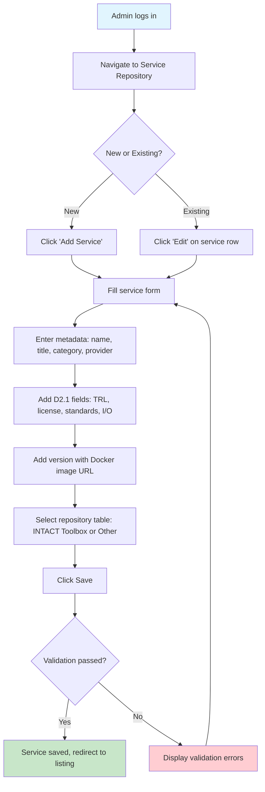
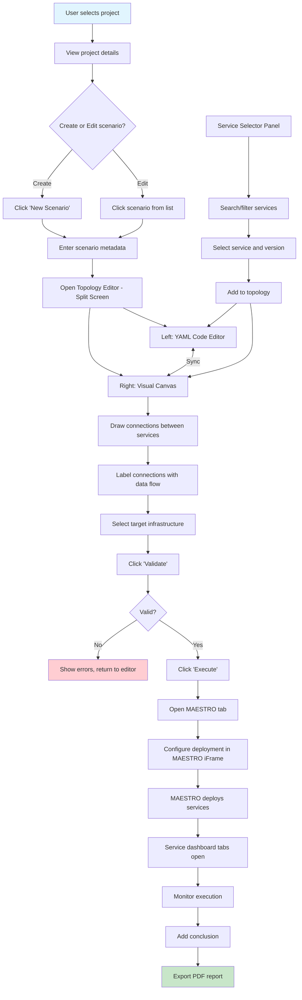
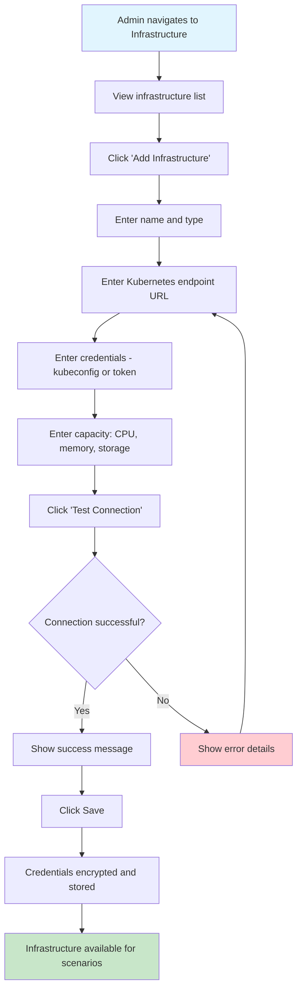
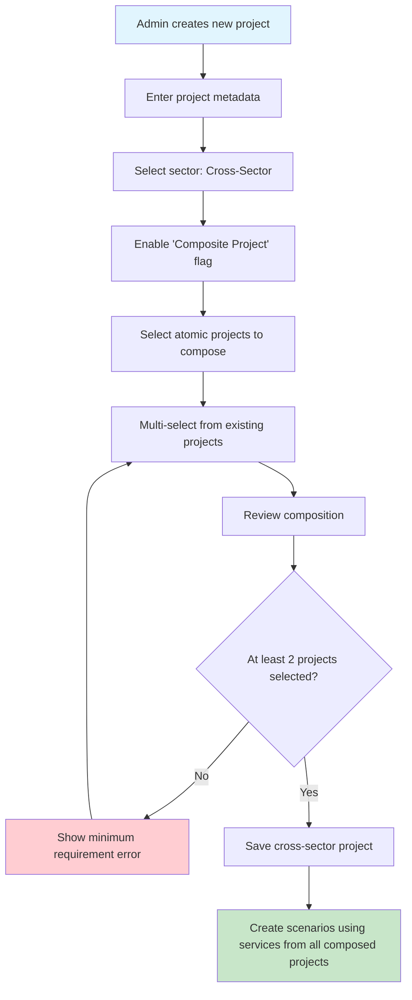
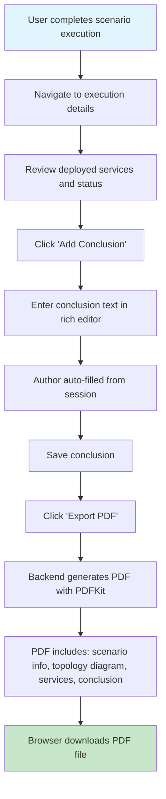
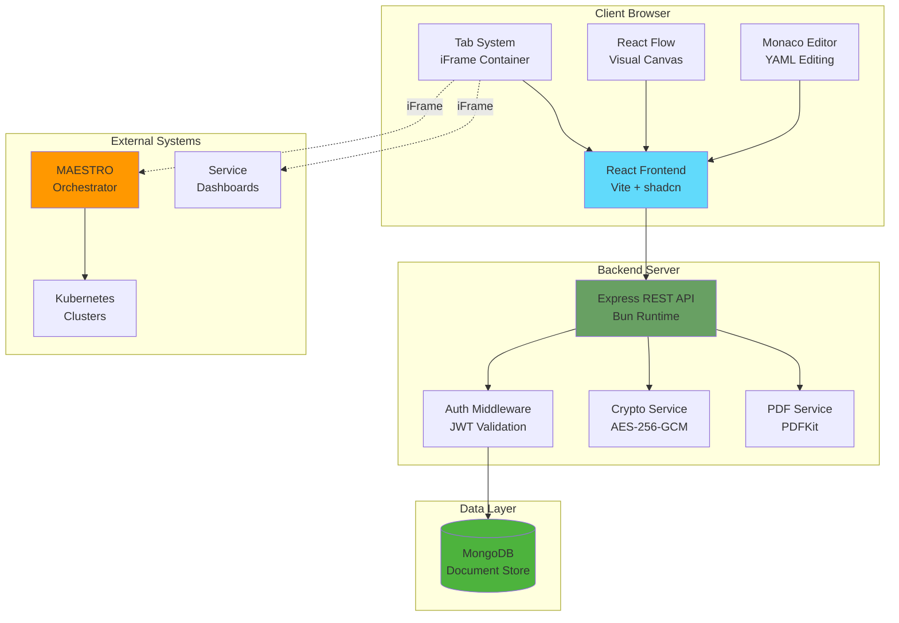
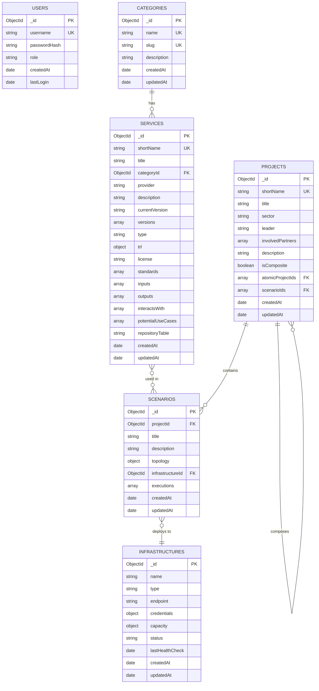
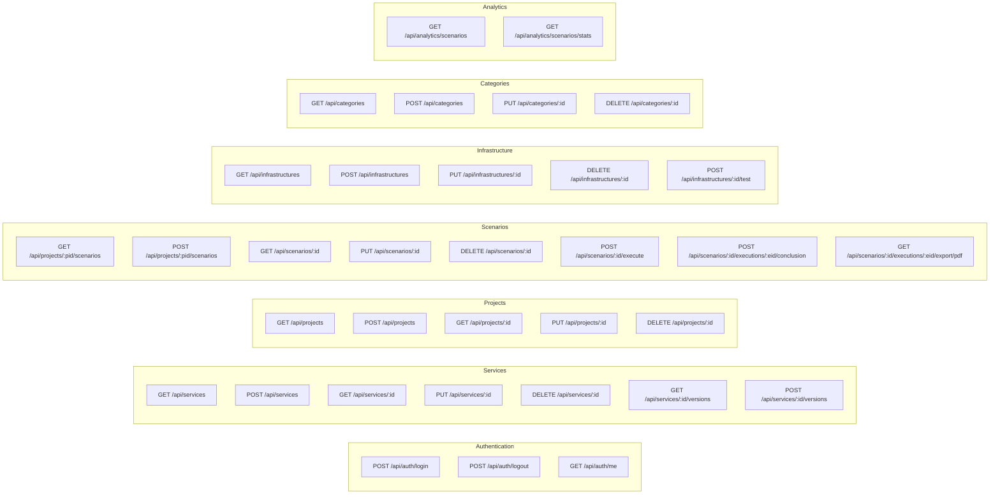
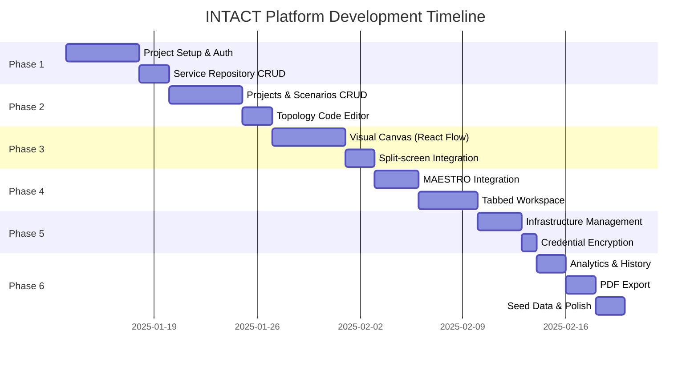

# Product Requirements Document: INTACT Digital Twin Management Platform

## Product Overview

**Product Vision:** A centralized web platform for managing the INTACT cybersecurity service repository and orchestrating Digital Twin projects across multiple sectors (Telecommunications, Healthcare, Transportation, and Nuclear), enabling security professionals to design, deploy, and evaluate cybersecurity scenarios in virtualized environments.

**Target Users:**

- Primary: INTACT consortium partners (~20 organizations) - tool owners updating their services
- Secondary: External organizations seeking cybersecurity services for their infrastructure

**Business Objectives:**

1. Provide a unified catalog of all INTACT toolbox cybersecurity services with version management
2. Enable creation and management of Digital Twin projects with visual scenario design
3. Streamline deployment of security testing scenarios via MAESTRO orchestration
4. Support cross-sector Digital Twin compositions for complex security evaluations
5. Generate exportable reports for scenario execution conclusions

**Success Metrics:**
| Metric | Target | Measurement Method |
|--------|--------|-------------------|
| Service catalog completeness | 100% of D2.1 tools onboarded | Count of services vs. D2.1 specification |
| Scenario execution success rate | >90% | Completed executions / Total executions |
| Time to deploy scenario | <5 minutes | Average deployment duration |
| User adoption | All 20 consortium partners active | Monthly active users |
| Report generation | 100% of completed scenarios | Reports exported / Completed scenarios |

---

## User Personas

### Persona 1: Tool Owner (Service Provider)

- **Demographics:** 35-50 years old, Software Engineer/Researcher at consortium partner organization, high technical proficiency
- **Goals:**
  - Register and maintain their cybersecurity tools in the INTACT repository
  - Keep service versions up-to-date with proper documentation
  - Ensure their tools are discoverable by other consortium members
- **Pain Points:**
  - Managing multiple versions across different deployments
  - Lack of centralized documentation for tool interoperability
  - Manual communication of updates to consortium partners
- **User Journey:**
  1. Logs into platform
  2. Navigates to Service Repository
  3. Creates/updates their service entry with Docker image URL, metadata, and version info
  4. Reviews service appears correctly in the INTACT Toolbox table

### Persona 2: Security Analyst (Scenario Designer)

- **Demographics:** 28-45 years old, Cybersecurity Analyst/Researcher, medium-high technical proficiency
- **Goals:**
  - Design and test cybersecurity scenarios using Digital Twins
  - Compose multiple services into detection/mitigation workflows
  - Document findings and conclusions for project deliverables
- **Pain Points:**
  - Complex manual configuration of multi-service deployments
  - Difficulty visualizing service interactions and data flows
  - Time-consuming report generation for project documentation
- **User Journey:**
  1. Creates or selects a Digital Twin project
  2. Designs a new scenario using the topology editor
  3. Selects services from repository and defines data flow connections
  4. Deploys scenario to infrastructure via MAESTRO
  5. Monitors execution through service dashboards
  6. Documents conclusion and exports PDF report

### Persona 3: Project Leader (Administrator)

- **Demographics:** 40-55 years old, Technical Project Manager at consortium lead organization, medium technical proficiency
- **Goals:**
  - Oversee all Digital Twin projects across the consortium
  - Monitor scenario execution history and outcomes
  - Manage infrastructure resources and access
- **Pain Points:**
  - Limited visibility into project activities across partners
  - Difficulty tracking which services are used in which projects
  - Manual coordination of infrastructure allocation
- **User Journey:**
  1. Reviews dashboard for project overview
  2. Checks analytics for scenario execution history
  3. Manages infrastructure allocations
  4. Reviews and exports scenario conclusions for deliverables

---

## Feature Requirements

### Module 1: Authentication & User Management

| Feature                | Description                                             | User Stories                                                                          | Priority    | Acceptance Criteria                                                                                                                                            | Dependencies |
| ---------------------- | ------------------------------------------------------- | ------------------------------------------------------------------------------------- | ----------- | -------------------------------------------------------------------------------------------------------------------------------------------------------------- | ------------ |
| **Admin Login**        | Simple username/password authentication for admin users | As an admin, I want to log in securely so that I can access the platform              | Must-have   | - Login form with username/password fields<br>- Password stored as bcrypt hash<br>- JWT token returned on success<br>- Session persists across browser refresh | None         |
| **Session Management** | JWT-based session with secure token handling            | As an admin, I want my session to persist so that I don't have to re-login frequently | Must-have   | - JWT expires after 24 hours<br>- Logout invalidates session<br>- Protected routes redirect to login                                                           | Admin Login  |
| **User Profile**       | View and update admin profile information               | As an admin, I want to view my profile so that I can verify my account details        | Should-have | - Display username and last login<br>- Allow password change                                                                                                   | Admin Login  |

### Module 2: Service Repository

| Feature                 | Description                                                       | User Stories                                                                               | Priority    | Acceptance Criteria                                                                                                                                                 | Dependencies    |
| ----------------------- | ----------------------------------------------------------------- | ------------------------------------------------------------------------------------------ | ----------- | ------------------------------------------------------------------------------------------------------------------------------------------------------------------- | --------------- |
| **Service Listing**     | Display services in two tables: INTACT Toolbox and Other Services | As a user, I want to see all available services categorized so that I can find what I need | Must-have   | - Two separate tables with filtering/sorting<br>- Columns: Short name, title, category, provider, description, version, last update<br>- Pagination (20 items/page) | None            |
| **Service CRUD**        | Create, read, update, delete services                             | As an admin, I want to manage services so that the repository stays current                | Must-have   | - Create form with all D2.1 metadata fields<br>- Edit existing services<br>- Soft delete with confirmation                                                          | Categories      |
| **Version Management**  | Track multiple versions per service                               | As an admin, I want to add new versions so that users can access specific releases         | Must-have   | - Add new version with Docker image URL<br>- View version history<br>- Access any historical version<br>- Current version prominently displayed                     | Service CRUD    |
| **Category Management** | Manage service categories (seeded from D2.1)                      | As an admin, I want to manage categories so that services are properly organized           | Must-have   | - CRUD operations on categories<br>- Seeded with D2.1 categories<br>- Prevent deletion of categories with services                                                  | None            |
| **Service Detail View** | Comprehensive view of service metadata                            | As a user, I want to see full service details so that I understand its capabilities        | Must-have   | - All D2.1 fields displayed<br>- Input/Output specifications<br>- Standards compliance<br>- Potential use cases                                                     | Service CRUD    |
| **Service Search**      | Search across services by name, description, provider             | As a user, I want to search services so that I can quickly find specific tools             | Should-have | - Full-text search<br>- Filter by category, provider, TRL<br>- Results highlight matching terms                                                                     | Service Listing |

### Module 3: Digital Twin Projects

| Feature                    | Description                                 | User Stories                                                                         | Priority  | Acceptance Criteria                                                                                                                         | Dependencies            |
| -------------------------- | ------------------------------------------- | ------------------------------------------------------------------------------------ | --------- | ------------------------------------------------------------------------------------------------------------------------------------------- | ----------------------- |
| **Project Listing**        | Display all DT projects in a table          | As a user, I want to see all projects so that I can select one to work on            | Must-have | - Table with: Short name, title, sector, leader, partners, description, last update<br>- Edit link for each project                         | None                    |
| **Project CRUD**           | Create, read, update, delete projects       | As an admin, I want to manage projects so that consortium work is organized          | Must-have | - Create form with all fields<br>- Select sector from predefined list<br>- Multi-select for involved partners<br>- Delete with confirmation | None                    |
| **Atomic vs Cross-Sector** | Support both single-sector and composed DTs | As an admin, I want to create cross-sector DTs so that I can model complex scenarios | Must-have | - Flag for composite projects<br>- Select multiple atomic projects for composition<br>- Visual indication of project type                   | Project CRUD            |
| **Project Detail View**    | View project with associated scenarios      | As a user, I want to see project details and scenarios so that I can work on them    | Must-have | - Project metadata displayed<br>- List of scenarios with status<br>- Quick actions: Edit project, Add scenario                              | Project CRUD, Scenarios |

### Module 4: Scenario Management

| Feature                    | Description                                       | User Stories                                                                  | Priority    | Acceptance Criteria                                                                                                                 | Dependencies               |
| -------------------------- | ------------------------------------------------- | ----------------------------------------------------------------------------- | ----------- | ----------------------------------------------------------------------------------------------------------------------------------- | -------------------------- |
| **Scenario Listing**       | Display scenarios within a project                | As a user, I want to see all scenarios so that I can select one to execute    | Must-have   | - Table: Title, description, infrastructure, status, last execution<br>- Actions: Edit, Execute, Delete                             | Projects                   |
| **Scenario CRUD**          | Create, read, update, delete scenarios            | As an admin, I want to manage scenarios so that I can design security tests   | Must-have   | - Create with title, description<br>- Associate with infrastructure<br>- Delete with confirmation                                   | Projects, Infrastructure   |
| **Topology Code Editor**   | YAML-based topology definition with Monaco Editor | As a user, I want to write topology in YAML so that I have precise control    | Must-have   | - Monaco Editor with YAML syntax highlighting<br>- Schema validation<br>- Auto-completion for service names<br>- Error highlighting | Service Repository         |
| **Topology Visual Canvas** | Drag-drop visual editor with React Flow           | As a user, I want to visually design topology so that I can see the data flow | Must-have   | - Drag services from palette<br>- Connect with labeled edges<br>- Pan/zoom canvas<br>- Node configuration panel                     | Service Repository         |
| **Split-Screen Editor**    | Synchronized code and visual editors              | As a user, I want both views so that I can use whichever is convenient        | Must-have   | - Left panel: Code editor<br>- Right panel: Visual canvas<br>- Changes sync bidirectionally<br>- Toggle full-screen for either      | Code Editor, Visual Canvas |
| **Service Selector**       | Browse and select services from repository        | As a user, I want to pick services so that I can add them to my scenario      | Must-have   | - Searchable service list<br>- Filter by category<br>- Select version<br>- Add to topology                                          | Service Repository         |
| **Topology Validation**    | Validate topology before execution                | As a user, I want validation so that I catch errors before deployment         | Should-have | - Syntax validation<br>- Service existence check<br>- Version availability check<br>- Connection validity check                     | Topology Editor            |

### Module 5: Scenario Execution

| Feature                      | Description                                 | User Stories                                                                         | Priority  | Acceptance Criteria                                                                                                                                             | Dependencies                       |
| ---------------------------- | ------------------------------------------- | ------------------------------------------------------------------------------------ | --------- | --------------------------------------------------------------------------------------------------------------------------------------------------------------- | ---------------------------------- |
| **Execution Trigger**        | Start scenario deployment via MAESTRO       | As a user, I want to execute scenarios so that I can test my security configurations | Must-have | - Deploy button triggers execution<br>- Status updates during deployment<br>- Error handling with clear messages                                                | Scenarios, Infrastructure, MAESTRO |
| **MAESTRO Integration**      | Embed MAESTRO interface for deployment      | As a user, I want to configure deployment in MAESTRO so that I have full control     | Must-have | - iFrame loads MAESTRO with scenario context<br>- Opens in application tab (not browser tab)<br>- MAESTRO receives scenario parameters                          | Tabbed Workspace                   |
| **Service Dashboard Tabs**   | Display deployed service dashboards in tabs | As a user, I want to access service dashboards so that I can monitor execution       | Must-have | - Each service opens in separate app tab<br>- iFrame for web-based dashboards<br>- Terminal emulator for CLI-based services<br>- Tab management (close, switch) | Tabbed Workspace                   |
| **Execution History**        | Track all executions for a scenario         | As a user, I want to see execution history so that I can review past runs            | Must-have | - List of executions with timestamp, status<br>- View details of each execution<br>- Access deployed service URLs                                               | Scenarios                          |
| **Conclusion Documentation** | Add conclusion to completed execution       | As a user, I want to document conclusions so that I capture findings                 | Must-have | - Rich text editor for conclusion<br>- Author and date auto-populated<br>- Save to execution record                                                             | Execution History                  |
| **PDF Export**               | Export execution report as PDF              | As a user, I want to export reports so that I can share findings                     | Must-have | - Export button generates PDF<br>- Includes: Scenario info, topology, services, conclusion<br>- Professional formatting                                         | Conclusion Documentation           |

### Module 6: Tabbed Workspace

| Feature                   | Description                               | User Stories                                                             | Priority    | Acceptance Criteria                                                                             | Dependencies  |
| ------------------------- | ----------------------------------------- | ------------------------------------------------------------------------ | ----------- | ----------------------------------------------------------------------------------------------- | ------------- |
| **Tab Container**         | Workspace area for multiple open tabs     | As a user, I want multiple tabs so that I can work with several services | Must-have   | - Tab bar with open tabs<br>- Active tab highlighted<br>- Content area shows active tab         | None          |
| **Tab Management**        | Open, close, switch between tabs          | As a user, I want to manage tabs so that I can organize my workspace     | Must-have   | - Click to switch tabs<br>- Close button on each tab<br>- Prevent closing unsaved work          | Tab Container |
| **iFrame Tab**            | Tab containing external content in iFrame | As a user, I want embedded dashboards so that I stay in the application  | Must-have   | - iFrame loads external URL<br>- Full-height content area<br>- Loading indicator                | Tab Container |
| **Tab State Persistence** | Maintain open tabs across navigation      | As a user, I want tabs to persist so that I don't lose my workspace      | Should-have | - Tabs persist during session<br>- Tab state stored in memory<br>- Restore tabs on page refresh | Tab Container |

### Module 7: Infrastructure Management

| Feature                    | Description                                  | User Stories                                                                           | Priority    | Acceptance Criteria                                                                                             | Dependencies        |
| -------------------------- | -------------------------------------------- | -------------------------------------------------------------------------------------- | ----------- | --------------------------------------------------------------------------------------------------------------- | ------------------- |
| **Infrastructure Listing** | Display all registered infrastructures       | As an admin, I want to see infrastructures so that I can manage resources              | Must-have   | - Table: Name, type, endpoint, status, capacity<br>- Last health check timestamp                                | None                |
| **Infrastructure CRUD**    | Create, read, update, delete infrastructures | As an admin, I want to manage infrastructures so that projects have deployment targets | Must-have   | - Create form with all fields<br>- Secure credential input<br>- Delete with confirmation                        | None                |
| **Credential Encryption**  | Securely store Kubernetes credentials        | As an admin, I want encrypted credentials so that infrastructure access is secure      | Must-have   | - AES-256-GCM encryption<br>- Credentials never returned in API responses<br>- Environment-based encryption key | Infrastructure CRUD |
| **Connection Test**        | Validate infrastructure connectivity         | As an admin, I want to test connections so that I verify infrastructure is accessible  | Should-have | - Test button triggers connectivity check<br>- Success/failure feedback<br>- Update status field                | Infrastructure CRUD |
| **Capacity Display**       | Show infrastructure resource capacity        | As an admin, I want to see capacity so that I can plan deployments                     | Should-have | - Display CPU, memory, storage<br>- Visual capacity indicators                                                  | Infrastructure CRUD |

### Module 8: Analytics

| Feature                  | Description                                 | User Stories                                                                 | Priority    | Acceptance Criteria                                                                                                      | Dependencies          |
| ------------------------ | ------------------------------------------- | ---------------------------------------------------------------------------- | ----------- | ------------------------------------------------------------------------------------------------------------------------ | --------------------- |
| **Scenario History**     | View execution history across all scenarios | As a user, I want to see all executions so that I can track project progress | Must-have   | - Table: Scenario, project, executed by, date, status<br>- Filter by project, date range, status<br>- Sort by any column | Scenarios, Executions |
| **Execution Statistics** | Aggregated stats on scenario executions     | As an admin, I want statistics so that I can report on project activities    | Should-have | - Total executions, success rate<br>- Executions by project, by sector<br>- Trend over time chart                        | Scenario History      |

### Module 9: Dashboard

| Feature             | Description                     | User Stories                                                             | Priority    | Acceptance Criteria                                                                                   | Dependencies |
| ------------------- | ------------------------------- | ------------------------------------------------------------------------ | ----------- | ----------------------------------------------------------------------------------------------------- | ------------ |
| **Overview Cards**  | Summary statistics on dashboard | As a user, I want an overview so that I quickly understand system status | Must-have   | - Total services, projects, scenarios<br>- Recent executions count<br>- Infrastructure status summary | All Modules  |
| **Recent Activity** | List of recent actions          | As a user, I want to see recent activity so that I stay informed         | Should-have | - Recent scenario executions<br>- Recently updated services<br>- Recently created projects            | All Modules  |
| **Quick Actions**   | Shortcuts to common tasks       | As a user, I want quick actions so that I can work efficiently           | Should-have | - Create new project<br>- Add new service<br>- View all scenarios                                     | All Modules  |

### Module 10: Settings

| Feature                 | Description                                      | User Stories                                                                   | Priority    | Acceptance Criteria                                                                                 | Dependencies |
| ----------------------- | ------------------------------------------------ | ------------------------------------------------------------------------------ | ----------- | --------------------------------------------------------------------------------------------------- | ------------ |
| **System Settings**     | Configure platform-wide settings                 | As an admin, I want to configure settings so that the platform meets our needs | Should-have | - MAESTRO base URL configuration<br>- Default infrastructure selection<br>- Session timeout setting | None         |
| **Category Management** | Manage service categories (linked from Services) | As an admin, I want to manage categories here for convenience                  | Should-have | - Same functionality as in Services module<br>- Centralized location                                | Categories   |

---

## User Flows

### Flow 1: Service Registration



**Alternative Paths:**

- Cancel at any step returns to service listing without saving
- Duplicate short name shows error message

**Error States:**

- Required field missing: Highlight field, show inline error
- Docker image URL invalid format: Show format hint
- Category not selected: Prompt to select or create category

---

### Flow 2: Scenario Design and Execution



**Alternative Paths:**

- Save draft without validation for later editing
- Re-execute previous scenario with same configuration
- Clone existing scenario as starting point

**Error States:**

- YAML syntax error: Monaco shows red underline, error message in gutter
- Service not found: Highlight in both code and canvas
- Infrastructure unavailable: Show status, suggest alternatives
- MAESTRO deployment failure: Display error from MAESTRO, allow retry

---

### Flow 3: Infrastructure Setup



**Alternative Paths:**

- Skip connection test (save anyway with "unverified" status)
- Import kubeconfig file instead of manual entry

**Error States:**

- Invalid endpoint format: Show expected format
- Authentication failure: Suggest checking credentials
- Network unreachable: Suggest checking firewall/VPN

---

### Flow 4: Cross-Sector Digital Twin Creation



---

### Flow 5: PDF Report Generation



---

## Non-Functional Requirements

### Performance

| Metric                  | Target                        | Rationale                               |
| ----------------------- | ----------------------------- | --------------------------------------- |
| **Initial Page Load**   | <3 seconds                    | Standard web application expectation    |
| **API Response Time**   | <500ms (95th percentile)      | Responsive user experience              |
| **Concurrent Users**    | 50 simultaneous               | Consortium size with buffer             |
| **Service List Render** | <1 second for 100 services    | D2.1 defines ~30 services, allow growth |
| **Topology Editor**     | 60 FPS during drag operations | Smooth visual editing experience        |
| **PDF Generation**      | <10 seconds                   | Acceptable wait for document generation |

### Security

| Requirement               | Implementation                             |
| ------------------------- | ------------------------------------------ |
| **Authentication**        | JWT tokens with 24-hour expiration         |
| **Password Storage**      | bcrypt with cost factor 12                 |
| **Credential Encryption** | AES-256-GCM for infrastructure credentials |
| **API Protection**        | All endpoints require valid JWT            |
| **CORS**                  | Restricted to application domain           |
| **Input Validation**      | Server-side validation on all inputs       |
| **XSS Prevention**        | React's built-in escaping + CSP headers    |
| **HTTPS**                 | Required for all communications            |

### Compatibility

| Category         | Supported                                          |
| ---------------- | -------------------------------------------------- |
| **Browsers**     | Chrome 90+, Firefox 88+, Safari 14+, Edge 90+      |
| **Screen Sizes** | 1280px minimum width (desktop-focused application) |
| **Devices**      | Desktop and laptop computers                       |
| **Node.js**      | Bun runtime (latest stable)                        |

### Accessibility

| Standard                | Level         | Implementation                                   |
| ----------------------- | ------------- | ------------------------------------------------ |
| **WCAG**                | 2.1 AA        | Target compliance                                |
| **Keyboard Navigation** | Full          | All interactive elements accessible via keyboard |
| **Screen Readers**      | Compatible    | ARIA labels on custom components                 |
| **Color Contrast**      | 4.5:1 minimum | Text on backgrounds                              |
| **Focus Indicators**    | Visible       | Custom focus styles on all interactive elements  |

---

## Technical Specifications

### System Architecture



### Frontend

| Aspect               | Specification                        |
| -------------------- | ------------------------------------ |
| **Runtime**          | Bun                                  |
| **Build Tool**       | Vite                                 |
| **Framework**        | React 18+                            |
| **UI Components**    | shadcn/ui                            |
| **Icons**            | Lucide React                         |
| **State Management** | Zustand (for tab workspace state)    |
| **Form Handling**    | React Hook Form + Zod validation     |
| **HTTP Client**      | Fetch API with custom wrapper        |
| **Code Editor**      | Monaco Editor (@monaco-editor/react) |
| **Visual Canvas**    | React Flow (@xyflow/react)           |
| **Routing**          | React Router v6                      |
| **Styling**          | Tailwind CSS (via shadcn)            |

### Backend

| Aspect                 | Specification                |
| ---------------------- | ---------------------------- |
| **Runtime**            | Bun                          |
| **Framework**          | Express.js                   |
| **API Style**          | RESTful JSON API             |
| **Authentication**     | JWT (jsonwebtoken)           |
| **Password Hashing**   | bcrypt                       |
| **Encryption**         | Node.js crypto (AES-256-GCM) |
| **PDF Generation**     | PDFKit                       |
| **Validation**         | Zod                          |
| **YAML Parsing**       | js-yaml                      |
| **Environment Config** | dotenv                       |

### Database

| Aspect            | Specification                                                     |
| ----------------- | ----------------------------------------------------------------- |
| **Database**      | MongoDB 6.0+                                                      |
| **ODM**           | Mongoose                                                          |
| **Collections**   | users, categories, services, projects, scenarios, infrastructures |
| **Indexes**       | Compound indexes on frequently queried fields                     |
| **Relationships** | Reference-based (ObjectId references between collections)         |

### Database Schema Diagram



### API Endpoints Summary



### Infrastructure

| Aspect                 | Specification                  |
| ---------------------- | ------------------------------ |
| **Local Development**  | Docker Compose (MongoDB + App) |
| **Production Hosting** | Kubernetes (future)            |
| **Container Registry** | Docker Hub or private registry |
| **CI/CD**              | GitHub Actions (future)        |
| **Monitoring**         | Application logs to stdout     |

---

## Analytics & Monitoring

### Key Metrics

| Metric                     | Description                     | Target                  |
| -------------------------- | ------------------------------- | ----------------------- |
| **Active Users**           | Monthly active admin users      | All consortium partners |
| **Services Registered**    | Total services in repository    | 100% of D2.1 tools      |
| **Scenarios Created**      | Total scenarios across projects | Growth over time        |
| **Execution Success Rate** | Completed / Total executions    | >90%                    |
| **Report Generation**      | PDF exports per month           | Track adoption          |

### Events to Track

| Event                   | Trigger              | Data Captured                |
| ----------------------- | -------------------- | ---------------------------- |
| `user.login`            | Successful login     | userId, timestamp            |
| `service.created`       | New service added    | serviceId, provider          |
| `service.version_added` | New version released | serviceId, version           |
| `project.created`       | New project created  | projectId, sector            |
| `scenario.created`      | New scenario created | scenarioId, projectId        |
| `scenario.executed`     | Execution triggered  | scenarioId, infrastructureId |
| `scenario.completed`    | Execution finished   | scenarioId, status, duration |
| `report.exported`       | PDF downloaded       | scenarioId, executionId      |

### Dashboard Requirements

1. **Overview Dashboard**
   - Total counts: Services, Projects, Scenarios, Executions
   - Recent activity feed
   - Execution success rate gauge

2. **Analytics Dashboard**
   - Execution history table with filters
   - Executions over time chart
   - Status breakdown pie chart

### Alerting (Future)

| Alert                  | Condition                   | Action             |
| ---------------------- | --------------------------- | ------------------ |
| Infrastructure Offline | Health check fails 3 times  | Email notification |
| High Failure Rate      | >20% executions fail in 24h | Dashboard warning  |

---

## Release Planning

### MVP (v1.0)

**Target Timeline:** 5-6 weeks

**Features:**

- ✅ Admin authentication (username/password)
- ✅ Service Repository with full D2.1 metadata
- ✅ Version management for services
- ✅ Category management (seeded from D2.1)
- ✅ Digital Twin Project CRUD
- ✅ Scenario CRUD with topology editor (code + visual)
- ✅ Infrastructure management with encrypted credentials
- ✅ MAESTRO integration via iFrame
- ✅ Tabbed workspace for service dashboards
- ✅ Execution history
- ✅ Conclusion documentation
- ✅ PDF export
- ✅ Seed data for all D2.1 services

**Success Criteria:**

- All consortium partners can log in
- All D2.1 services are registered
- At least one scenario successfully executed per PUC
- PDF reports generated for completed executions

### Phase Breakdown



### Future Releases

**v1.1 (Post-MVP)**

- Multi-user support with role-based access
- Service input/output compatibility validation
- Scenario cloning
- Batch execution of scenarios

**v1.2**

- Real-time execution logs via WebSocket
- Infrastructure health monitoring dashboard
- Notification system for execution completion

**v2.0**

- Integration with external data spaces (GAIA-X, IDSA)
- Advanced analytics with trend analysis
- API for programmatic scenario execution
- Integration with Zenodo for dataset export

---

## Open Questions & Assumptions

### Open Questions

| #   | Question                                                                            | Impact                          | Status                       |
| --- | ----------------------------------------------------------------------------------- | ------------------------------- | ---------------------------- |
| Q1  | What is the exact MAESTRO API contract for passing scenario parameters?             | Affects iFrame URL construction | Pending MAESTRO team input   |
| Q2  | How should CLI-based service dashboards be displayed? Terminal emulator in browser? | UX for non-web services         | Assumed xterm.js             |
| Q3  | Should execution logs be persisted or only available during runtime?                | Storage requirements            | Assumed not persisted (v1.0) |
| Q4  | What is the expected size of topology files? Any practical limit?                   | Validation rules                | Assumed <1MB                 |
| Q5  | Are there branding guidelines for the INTACT platform?                              | UI design                       | Pending consortium           |

### Assumptions

| #   | Assumption                                              | Rationale                               | Risk if Wrong                       |
| --- | ------------------------------------------------------- | --------------------------------------- | ----------------------------------- |
| A1  | Single admin user is sufficient for MVP                 | Small consortium, controlled access     | Low - easy to extend                |
| A2  | MAESTRO provides service dashboard URLs post-deployment | Standard orchestration pattern          | Medium - need alternative discovery |
| A3  | All services have Docker images available               | D2.1 specifies containerized deployment | Medium - need alternative packaging |
| A4  | MongoDB is sufficient for all data needs                | Document model fits flexible schemas    | Low - can migrate if needed         |
| A5  | iFrame embedding works for all service dashboards       | Most services are web-based             | Medium - some may block embedding   |
| A6  | Kafka bus connectivity is managed by MAESTRO            | Orchestrator responsibility             | Low - standard deployment pattern   |

---

## Appendix

### A. Competitive Analysis

| Platform                 | Strengths                                     | Weaknesses                                      | Relevance to INTACT                                 |
| ------------------------ | --------------------------------------------- | ----------------------------------------------- | --------------------------------------------------- |
| **Kubernetes Dashboard** | Native K8s management, real-time status       | No domain-specific features, no workflow design | Complementary - INTACT adds security workflow layer |
| **Apache NiFi**          | Visual data flow design, extensive connectors | Complex setup, not security-focused             | Similar visual approach, different domain           |
| **MISP**                 | Threat intelligence sharing, community-driven | Not deployment-focused, no DT concept           | Potential integration point for threat data         |
| **OpenCTI**              | Cyber threat intelligence platform            | No orchestration, no DT                         | Could feed threat intelligence to INTACT            |

### B. D2.1 Service Categories (Seed Data)

```javascript
const seedCategories = [
  { name: 'Predictive Threat Intelligence', slug: 'predictive-threat-intelligence' },
  { name: 'AI Attack-Defence Emulation', slug: 'ai-attack-defence-emulation' },
  { name: 'Automated Threat Inspection', slug: 'automated-threat-inspection' },
  { name: 'Zero-Trust Distributed Computing', slug: 'zero-trust-distributed-computing' },
  { name: 'Twinning Agents', slug: 'twinning-agents' },
  { name: 'Dashboard & Explainable AI', slug: 'dashboard-xai' },
  { name: 'Open Security Service Repository', slug: 'ossr' },
  { name: 'Training', slug: 'training' },
  { name: 'Orchestration', slug: 'orchestration' },
  { name: 'Message Broker', slug: 'message-broker' },
];
```

### C. D2.1 Services to Seed (Tables 17-37)

| Short Name     | Title                                             | Category                         | Provider   | Table |
| -------------- | ------------------------------------------------- | -------------------------------- | ---------- | ----- |
| ULANCS-GAME    | Joint Security-vs-QoS Modelling/Game Optimisation | Predictive Threat Intelligence   | ULANCS     | 17    |
| NETWORK-FUZZER | Montimage Network Fuzzer                          | AI Attack-Defence Emulation      | MONT       | 18    |
| SPLIT          | Security Protocol Testing Toolkit                 | AI Attack-Defence Emulation      | SBA        | 19    |
| CAST           | Combinatorial API Security Testing                | AI Attack-Defence Emulation      | SBA        | 20    |
| ORION          | Orion Malware Detection                           | Automated Threat Inspection      | AIRBUS     | 21    |
| DATA-DIODE     | Data Diode                                        | Automated Threat Inspection      | BEYOND     | 22    |
| MMT            | Montimage Monitoring Tool                         | Automated Threat Inspection      | MONT       | 23    |
| ROSCO-EBPF     | Runtime Security Pipeline                         | Automated Threat Inspection      | SIEMENS    | 24    |
| LLM-TM         | LLM Threat Modelling                              | Automated Threat Inspection      | SIEMENS    | 25    |
| FPGA-NIDS      | FPGA Network Intrusion Detection                  | Automated Threat Inspection      | TUC        | 26    |
| K3CR-PROBES    | K3CyberRadar Probes                               | Automated Threat Inspection      | K3Y        | 27    |
| DID            | Zero-Trust Distributed Computing                  | Zero-Trust Distributed Computing | SBA        | 28    |
| DIST-HSM       | Distributed HSM                                   | Zero-Trust Distributed Computing | BEYOND     | 29    |
| TWINNING-AGENT | Twinning Agents                                   | Twinning Agents                  | FRAUNHOFER | 30    |
| PAC2200-SHADOW | PAC2200 Digital Shadow                            | Twinning Agents                  | SIEMENS    | 31    |
| HITL-DASHBOARD | Interactive HITL Dashboard                        | Dashboard & Explainable AI       | HMU        | 32    |
| TRUSTEE-XAI    | TRUSTEE Explainable AI Tool                       | Dashboard & Explainable AI       | K3Y        | 33    |
| OSSR           | Open Security Service Repository                  | Open Security Service Repository | AXON       | 34    |
| CYBERRANGE     | CyberRange Training                               | Training                         | THALES     | 35    |
| MAESTRO        | Service Orchestrator                              | Orchestration                    | UBI        | 36    |
| COS-BROKER     | Message Broker (COS)                              | Message Broker                   | AEGIS      | 37    |

### D. Topology DSL Schema

```yaml
# topology-schema.yaml
$schema: 'http://json-schema.org/draft-07/schema#'
type: object
required: [version, name, services]
properties:
  version:
    type: string
    pattern: "^\\d+\\.\\d+$"
  name:
    type: string
    maxLength: 100
  description:
    type: string
    maxLength: 500
  services:
    type: array
    minItems: 1
    items:
      type: object
      required: [id, service]
      properties:
        id:
          type: string
          pattern: '^[a-z0-9-]+$'
        service:
          type: string
          description: 'shortName from Service repository'
        version:
          type: string
          default: 'latest'
        config:
          type: object
          additionalProperties: true
  connections:
    type: array
    items:
      type: object
      required: [from, to]
      properties:
        from:
          type: string
        to:
          type: string
        label:
          type: string
        via:
          type: string
          enum: [kafka, rest, grpc, direct]
        topic:
          type: string
```

### E. INTACT Consortium Partners

| #   | Partner                           | Abbreviation | Country  |
| --- | --------------------------------- | ------------ | -------- |
| 1   | Inlecom Commercial Pathways       | ICP          | Belgium  |
| 2   | Thales Six GTS France             | THALES       | France   |
| 3   | Airbus Cybersecurity              | AIRBUS       | France   |
| 4   | Siemens SRL                       | SIEMENS      | Romania  |
| 5   | AVL List GMBH                     | AVL          | Austria  |
| 6   | Fraunhofer                        | FRAUNHOFER   | Germany  |
| 7   | SBA Research                      | SBA          | Austria  |
| 8   | NCSRD Demokritos                  | NCSRD        | Greece   |
| 9   | Hellenic Mediterranean University | HMU          | Greece   |
| 10  | Technical University of Crete     | TUC          | Greece   |
| 11  | Montimage EURL                    | MONT         | France   |
| 12  | UBITECH                           | UBI          | Greece   |
| 13  | AXON Logic                        | AXON         | Greece   |
| 14  | K3Y                               | K3Y          | Greece   |
| 15  | BEYOND Semiconductor              | BEYOND       | Slovenia |
| 16  | AEGIS IT Research                 | AEGIS        | Greece   |
| 17  | 5th Regional Health Authority     | 5YPE         | Greece   |
| 18  | Digital For Planet                | D4P          | Portugal |
| 19  | University of Lancaster           | ULANCS       | UK       |

### F. Glossary

| Term                          | Definition                                                                       |
| ----------------------------- | -------------------------------------------------------------------------------- |
| **Atomic Digital Twin**       | A Digital Twin representing a single sector (Telcos, Health, Transport, Nuclear) |
| **Cross-Sector Digital Twin** | A composite Digital Twin combining two or more atomic DTs                        |
| **D2.1**                      | INTACT Deliverable 2.1: Reference system architecture document                   |
| **MAESTRO**                   | The INTACT service orchestrator platform developed by UBITECH                    |
| **PUC**                       | Pilot Use Case - one of four validation scenarios in INTACT                      |
| **Scenario**                  | A configured topology of services with defined data flows for testing            |
| **Topology**                  | The arrangement and connections of services in a scenario                        |
| **TRL**                       | Technology Readiness Level (1-9 scale)                                           |

### G. AI Research Insights

**Research Round 1: Concept Validation**

- Digital Twin platforms for cybersecurity are emerging but not yet mature
- Market gap exists for integrated service catalog + orchestration + DT design
- EU research projects often lack user-friendly tooling for consortium collaboration

**Research Round 2: Feature Prioritization**

- Visual topology editor is high-value differentiator
- Version management critical for research reproducibility
- PDF export essential for project deliverables and reporting

**Research Round 3: Technical Feasibility**

- React Flow well-suited for node-based editors (proven in many projects)
- Monaco Editor industry standard for code editing in browser
- Bun runtime mature enough for production backend

**AI-Generated Edge Cases:**

1. Service deleted while referenced in active scenario
2. Infrastructure goes offline during execution
3. Circular dependencies in service connections
4. Large topology files causing editor performance issues
5. Concurrent edits to same scenario (future multi-user)
6. iFrame blocked by service dashboard CSP headers

**AI-Suggested Improvements:**

1. Add "duplicate scenario" feature to accelerate workflow
2. Consider WebSocket for real-time execution status (post-MVP)
3. Add topology diff view for scenario versioning
4. Implement service dependency graph visualization

---

_Document Version: 1.0_
_Last Updated: 2025-01-13_
_Author: INTACT Technical Team_
