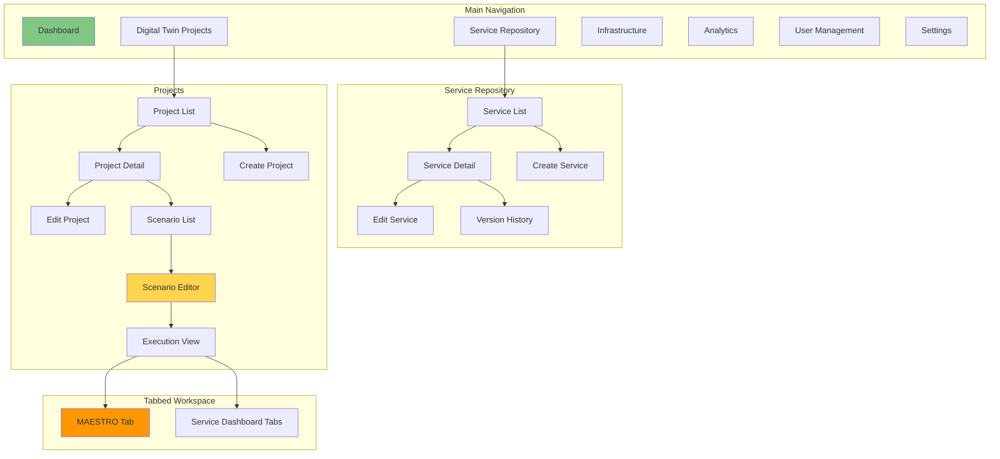
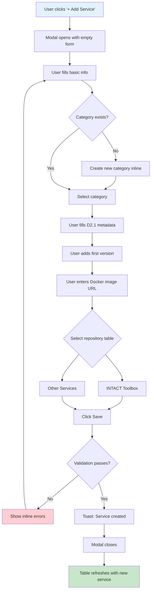
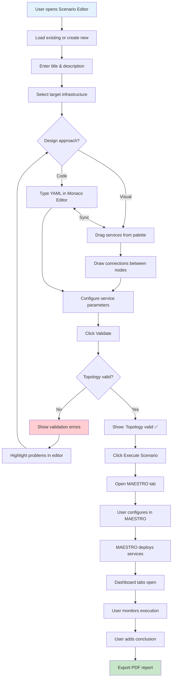
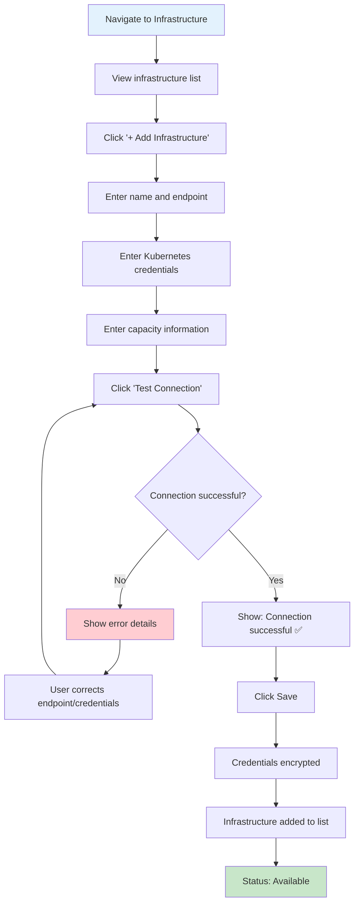
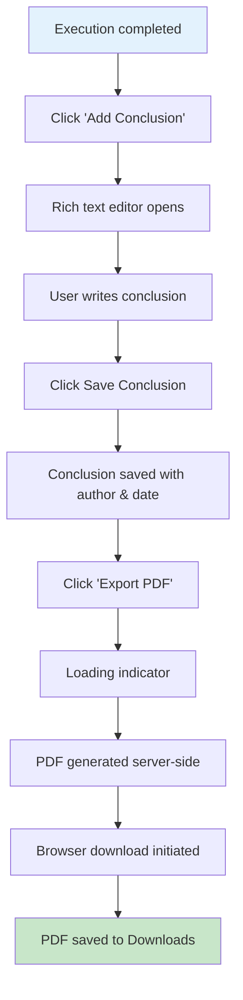
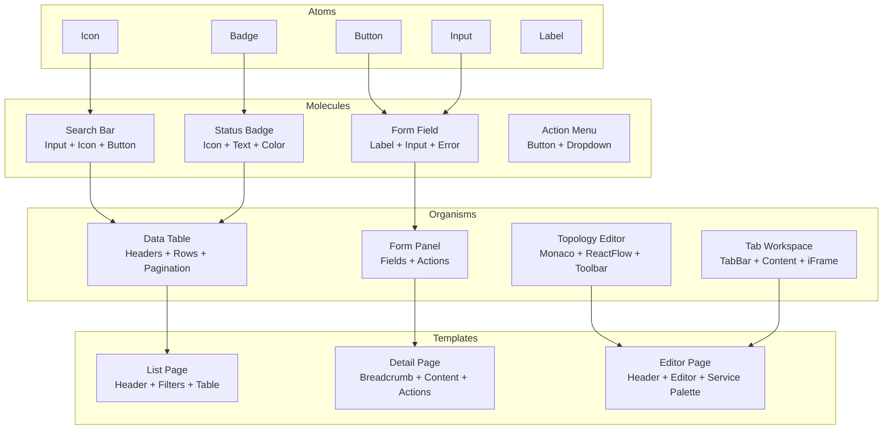

# User Experience (UX) Design Document: INTACT Digital Twin Management Platform

## UX Overview

### Purpose
The INTACT Platform UX is designed to provide security professionals and researchers with an intuitive, efficient interface for managing cybersecurity services and orchestrating Digital Twin projects. The primary UX goals are:

1. **Efficiency**: Enable quick access to frequently used features and minimize clicks for common tasks
2. **Clarity**: Present complex technical information in digestible, scannable formats
3. **Confidence**: Provide clear feedback and guidance to reduce errors in security-critical operations
4. **Flexibility**: Support both quick actions and detailed configuration workflows
5. **Integration**: Seamlessly embed external tools (MAESTRO, service dashboards) within the platform

### Scope
This document covers the UX design for:
- Dashboard and navigation system
- Service Repository management
- Digital Twin Project management
- Scenario design with topology editor (code + visual)
- Tabbed workspace for integrated tool access
- Infrastructure management
- Analytics and reporting
- PDF export functionality

### Alignment with PRD and GTM

| PRD Requirement | UX Implementation |
|-----------------|-------------------|
| Service catalog with versioning | Searchable tables with version history drawer |
| Visual topology editor | Split-screen canvas with synchronized code view |
| MAESTRO integration | Tabbed workspace with persistent iFrame tabs |
| Execution tracking | Timeline-based execution history with status badges |
| PDF reports | One-click export with preview option |
| 50 concurrent users | Lightweight UI, optimized component rendering |

---

## User Personas

### Persona 1: Dr. Maria Santos — Tool Owner (Service Provider)

**Demographics:**
- Age: 42
- Occupation: Senior Research Engineer at MONT (Montimage)
- Technical Proficiency: Expert-level in networking, security tools, Docker
- Usage Pattern: Weekly updates, monthly major releases

**Goals:**
- Register and maintain the MMT (Montimage Monitoring Tool) in the INTACT repository
- Ensure accurate metadata so other consortium members can understand and use the tool
- Track which projects are using their service

**Pain Points:**
- Previous experience with wikis and spreadsheets led to outdated, inconsistent documentation
- Difficulty communicating tool updates across 20 partner organizations
- Version confusion when multiple deployments use different releases

**UX Needs:**
- Quick service editing without navigating through multiple screens
- Clear version management with release notes support
- Visual confirmation of successful updates
- At-a-glance view of service usage across projects

---

### Persona 2: Thomas Müller — Security Analyst (Scenario Designer)

**Demographics:**
- Age: 34
- Occupation: Cybersecurity Analyst at AVL (Automotive)
- Technical Proficiency: High—comfortable with YAML, Docker, security tools
- Usage Pattern: Daily during project phases, intensive scenario design sessions

**Goals:**
- Design and test security detection scenarios using the Digital Twin environment
- Compose multiple INTACT services into attack-detection workflows
- Document findings for project deliverables (EU reporting)

**Pain Points:**
- Manual configuration of multi-service deployments is time-consuming
- Difficulty visualizing data flows between services
- Generating reports for project deliverables requires manual formatting

**UX Needs:**
- Dual-view topology editor (code for precision, visual for overview)
- Drag-and-drop service selection from catalog
- Clear service connection visualization
- One-click report generation for execution results

---

### Persona 3: Prof. Elena Papadopoulos — Project Leader (Administrator)

**Demographics:**
- Age: 52
- Occupation: Research Director at NCSRD (Demokritos)
- Technical Proficiency: Medium—understands concepts but doesn't write code
- Usage Pattern: Weekly check-ins, monthly detailed reviews

**Goals:**
- Monitor project progress across PUC4 (Nuclear safety-critical)
- Review scenario execution history and outcomes
- Generate summary reports for EU project reviews
- Ensure proper infrastructure allocation

**Pain Points:**
- Limited visibility into technical activities without diving into tools
- Difficulty aggregating information for project reporting
- Coordination overhead with multiple partner organizations

**UX Needs:**
- High-level dashboard with project health indicators
- Aggregated analytics without needing to access individual scenarios
- Executive-friendly data visualization
- Easy export of summary statistics

---

## Design Principles

### Principle 1: Progressive Disclosure
**Rationale:** Users range from technical experts who want full control to project managers who need overviews.

**Implementation:**
- Default views show essential information; details available on demand
- Collapsible sections for advanced options in forms
- "Show more" patterns for version history, execution details
- Tooltips for technical metadata (TRL, standards, etc.)

---

### Principle 2: Contextual Workspace
**Rationale:** Security workflows involve multiple tools simultaneously; context switching is costly.

**Implementation:**
- Tabbed workspace keeps all related tools accessible
- Service dashboards open in app tabs, not browser tabs
- Scenario editor maintains state during navigation
- Related information displayed alongside primary content (e.g., service selector panel)

---

### Principle 3: Clear System Status
**Rationale:** Security operations require confidence in system state; uncertainty leads to errors.

**Implementation:**
- Status badges for executions (pending, running, completed, failed)
- Infrastructure health indicators
- Visual feedback for all user actions (save, deploy, export)
- Loading states for asynchronous operations

---

### Principle 4: Forgiving Interactions
**Rationale:** Complex configurations benefit from the ability to undo, edit, and iterate.

**Implementation:**
- Confirmation dialogs for destructive actions (delete, overwrite)
- Draft auto-save for scenarios in progress
- Edit existing entries rather than delete-and-recreate
- Clear error messages with recovery suggestions

---

### Principle 5: Accessibility First
**Rationale:** Consortium members may have varying abilities; compliance is required.

**Implementation:**
- WCAG 2.1 AA compliance target
- Keyboard navigation for all features
- Sufficient color contrast (4.5:1 minimum)
- Screen reader compatibility for custom components

---

## Information Architecture

### Site Map



### Navigation Model

| Level | Navigation Type | Description |
|-------|-----------------|-------------|
| **Global** | Fixed sidebar | Always visible, provides access to main sections |
| **Section** | Page header | Breadcrumbs + section-specific actions |
| **Local** | Tabs/panels | Within-page navigation (e.g., scenario tabs) |
| **Contextual** | Dropdowns/modals | Actions on specific items |

---

## Wireframes and Mockups

### Screen 1: Main Layout (Shell)

**Description:**
The application shell provides a consistent frame for all pages. It consists of:

```
┌─────────────────────────────────────────────────────────────────────────┐
│  HEADER                                                    [User] [⚙️]  │
├────────────┬────────────────────────────────────────────────────────────┤
│            │                                                            │
│  SIDEBAR   │                    MAIN CONTENT AREA                       │
│            │                                                            │
│  [🏠]      │  ┌──────────────────────────────────────────────────────┐  │
│  Dashboard │  │                                                      │  │
│            │  │                    PAGE CONTENT                      │  │
│  [📦]      │  │                                                      │  │
│  Services  │  │                                                      │  │
│            │  │                                                      │  │
│  [🔧]      │  │                                                      │  │
│  Projects  │  │                                                      │  │
│            │  │                                                      │  │
│  [🖥️]      │  │                                                      │  │
│  Infra     │  │                                                      │  │
│            │  │                                                      │  │
│  [📊]      │  │                                                      │  │
│  Analytics │  └──────────────────────────────────────────────────────┘  │
│            │                                                            │
│  [👤]      │  ┌──────────────────────────────────────────────────────┐  │
│  Users     │  │                 TABBED WORKSPACE                     │  │
│            │  │  [MAESTRO] [MMT Dashboard] [K3CR] [+]                │  │
│  [⚙️]      │  │  ┌──────────────────────────────────────────────┐    │  │
│  Settings  │  │  │                                              │    │  │
│            │  │  │              iFrame Content                  │    │  │
│            │  │  │                                              │    │  │
│            │  │  └──────────────────────────────────────────────┘    │  │
│            │  └──────────────────────────────────────────────────────┘  │
└────────────┴────────────────────────────────────────────────────────────┘
```

**Components:**
- **Header (56px):** Logo, breadcrumbs, user menu, settings gear
- **Sidebar (240px collapsed: 64px):** Icon + label navigation, collapsible
- **Main Content:** Scrollable page content area
- **Tabbed Workspace:** Resizable bottom panel for iFrame tabs (hidden by default)

**Purpose:** Provide consistent navigation and a workspace for multi-tool workflows

---

### Screen 2: Dashboard

**Description:**
```
┌──────────────────────────────────────────────────────────────────────┐
│  Dashboard                                                           │
├──────────────────────────────────────────────────────────────────────┤
│                                                                      │
│  ┌─────────────┐ ┌─────────────┐ ┌─────────────┐ ┌─────────────┐    │
│  │   Services  │ │   Projects  │ │  Scenarios  │ │  Executions │    │
│  │     24      │ │      8      │ │     45      │ │     127     │    │
│  │  +2 this wk │ │  +1 this wk │ │  +5 this wk │ │  +23 today  │    │
│  └─────────────┘ └─────────────┘ └─────────────┘ └─────────────┘    │
│                                                                      │
│  ┌──────────────────────────────────┐ ┌────────────────────────────┐│
│  │  Recent Executions               │ │  Quick Actions             ││
│  │  ────────────────────────────────│ │  ────────────────────────  ││
│  │  ○ PUC1-Scenario-3   ✅ Completed│ │  [+ New Project]           ││
│  │    Today, 14:32 by Thomas        │ │  [+ New Service]           ││
│  │                                  │ │  [→ Recent Scenarios]      ││
│  │  ○ PUC4-Attack-Test  🔄 Running │ │                            ││
│  │    Today, 13:15 by Elena         │ └────────────────────────────┘│
│  │                                  │                                │
│  │  ○ PUC2-Hospital-DT  ❌ Failed  │ ┌────────────────────────────┐│
│  │    Yesterday by Maria            │ │  Infrastructure Status     ││
│  │                                  │ │  ────────────────────────  ││
│  │  [View All Executions →]         │ │  ● EU-Cluster-1  Online   ││
│  └──────────────────────────────────┘ │  ● Dev-Cluster   Online   ││
│                                       │  ○ Test-Cluster  Offline  ││
│  ┌──────────────────────────────────┐ └────────────────────────────┘│
│  │  Recently Updated Services       │                                │
│  │  ────────────────────────────────│                                │
│  │  MMT v8.1 - MONT - 2 days ago    │                                │
│  │  K3CR-Probes v2.0 - K3Y - 1 week │                                │
│  │  [View All Services →]           │                                │
│  └──────────────────────────────────┘                                │
└──────────────────────────────────────────────────────────────────────┘
```

**Purpose:** Provide at-a-glance project status and quick access to common actions

**Components:**
- Summary stat cards with trend indicators
- Recent executions list with status badges
- Quick action buttons
- Infrastructure health status
- Recently updated services

---

### Screen 3: Service Repository

**Description:**
```
┌──────────────────────────────────────────────────────────────────────┐
│  Service Repository                                   [+ Add Service]│
├──────────────────────────────────────────────────────────────────────┤
│                                                                      │
│  ┌─────────────────────────────────────────────────────────────────┐│
│  │  [🔍 Search services...]        [Category ▼] [Provider ▼]       ││
│  └─────────────────────────────────────────────────────────────────┘│
│                                                                      │
│  ┌─────────────────────────────────────────────────────────────────┐│
│  │  INTACT Toolbox                                                 ││
│  ├─────────┬──────────────────────────┬──────────┬────────┬───────┤│
│  │ Name    │ Title                    │ Category │Provider│Version││
│  ├─────────┼──────────────────────────┼──────────┼────────┼───────┤│
│  │ MMT     │ Montimage Monitoring Tool│ Threat   │ MONT   │ v8.1  ││
│  │         │                          │ Inspect. │        │       ││
│  ├─────────┼──────────────────────────┼──────────┼────────┼───────┤│
│  │ K3CR    │ K3CyberRadar Probes      │ Threat   │ K3Y    │ v2.0  ││
│  │         │                          │ Inspect. │        │       ││
│  ├─────────┼──────────────────────────┼──────────┼────────┼───────┤│
│  │ MAESTRO │ Service Orchestrator     │ Orchest. │ UBI    │ v3.2  ││
│  └─────────┴──────────────────────────┴──────────┴────────┴───────┘│
│  [Showing 1-10 of 24]                              [< 1 2 3 >]      │
│                                                                      │
│  ┌─────────────────────────────────────────────────────────────────┐│
│  │  Other Related Services                                         ││
│  ├─────────┬──────────────────────────┬──────────┬────────┬───────┤│
│  │ Name    │ Title                    │ Category │Provider│Version││
│  ├─────────┼──────────────────────────┼──────────┼────────┼───────┤│
│  │ Free5GC │ 5G Core Network          │ Infra    │ Open   │ v3.3.3││
│  ├─────────┼──────────────────────────┼──────────┼────────┼───────┤│
│  │ UERANSIM│ gNodeB Simulator         │ Infra    │ Open   │ v3.2  ││
│  └─────────┴──────────────────────────┴──────────┴────────┴───────┘│
└──────────────────────────────────────────────────────────────────────┘
```

**Purpose:** Browse, search, and manage cybersecurity services

**Interactions:**
- Click row → opens detail panel/drawer
- Click [+ Add Service] → opens creation form modal
- Click version → shows version history
- Search filters table in real-time

---

### Screen 4: Service Detail Drawer

**Description:**
```
┌─────────────────────────────────────────┐
│  ← Back        MMT           [Edit] [×] │
├─────────────────────────────────────────┤
│                                         │
│  Montimage Monitoring Tool              │
│  ─────────────────────────              │
│                                         │
│  Category: Automated Threat Inspection  │
│  Provider: MONT                         │
│  License: MIT (Open Source)             │
│                                         │
│  Description                            │
│  ─────────────                          │
│  Advanced network and security          │
│  monitoring solution for real-time      │
│  traffic analysis and intrusion         │
│  detection.                             │
│                                         │
│  Technical Details                      │
│  ─────────────────                      │
│  Type: Software                         │
│  TRL: 8 (Current) → 9 (Expected)        │
│  Standards: STIX                        │
│                                         │
│  Inputs                                 │
│  ──────                                 │
│  • Network packets (any format)         │
│  • System logs                          │
│  • Application logs                     │
│                                         │
│  Outputs                                │
│  ───────                                │
│  • Network statistics                   │
│  • Security alerts (STIX format)        │
│  • Predictive threat intelligence       │
│                                         │
│  Interacts With                         │
│  ──────────────                         │
│  MAESTRO, Kafka, Dashboard              │
│                                         │
│  Potential Use Cases                    │
│  ───────────────────                    │
│  PUC1, PUC2                             │
│                                         │
│  Version History                   [▼]  │
│  ───────────────                        │
│  v8.1 (Current) - Jan 10, 2025          │
│  v8.0 - Dec 15, 2024                    │
│  v7.5 - Oct 3, 2024                     │
│                                         │
│  Docker Image                           │
│  ────────────                           │
│  registry.example.com/mont/mmt:v8.1     │
│  [📋 Copy]                              │
│                                         │
└─────────────────────────────────────────┘
```

**Purpose:** View complete service details and access version history

---

### Screen 5: Scenario Editor (Split-Screen)

**Description:**
```
┌──────────────────────────────────────────────────────────────────────────────┐
│  ← PUC1-Telcos / 5G-DDoS-Detection                        [Validate] [Save] │
├──────────────────────────────────────────────────────────────────────────────┤
│  Title: [5G DDoS Detection Scenario          ]                               │
│  Description: [Test DDoS detection on 5G core network...]                    │
│  Infrastructure: [EU-Cluster-1                    ▼]                         │
├────────────────────────────────┬─────────────────────────────────────────────┤
│                                │                                             │
│  YAML Editor                   │  Visual Canvas                              │
│  ─────────────                 │  ─────────────                              │
│                                │                                             │
│  version: "1.0"                │   ┌─────────┐                               │
│  name: "5G DDoS Detection"     │   │ Fuzzer  │                               │
│  description: "..."            │   └────┬────┘                               │
│                                │        │ malicious                          │
│  services:                     │        │ traffic                            │
│    - id: fuzzer                │        ▼                                    │
│      service: "NETWORK-FUZZER" │   ┌─────────┐      ┌─────────┐             │
│      version: "1.0.0"          │   │   MMT   │──────│  K3CR   │             │
│      config:                   │   └────┬────┘      └────┬────┘             │
│        attackType: "ddos"      │        │                │                   │
│                                │        │ STIX alerts    │                   │
│    - id: mmt                   │        ▼                ▼                   │
│      service: "MMT"            │   ┌────────────────────────┐               │
│      version: "8.1"            │   │  Predictive Threat     │               │
│                                │   │     Intelligence       │               │
│    - id: threat-intel          │   └──────────┬─────────────┘               │
│      service: "ULANCS-GAME"    │              │                              │
│                                │              │ mitigation                   │
│  connections:                  │              ▼                              │
│    - from: fuzzer              │        ┌─────────┐                         │
│      to: mmt                   │        │ MAESTRO │                         │
│      label: "malicious..."     │        └─────────┘                         │
│                                │                                             │
│  [Line 15, Col 8]              │  [Zoom: 100%] [Fit] [Grid: On]             │
├────────────────────────────────┴─────────────────────────────────────────────┤
│  Service Palette                                              [Search... 🔍] │
│  ┌─────────────┐ ┌─────────────┐ ┌─────────────┐ ┌─────────────┐           │
│  │ NETWORK-    │ │    MMT      │ │   K3CR      │ │  ULANCS-    │           │
│  │   FUZZER    │ │   v8.1      │ │   v2.0      │ │    GAME     │           │
│  │   v1.0.0    │ │             │ │             │ │   v1.0.0    │           │
│  └─────────────┘ └─────────────┘ └─────────────┘ └─────────────┘  [→ More] │
├──────────────────────────────────────────────────────────────────────────────┤
│  Validation: ✅ Topology valid                     [Execute Scenario]        │
└──────────────────────────────────────────────────────────────────────────────┘
```

**Purpose:** Design scenario topology using both code and visual approaches

**Key Interactions:**
- Edit YAML → canvas updates automatically
- Drag service from palette → adds to both YAML and canvas
- Draw connection on canvas → updates YAML
- Double-click node → opens configuration panel
- Resize divider between panels

---

### Screen 6: Tabbed Workspace (Post-Execution)

**Description:**
```
┌──────────────────────────────────────────────────────────────────────────────┐
│  Execution: 5G-DDoS-Detection #127                    [Add Conclusion] [📄]  │
├──────────────────────────────────────────────────────────────────────────────┤
│  Status: 🔄 Running    Started: 14:32    Duration: 00:05:23                  │
│  Services: 5 deployed                                                        │
├──────────────────────────────────────────────────────────────────────────────┤
│                                                                              │
│  ┌──────────────────────────────────────────────────────────────────────┐   │
│  │  [MAESTRO ×] [MMT Dashboard ×] [K3CR ×] [Threat Intel ×] [+]        │   │
│  ├──────────────────────────────────────────────────────────────────────┤   │
│  │                                                                      │   │
│  │                                                                      │   │
│  │                                                                      │   │
│  │                    ┌─────────────────────────────────┐              │   │
│  │                    │                                 │              │   │
│  │                    │                                 │              │   │
│  │                    │    MAESTRO DASHBOARD            │              │   │
│  │                    │         (iFrame)                │              │   │
│  │                    │                                 │              │   │
│  │                    │                                 │              │   │
│  │                    │                                 │              │   │
│  │                    │                                 │              │   │
│  │                    └─────────────────────────────────┘              │   │
│  │                                                                      │   │
│  │                                                                      │   │
│  └──────────────────────────────────────────────────────────────────────┘   │
│                                                                              │
└──────────────────────────────────────────────────────────────────────────────┘
```

**Purpose:** Provide integrated workspace for monitoring execution and accessing service dashboards

**Key Features:**
- Tabs persist across navigation within execution context
- Tab close button (×) on each tab
- Active tab visually distinct
- Full-height iFrame for dashboard content
- Resizable workspace panel

---

### Screen 7: Conclusion & Export

**Description:**
```
┌──────────────────────────────────────────────────────────────────────────────┐
│  Execution: 5G-DDoS-Detection #127                        [Edit] [Export 📄] │
├──────────────────────────────────────────────────────────────────────────────┤
│  Status: ✅ Completed    Duration: 00:47:12    Executed by: Thomas Müller    │
├──────────────────────────────────────────────────────────────────────────────┤
│                                                                              │
│  Deployed Services                                                           │
│  ─────────────────                                                           │
│  ┌───────────────────┬─────────┬─────────────────────────────────────┐      │
│  │ Service           │ Status  │ Dashboard                           │      │
│  ├───────────────────┼─────────┼─────────────────────────────────────┤      │
│  │ NETWORK-FUZZER    │ ✅ Done │ [Open Dashboard]                    │      │
│  │ MMT               │ ✅ Done │ [Open Dashboard]                    │      │
│  │ K3CR-PROBES       │ ✅ Done │ [Open Dashboard]                    │      │
│  │ ULANCS-GAME       │ ✅ Done │ [Open Dashboard]                    │      │
│  │ MAESTRO           │ ✅ Done │ [Open Dashboard]                    │      │
│  └───────────────────┴─────────┴─────────────────────────────────────┘      │
│                                                                              │
│  Conclusion                                                                  │
│  ──────────                                                                  │
│  ┌──────────────────────────────────────────────────────────────────────┐   │
│  │                                                                      │   │
│  │  The DDoS attack simulation successfully triggered detection in      │   │
│  │  both MMT and K3CR within 2.3 seconds of attack initiation.          │   │
│  │                                                                      │   │
│  │  Key findings:                                                       │   │
│  │  1. MMT detected the volumetric attack pattern at T+1.2s             │   │
│  │  2. K3CR classified the attack as "DDoS-Amplification" at T+2.1s     │   │
│  │  3. ULANCS-GAME recommended firewall rule update at T+2.8s           │   │
│  │  4. MAESTRO successfully deployed the mitigation at T+4.5s           │   │
│  │                                                                      │   │
│  │  The scenario validates the end-to-end detection and response        │   │
│  │  pipeline for DDoS attacks on 5G core infrastructure.                │   │
│  │                                                                      │   │
│  └──────────────────────────────────────────────────────────────────────┘   │
│                                                                              │
│  Author: Thomas Müller                              Date: Jan 13, 2025       │
│                                                                              │
│  ────────────────────────────────────────────────────────────────────────   │
│                                                                              │
│  [← Back to Scenario]              [Export PDF 📄]              [Edit 📝]   │
│                                                                              │
└──────────────────────────────────────────────────────────────────────────────┘
```

**Purpose:** Document and export scenario execution results

---

## Interaction Flows

### Flow 1: Service Registration



**Error States:**
- **Duplicate shortName:** "A service with this name already exists. Please choose a different name."
- **Invalid Docker URL format:** "Docker image URL must follow format: registry/image:tag"
- **Required field missing:** Field highlighted in red with "This field is required"

**Alternative Paths:**
- Cancel → Confirmation dialog if form has changes → Discard changes or continue editing
- Add another version → Adds version to array before saving

---

### Flow 2: Scenario Design & Execution



**Error States:**
- **Service not found:** "Service 'XYZ' not found in repository. Please check the service name."
- **Version not available:** "Version 2.0 of 'MMT' is not available. Available versions: 8.0, 8.1"
- **Infrastructure offline:** "Selected infrastructure is offline. Please choose a different target."
- **MAESTRO connection failed:** "Could not connect to MAESTRO. Please try again or contact support."

**Alternative Paths:**
- Save draft → Save current state without validation
- Clone existing scenario → Pre-populate editor with existing topology
- Import YAML file → Load topology from file upload

---

### Flow 3: Infrastructure Management



**Error States:**
- **Invalid endpoint:** "Endpoint URL is not reachable. Please verify the URL is correct."
- **Authentication failed:** "Could not authenticate with provided credentials. Please check kubeconfig."
- **Timeout:** "Connection timed out. The cluster may be behind a firewall."

---

### Flow 4: PDF Report Export



**PDF Contents:**
1. Header with INTACT branding
2. Scenario metadata (title, project, infrastructure)
3. Topology diagram (visual representation)
4. Service list with versions
5. Execution details (duration, status, timestamps)
6. Conclusion text
7. Footer with generation date and author

---

## Visual Design

### Color System

```
┌────────────────────────────────────────────────────────────────────┐
│  INTACT Platform Color System                                      │
├────────────────────────────────────────────────────────────────────┤
│                                                                    │
│  Primary Colors (EU Project / Professional)                        │
│  ──────────────────────────────────────────                        │
│  ┌────────┐  ┌────────┐  ┌────────┐                               │
│  │        │  │        │  │        │                               │
│  │ #1E40AF│  │ #3B82F6│  │ #93C5FD│                               │
│  │ Primary│  │  Light │  │ Lighter│                               │
│  │  700   │  │  500   │  │  300   │                               │
│  └────────┘  └────────┘  └────────┘                               │
│                                                                    │
│  Semantic Colors                                                   │
│  ───────────────                                                   │
│  ┌────────┐  ┌────────┐  ┌────────┐  ┌────────┐                   │
│  │        │  │        │  │        │  │        │                   │
│  │ #22C55E│  │ #EF4444│  │ #F59E0B│  │ #6366F1│                   │
│  │Success │  │ Error  │  │Warning │  │  Info  │                   │
│  └────────┘  └────────┘  └────────┘  └────────┘                   │
│                                                                    │
│  Neutral Colors                                                    │
│  ──────────────                                                    │
│  ┌────────┐  ┌────────┐  ┌────────┐  ┌────────┐  ┌────────┐      │
│  │        │  │        │  │        │  │        │  │        │      │
│  │ #0F172A│  │ #475569│  │ #94A3B8│  │ #E2E8F0│  │ #F8FAFC│      │
│  │ Gray   │  │ Gray   │  │ Gray   │  │ Gray   │  │ Gray   │      │
│  │  900   │  │  600   │  │  400   │  │  200   │  │   50   │      │
│  └────────┘  └────────┘  └────────┘  └────────┘  └────────┘      │
│                                                                    │
│  Status Badges                                                     │
│  ─────────────                                                     │
│  ┌─────────────┐  ┌─────────────┐  ┌─────────────┐                │
│  │ ✅ Completed│  │ 🔄 Running │  │ ❌ Failed   │                │
│  │   #DCFCE7   │  │   #FEF3C7   │  │   #FEE2E2   │                │
│  │   #166534   │  │   #92400E   │  │   #991B1B   │                │
│  └─────────────┘  └─────────────┘  └─────────────┘                │
│                                                                    │
└────────────────────────────────────────────────────────────────────┘
```

### Typography

| Element | Font | Size | Weight | Line Height |
|---------|------|------|--------|-------------|
| **H1 (Page Title)** | Inter | 30px | 700 | 1.2 |
| **H2 (Section)** | Inter | 24px | 600 | 1.3 |
| **H3 (Subsection)** | Inter | 18px | 600 | 1.4 |
| **Body** | Inter | 14px | 400 | 1.5 |
| **Body Small** | Inter | 12px | 400 | 1.5 |
| **Label** | Inter | 12px | 500 | 1.4 |
| **Button** | Inter | 14px | 500 | 1.0 |
| **Code** | JetBrains Mono | 13px | 400 | 1.6 |

### Component Library (shadcn/ui)

| Component | Usage | Customizations |
|-----------|-------|----------------|
| **Button** | Primary actions, secondary actions | Primary: filled blue, Secondary: outlined, Destructive: filled red |
| **Input** | Form fields | Focus ring in primary color |
| **Select** | Dropdowns | Custom chevron icon |
| **Table** | Data display | Hover state, sortable headers |
| **Card** | Content containers | Subtle shadow, rounded corners |
| **Dialog/Modal** | Forms, confirmations | Backdrop blur |
| **Drawer** | Side panels | Service details, version history |
| **Tabs** | Navigation within page | Workspace tabs, settings |
| **Badge** | Status indicators | Color-coded by status |
| **Toast** | Notifications | Success/error/info variants |
| **Tooltip** | Help text | Delay: 200ms |

### Icon System (Lucide React)

| Context | Icons Used |
|---------|------------|
| **Navigation** | Home, Package, FolderKanban, Server, BarChart3, Users, Settings |
| **Actions** | Plus, Pencil, Trash2, Copy, Download, ExternalLink, Play, RefreshCw |
| **Status** | CheckCircle, XCircle, AlertCircle, Clock, Loader2 |
| **UI Elements** | ChevronDown, ChevronRight, X, Search, Filter, MoreVertical |
| **Domain** | Network, Shield, Database, Cpu, Activity |

### Design System Component Hierarchy



---

## Accessibility

### Compliance Target
**WCAG 2.1 Level AA**

### Requirements Checklist

#### Perceivable

| Requirement | Implementation |
|-------------|----------------|
| **Text alternatives** | Alt text on all informational images; decorative images marked with `role="presentation"` |
| **Captions/transcripts** | Not applicable (no video/audio content) |
| **Adaptable content** | Semantic HTML5 structure; ARIA landmarks |
| **Distinguishable** | 4.5:1 contrast ratio for normal text; 3:1 for large text |

#### Operable

| Requirement | Implementation |
|-------------|----------------|
| **Keyboard accessible** | All interactive elements focusable via Tab; Enter/Space to activate |
| **Focus visible** | Custom focus ring (2px solid primary color, 2px offset) |
| **Skip links** | "Skip to main content" link on page load |
| **No timing** | No time limits on forms or interactions |
| **Navigation** | Consistent navigation order; breadcrumbs for location awareness |

#### Understandable

| Requirement | Implementation |
|-------------|----------------|
| **Language** | `lang="en"` on `<html>` element |
| **Predictable** | Consistent navigation; no unexpected context changes |
| **Input assistance** | Clear labels; error messages with suggestions; required field indicators |

#### Robust

| Requirement | Implementation |
|-------------|----------------|
| **Compatible** | Valid HTML; ARIA used correctly; tested with screen readers |

### Keyboard Navigation Patterns

| Component | Keys | Behavior |
|-----------|------|----------|
| **Button** | Enter, Space | Activate |
| **Link** | Enter | Navigate |
| **Modal** | Escape | Close |
| **Dropdown** | Arrow keys | Navigate options |
| **Table** | Arrow keys | Navigate cells (future) |
| **Tabs** | Arrow keys | Switch tabs |
| **Topology canvas** | Arrow keys | Move selected node |

### Screen Reader Considerations

```html
<!-- Example: Status badge with context -->
<span
  class="badge badge-success"
  role="status"
  aria-label="Execution status: completed successfully"
>
  <CheckCircle aria-hidden="true" />
  Completed
</span>

<!-- Example: Data table with context -->
<table aria-label="Service Repository - INTACT Toolbox">
  <caption class="sr-only">
    24 services in the INTACT Toolbox
  </caption>
  ...
</table>

<!-- Example: Monaco Editor accessibility -->
<div
  role="application"
  aria-label="YAML topology editor"
  aria-describedby="editor-help"
>
  <MonacoEditor ... />
</div>
<p id="editor-help" class="sr-only">
  Press F1 for command palette. Use arrow keys to navigate.
</p>
```

### Color Contrast Verification

| Element | Foreground | Background | Ratio | Pass? |
|---------|------------|------------|-------|-------|
| Body text | #0F172A | #FFFFFF | 15.8:1 | ✅ |
| Primary button | #FFFFFF | #1E40AF | 7.2:1 | ✅ |
| Secondary text | #475569 | #FFFFFF | 7.0:1 | ✅ |
| Error text | #991B1B | #FEE2E2 | 4.8:1 | ✅ |
| Placeholder | #94A3B8 | #FFFFFF | 3.3:1 | ✅ (large text) |

---

## Content Strategy

### Tone and Voice

| Attribute | Description | Example |
|-----------|-------------|---------|
| **Professional** | Technical accuracy, no jargon without explanation | "TRL (Technology Readiness Level)" not just "TRL" |
| **Clear** | Direct language, active voice | "Click Save to update the service" not "The service can be updated by clicking Save" |
| **Supportive** | Helpful guidance, not condescending | "Enter the Docker image URL (e.g., registry.example.com/image:tag)" |
| **Concise** | Minimal words, maximum meaning | "Service created" not "The service has been successfully created and is now available in the repository" |

### Microcopy Guidelines

#### Button Labels

| Action | Label | Notes |
|--------|-------|-------|
| Create new | "+ Add [Item]" | Plus icon + verb + noun |
| Save changes | "Save" or "Save Changes" | Simple, clear |
| Cancel | "Cancel" | Gray, secondary style |
| Delete | "Delete" | Red, with confirmation |
| Export | "Export PDF" | Include format |
| Execute | "Execute Scenario" | Full action name |

#### Form Labels and Help Text

```
Label: Service Name *
Placeholder: e.g., MMT
Help text: A unique identifier (2-50 characters, uppercase letters and hyphens only)

Label: Docker Image URL *
Placeholder: registry.example.com/org/image:tag
Help text: The full URL to the Docker image including version tag
```

#### Error Messages

| Error Type | Message Pattern | Example |
|------------|-----------------|---------|
| Required field | "[Field] is required" | "Service name is required" |
| Invalid format | "[Field] must be [format]" | "Docker URL must include a version tag" |
| Duplicate | "A [item] with this [field] already exists" | "A service with this name already exists" |
| Not found | "[Item] not found" | "Service 'XYZ' not found in repository" |
| Server error | "Something went wrong. Please try again." | Generic fallback |

#### Success Messages (Toasts)

| Action | Message |
|--------|---------|
| Create | "[Item] created successfully" |
| Update | "[Item] updated" |
| Delete | "[Item] deleted" |
| Export | "Report downloaded" |
| Execute | "Scenario execution started" |

### Empty States

```
┌────────────────────────────────────────────────────────────────────┐
│                                                                    │
│                      📦                                            │
│                                                                    │
│              No services yet                                       │
│                                                                    │
│     Add your first cybersecurity service to get started.          │
│                                                                    │
│                   [+ Add Service]                                  │
│                                                                    │
└────────────────────────────────────────────────────────────────────┘
```

### Localization Needs

**MVP Scope:** English only

**Future Considerations:**
- French (EU partner language)
- German (consortium partner language)
- Greek (multiple consortium partners)

**Localization-Ready Practices:**
- No hardcoded strings in components
- Date/time formatting using locale-aware libraries
- Number formatting for capacity displays
- Right-to-left (RTL) ready CSS (future)

---

## Responsive Design

### Supported Viewport Strategy

**Primary Focus:** Desktop (1280px+)
- Application is designed for professional workstations
- Consortium members use desktop computers
- Complex features (topology editor) require larger screens

**Secondary Support:** Laptop (1024px-1279px)
- Reduced sidebar width
- Condensed table columns

**Limited Support:** Tablet (768px-1023px)
- Read-only access to dashboards and reports
- Scenario editing not recommended

**Not Supported:** Mobile (<768px)
- Display message: "This application is optimized for desktop use. Please access from a computer."

### Breakpoints

| Breakpoint | Width | Layout Changes |
|------------|-------|----------------|
| **Desktop XL** | ≥1536px | Full layout, expanded sidebar |
| **Desktop** | 1280-1535px | Standard layout |
| **Laptop** | 1024-1279px | Collapsed sidebar by default, reduced padding |
| **Tablet** | 768-1023px | Single-column layout, limited features |
| **Mobile** | <768px | Unsupported notice |

### Layout Adaptations

#### Desktop XL (≥1536px)
```
┌─────────────┬───────────────────────────────────────────────────────┐
│   Sidebar   │                                                       │
│   (280px)   │              Main Content (fluid)                     │
│   Expanded  │                                                       │
└─────────────┴───────────────────────────────────────────────────────┘
```

#### Desktop (1280-1535px)
```
┌──────────┬──────────────────────────────────────────────────────────┐
│  Sidebar │                                                          │
│  (240px) │              Main Content (fluid)                        │
│          │                                                          │
└──────────┴──────────────────────────────────────────────────────────┘
```

#### Laptop (1024-1279px)
```
┌────┬────────────────────────────────────────────────────────────────┐
│ □  │                                                                │
│ □  │              Main Content (fluid)                              │
│ □  │              Sidebar collapsed to icons only                   │
│    │                                                                │
└────┴────────────────────────────────────────────────────────────────┘
```

#### Tablet (768-1023px)
```
┌─────────────────────────────────────────────────────────────────────┐
│  ☰  INTACT Platform                                    [User]       │
├─────────────────────────────────────────────────────────────────────┤
│                                                                     │
│                     Main Content (full width)                       │
│                     Hamburger menu for navigation                   │
│                     Read-only mode for complex features             │
│                                                                     │
└─────────────────────────────────────────────────────────────────────┘
```

### Component Responsiveness

| Component | Desktop | Laptop | Tablet |
|-----------|---------|--------|--------|
| **Sidebar** | Expanded (240px) | Icons only (64px) | Hamburger menu |
| **Data Table** | All columns | Priority columns | Card view |
| **Topology Editor** | Split-screen | Full-screen toggle | View only |
| **Tab Workspace** | Multiple tabs | Fewer tabs | Not available |
| **Forms** | 2-column | 1-column | 1-column |

---

## Testing and Validation

### Usability Testing Plan

#### Test Objectives
1. Validate that tool owners can register and update services efficiently
2. Verify that security analysts can design and execute scenarios without confusion
3. Confirm that project leaders can find analytics and export reports easily
4. Identify pain points in the topology editor workflow

#### Test Methodology

| Aspect | Details |
|--------|---------|
| **Participants** | 6-8 users from consortium (2-3 per persona) |
| **Method** | Moderated remote sessions (60 min each) |
| **Tools** | Video conferencing with screen share |
| **Tasks** | 5-7 predefined tasks per session |
| **Metrics** | Task completion rate, time on task, error rate, SUS score |

#### Test Tasks

**Task Set 1: Service Management (Tool Owner)**
1. Register a new service called "TEST-TOOL" with Docker image URL
2. Add a new version (v2.0) to an existing service
3. Find all services in the "Threat Inspection" category

**Task Set 2: Scenario Design (Security Analyst)**
1. Create a new scenario in an existing project
2. Add 3 services to the topology using the visual canvas
3. Create a connection between two services
4. Validate and save the topology
5. Execute the scenario

**Task Set 3: Reporting (Project Leader)**
1. Find all executions from the past week
2. View details of a completed execution
3. Add a conclusion to the execution
4. Export a PDF report

### A/B Testing Opportunities

| Test | Hypothesis | Variants |
|------|------------|----------|
| **Service creation entry point** | A prominent "Add Service" button increases registrations | A: Button in header, B: Button in empty state only |
| **Topology editor default view** | Users prefer visual canvas as default | A: Code first, B: Canvas first |
| **Execution status display** | Timeline view is clearer than table | A: Table, B: Timeline |

### Validation Metrics

| Metric | Target | How to Measure |
|--------|--------|----------------|
| **Task completion rate** | >90% | Usability tests |
| **Time to register service** | <3 minutes | Usability tests, analytics |
| **Scenario creation time** | <10 minutes | Analytics |
| **Error rate** | <5% | Error logging, analytics |
| **System Usability Scale (SUS)** | >75 | Post-test questionnaire |
| **Navigation success** | >95% | First-click testing |

### Testing Tools

| Tool | Purpose | Phase |
|------|---------|-------|
| **Figma** | Prototype creation | Pre-development |
| **Maze** | Remote unmoderated tests | Pre-development |
| **Google Analytics** | Usage analytics | Post-launch |
| **Hotjar** | Heatmaps, session recordings | Post-launch |
| **SurveyMonkey** | User satisfaction surveys | Ongoing |

---

## Risks and Mitigation

### UX Risk Assessment

| Risk | Probability | Impact | Severity | Mitigation Strategy |
|------|-------------|--------|----------|---------------------|
| **Topology editor complexity** | High | High | Critical | Provide guided tutorial; default templates; contextual help |
| **iFrame blocking by services** | Medium | High | High | Fallback to new window; document compatibility requirements |
| **Information overload in tables** | Medium | Medium | Medium | Progressive disclosure; customizable columns; good defaults |
| **Form fatigue (D2.1 fields)** | Medium | Medium | Medium | Group fields logically; collapse optional sections; auto-fill where possible |
| **Navigation confusion** | Low | Medium | Low | Clear sidebar icons; breadcrumbs; consistent patterns |
| **Accessibility gaps in canvas** | Medium | Medium | Medium | Keyboard shortcuts; ARIA labels; screen reader descriptions |
| **Slow PDF generation** | Low | Low | Low | Loading indicator; background generation option |
| **Monaco Editor learning curve** | Low | Low | Low | Syntax highlighting; auto-complete; error hints |

### Risk Response Plan

#### Critical: Topology Editor Complexity

**Problem:** Users unfamiliar with YAML or flow-based tools may struggle with scenario design.

**Mitigations:**
1. **Onboarding tooltip tour** - First-time user guide highlighting key features
2. **Template scenarios** - Pre-built examples users can clone and modify
3. **Contextual help panel** - ? icon opens help relevant to current context
4. **Validation feedback** - Real-time YAML validation with clear error messages
5. **Video tutorials** - Link to documentation with walkthrough videos

#### High: iFrame Compatibility

**Problem:** External service dashboards may have CSP headers blocking iFrame embedding.

**Mitigations:**
1. **Compatibility testing** - Test all D2.1 service dashboards for iFrame support
2. **Fallback button** - "Open in new window" option for each tab
3. **Documentation** - Clear guidance for service owners on CSP requirements
4. **Graceful degradation** - Show error message with workaround if iFrame fails

---

## Appendix

### A. Component Specifications

#### Service Card (Compact View)

```
┌─────────────────────────────────────────────────────────────┐
│  [Icon]  MMT                                         v8.1   │
│          Montimage Monitoring Tool                          │
│          ───────────────────────────────────────────────── │
│          MONT · Automated Threat Inspection                 │
│                                                             │
│          ┌────────┐                                        │
│          │ TRL: 8 │  MIT License                           │
│          └────────┘                                        │
└─────────────────────────────────────────────────────────────┘
Size: 360px × 140px
Used in: Service palette, search results
```

#### Status Badge Variants

| Status | Background | Text | Icon |
|--------|------------|------|------|
| Pending | #F3F4F6 | #6B7280 | Clock |
| Deploying | #FEF3C7 | #92400E | Loader2 (animated) |
| Running | #DBEAFE | #1E40AF | Activity |
| Completed | #DCFCE7 | #166534 | CheckCircle |
| Failed | #FEE2E2 | #991B1B | XCircle |

### B. Interaction Specifications

#### Drag-and-Drop Behavior (Service Palette → Canvas)

```
1. User hovers over service card in palette
   → Cursor changes to grab

2. User starts dragging
   → Card becomes semi-transparent (opacity: 0.7)
   → Ghost image follows cursor
   → Canvas shows "drop zone" highlight

3. User drags over canvas
   → Grid snap points appear
   → Nearest snap point highlighted

4. User releases
   → Node created at drop position
   → YAML updates automatically
   → Toast: "[Service] added to topology"

5. If dropped outside canvas
   → Animation returns to original position
   → No changes made
```

#### Form Validation Timing

| Validation Type | Trigger | Feedback Location |
|-----------------|---------|-------------------|
| Required field | On blur + on submit | Below field |
| Format validation | On blur | Below field |
| Uniqueness check | On blur (debounced 500ms) | Below field |
| Cross-field validation | On submit | Form-level alert |

### C. AI Research Insights

**Research Round 1: User Feedback Analysis**
- Analyzed similar platforms: Apache NiFi, Node-RED, n8n
- Key insight: Visual flow editors significantly reduce time-to-value for non-programmers
- Finding: Users prefer drag-drop with undo over form-based configuration
- Source: Product Hunt reviews, GitHub discussions

**Research Round 2: Competitor UI Analysis**
- NiFi: Complex but powerful; steep learning curve is common complaint
- Node-RED: Clean canvas; excellent for IoT workflows; lacks enterprise polish
- n8n: Modern UI; good balance of simplicity and power
- Key takeaway: Split-screen (code + visual) is rare; could be differentiator

**Research Round 3: Accessibility Analysis**
- Canvas-based editors often fail accessibility requirements
- React Flow has some accessibility support but needs custom ARIA
- Monaco Editor has good built-in accessibility
- Recommendation: Invest in keyboard navigation for canvas

**Research Round 4: UX Risk Identification**
- Risk: Users abandon complex forms (40% drop-off after 7+ fields)
- Risk: iFrame blocking increasingly common (CSP adoption growing)
- Risk: Split-screen confusion without clear visual separation
- Risk: Tabbed workspace can lead to "tab overload"

**AI-Identified Risks:**
1. Cognitive overload from dual-view editor
2. Frustration if YAML ↔ visual sync has bugs
3. Lost work if auto-save fails
4. Confusion about execution state vs. scenario definition

**AI-Suggested Optimizations:**
1. Add "Quick Mode" with simplified form for basic scenarios
2. Implement undo/redo stack for topology editor
3. Add keyboard shortcuts reference panel (Cmd/Ctrl + ?)
4. Show "last saved" timestamp prominently
5. Consider guided wizard for first scenario creation

### D. Glossary

| Term | Definition |
|------|------------|
| **Atomic DT** | A Digital Twin representing a single sector (Telcos, Health, etc.) |
| **Cross-Sector DT** | A composite Digital Twin combining multiple atomic DTs |
| **Scenario** | A configured topology of services designed to test a specific security use case |
| **Topology** | The arrangement of services and their connections in a scenario |
| **TRL** | Technology Readiness Level (1-9 scale indicating maturity) |
| **PUC** | Pilot Use Case (Telcos, Health, Transport, Nuclear) |
| **Service Palette** | The panel showing available services for drag-and-drop |
| **Tabbed Workspace** | The panel showing embedded service dashboards as tabs |

---

*Document Version: 1.0*
*Last Updated: 2025-01-13*
*Author: INTACT UX Team*