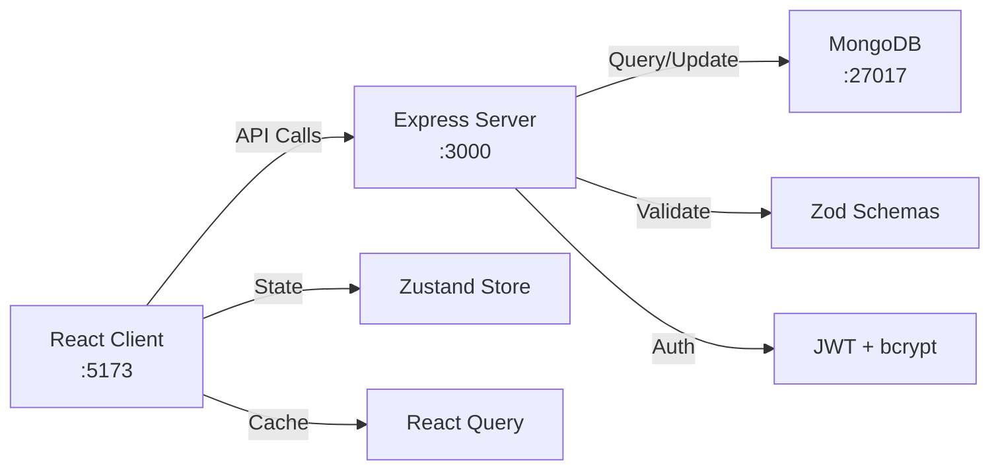

# Development Guide

Complete guide to setting up your development environment and contributing to the MI Digital Twin Management Service.

## Prerequisites

Install these before starting:

- **Node.js** 20+ - Download from [nodejs.org](https://nodejs.org)
- **Docker & Docker Compose** - Download from [docker.com](https://www.docker.com)
- **Git** - For version control

**Verify installation:**

```bash
node --version # Should be 20.0 or higher
docker --version # Should be 20.0 or higher
docker-compose --version
```

## Quick Setup (5 minutes)

### 1. Clone & Install Dependencies

```bash
# Clone repository
git clone <repo-url>
cd service-repository-digitaltwin-management-platform

# Install root dependencies (optional, for monorepo scripts)
npm install
```

### 2. Start Database

```bash
# Start MongoDB in the background
docker-compose up -d mongodb

# Verify it's running
docker-compose ps
```

### 3. Setup Backend (Terminal 1)

```bash
cd server
cp .env.example .env

# Install dependencies
npm install

# Seed database with initial data
npm run seed

# Start development server (port 3000)
npm run dev
```

### 4. Setup Frontend (Terminal 2)

```bash
cd client
cp .env.example .env

# Install dependencies
npm install

# Start Vite dev server (port 5173)
npm run dev
```

### 5. Access Application

- **Frontend:** http://localhost:5173
- **Backend API:** http://localhost:3000
- **Default Login:** admin / intact2025
- **MongoDB:** localhost:27017 (via mongo client or Mongo Express)

## Development Workflow

### Backend Development

**File:** `server/`

```bash
cd server
npm run dev # Start with hot reload
npm run lint # Check code style
npm run format # Fix formatting
```

**Key Commands:**

- `npm run seed` - Reset database with initial data
- `npm run start` - Production build

**Structure:**

- `src/routes/` - API endpoints
- `src/models/` - Mongoose schemas
- `src/middleware/` - Auth, validation, errors
- `src/validators/` - Zod schemas
- `src/app.ts` - Express entry point

**Testing:**

```bash
# Run tests (if available)
npm test
```

See [Backend Architecture](architecture/backend.md) for detailed structure.

### Frontend Development

**File:** `client/`

```bash
cd client
npm run dev # Start with HMR hot reload
npm run lint # Check code style
npm run format # Fix formatting
npm run build # Production build
npm run preview # Preview production build
```

**Key Commands:**

- `npm run build` - TypeScript check + Vite build
- `npm run preview` - Serve production build locally

**Structure:**

- `src/pages/` - Route components
- `src/components/` - Reusable UI components
- `src/lib/api.ts` - Centralized API client
- `src/store/` - Zustand state stores
- `src/types/` - TypeScript definitions

See [Frontend Architecture](architecture/frontend.md) for detailed structure.

## Code Style & Formatting

All code must follow project conventions before committing.

### Automatic Formatting

```bash
# Format all files in a module
cd server && npm run format
cd client && npm run format
```

### Code Quality Checks

```bash
# Lint code
cd server && npm run lint
cd client && npm run lint

# Fix lint issues automatically
cd server && npm run lint -- --fix
cd client && npm run lint -- --fix
```

### Style Guidelines

- **JavaScript/TypeScript:** Follow ESLint configuration
- **Styling:** Review [Styling Guide](design/styling.md)
- **UI Components:** Check [UI Patterns](design/ui-patterns.md)
- **Naming:** Use camelCase for variables/functions, PascalCase for components/classes

## Environment Configuration

### Backend (.env)

**Required variables:**

```env
PORT=3000
NODE_ENV=development
MONGODB_URI=mongodb://localhost:27017/intact
JWT_SECRET=your-secret-key-change-in-production
```

**Optional variables (see `.env.example`):**

```env
CORS_ORIGIN=http://localhost:5173
LOG_LEVEL=debug
```

### Frontend (.env)

**Required variables:**

```env
VITE_API_URL=http://localhost:3000
```

**Build environment:**

- Development: `vite build` with NODE_ENV=production
- Production: Same, deployed to CDN

See [Configuration Guide](installation/configuration.md) for all options.

## Git Workflow

### Before Committing

```bash
# 1. Update your branch with latest changes
git pull origin main

# 2. Create feature branch
git checkout -b feature/your-feature-name

# 3. Make your changes and test locally
npm run dev # Test in both client and server terminals

# 4. Format and lint
cd server && npm run format && npm run lint -- --fix
cd client && npm run format && npm run lint -- --fix

# 5. Stage and commit
git add .
git commit -m "Description of changes"

# 6. Push to remote
git push origin feature/your-feature-name
```

### Commit Message Format

Use descriptive commit messages:

```
feat: Add scenario execution API endpoint
fix: Resolve topology editor canvas rendering issue
docs: Update API documentation
refactor: Reorganize project service logic
test: Add unit tests for authentication middleware
```

### Pull Request Process

1. Push feature branch to remote
2. Create PR with detailed description
3. Request review from team members
4. Address review feedback
5. Merge when approved

## Testing

### Backend Testing

```bash
# Run all tests
cd server && npm test

# Run specific test file
cd server && npm test path/to/test.ts

# Watch mode
cd server && npm test --watch
```

### Frontend Testing

```bash
# Run all tests
cd client && npm test

# Run specific test file
cd client && npm test path/to/test.ts

# Watch mode
cd client && npm test --watch
```

### Manual Testing

1. **Backend:** Use Postman, curl, or VS Code REST Client

- Example: `http://localhost:3000/api/services`
- Auth header: `Authorization: Bearer <token>`

2. **Frontend:** Use browser DevTools

- Open http://localhost:5173
- Check Network tab for API calls
- Use React DevTools extension

See [API Reference](API.md) for all endpoints.

## Debugging

### Backend Debugging

```bash
# Start with V8 debugger
npm run --inspect-wait dev

# Then connect debugger in VS Code or Chrome DevTools
# chrome://inspect or VS Code debugger
```

**Browser-based:**

1. Open `chrome://inspect`
2. Click "inspect" next to Node process
3. Set breakpoints and step through code

**VS Code:**

1. Add breakpoints in editor
2. Open Run and Debug (Cmd+Shift+D)
3. Select "Node" configuration
4. Press play button

### Frontend Debugging

```bash
# React DevTools Chrome extension
# Vue DevTools (if applicable)
# Built-in browser DevTools (F12)
```

**Tips:**

- Check Network tab for API calls
- Check Console for JavaScript errors
- Use React DevTools to inspect component state
- Examine Zustand store in browser console: `window.__ZUSTAND_DEBUG__`

See [Debugging Guide](troubleshooting/debugging.md) for more techniques.

## Common Issues

**Port 3000 or 5173 already in use?**

```bash
# Kill process on port 3000
lsof -ti:3000 | xargs kill -9

# Kill process on port 5173
lsof -ti:5173 | xargs kill -9
```

**MongoDB connection fails?**

```bash
# Check if MongoDB is running
docker-compose ps

# Restart MongoDB
docker-compose restart mongodb

# Check logs
docker-compose logs mongodb
```

**Dependencies outdated?**

```bash
# Update all dependencies
cd server && npm update
cd client && npm update
```

**Strange behavior after git pull?**

```bash
# Clean install dependencies
cd server && rm -rf node_modules && npm install
cd client && rm -rf node_modules && npm install
```

See [Troubleshooting Guide](troubleshooting/common-issues.md) for more solutions.

## IDE Setup

### VS Code

**Recommended extensions:**

- ESLint
- Prettier
- Thunder Client (REST client)
- React Developer Tools
- MongoDB for VS Code

**Settings (`.vscode/settings.json`):**

```json
{
  "editor.defaultFormatter": "esbenp.prettier-vscode",
  "editor.formatOnSave": true,
  "[javascript][typescript]": {
    "editor.defaultFormatter": "esbenp.prettier-vscode"
  },
  "eslint.validate": ["javascript", "typescript"]
}
```

### WebStorm / IntelliJ IDEA

- Built-in ESLint and Prettier support
- Enable React and TypeScript plugins
- Configure run configurations for `npm run dev`

## Architecture Overview



**Data Flow:**

1. User interacts with React component
2. Component calls API via `lib/api.ts`
3. Server receives request at Express route
4. Middleware validates JWT token
5. Zod validates request body
6. Route handler queries MongoDB via Mongoose
7. Response returned to client
8. React Query caches result
9. Component updates with new data

See [Data Flow](architecture/data-flow.md) for detailed diagrams.

## Next Steps

- **Backend:** Review [Backend Architecture](architecture/backend.md)
- **Frontend:** Review [Frontend Architecture](architecture/frontend.md)
- **API:** Check [API Reference](API.md)
- **Components:** See [Component Reference](COMPONENTS.md)
- **Deployment:** Read [Deployment Guide](DEPLOYMENT.md)

## Contributing

1. Fork repository
2. Create feature branch (`git checkout -b feature/amazing-feature`)
3. Commit changes (`git commit -m 'Add amazing feature'`)
4. Push to branch (`git push origin feature/amazing-feature`)
5. Open Pull Request

Review [Styling Guide](design/styling.md) and [Architecture Overview](architecture/overview.md) before contributing.

## Support

- **Questions?** Check [Troubleshooting](troubleshooting/common-issues.md)
- **API Help?** See [API Reference](API.md)
- **Design Help?** See [UI Patterns](design/ui-patterns.md)
- **Deployment?** See [Deployment Guide](DEPLOYMENT.md)
