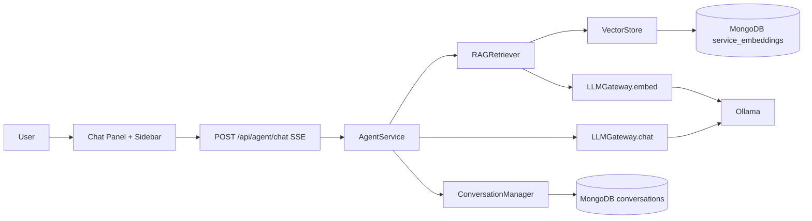
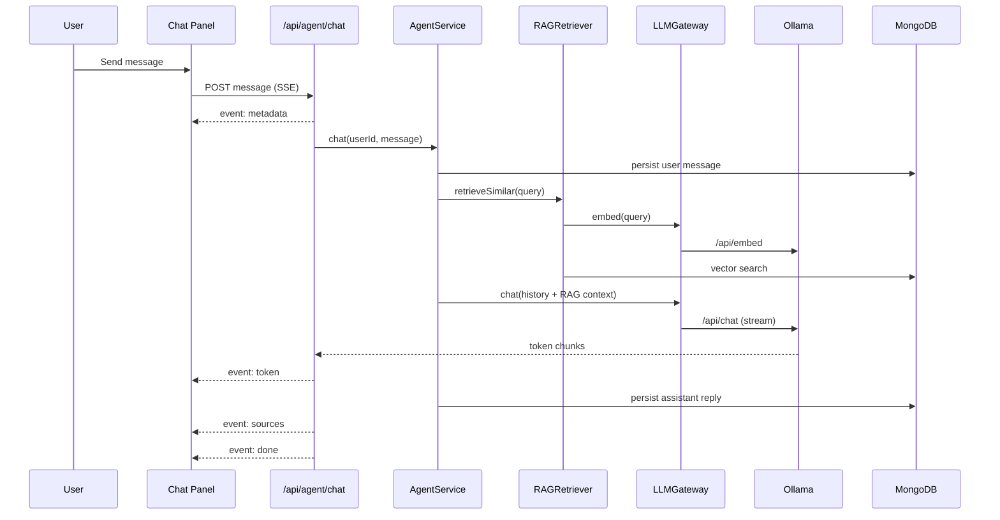

# Agent Architecture

Boss Agent architecture for conversational assistance over the service repository.

## Overview

## Backend Components

- `LLMGateway` (`server/src/agent/llm-gateway.ts`) wraps Ollama chat and embedding APIs.
- `RAGRetriever` (`server/src/agent/rag-retriever.ts`) builds service embedding text, indexes vectors, retrieves similar services, and formats context for prompts.
- `VectorStore` abstraction (`server/src/agent/vector-store.ts`) supports:
  - `MongoVectorStore` (`server/src/agent/stores/mongo-vector-store.ts`) using Mongo collection plus `$vectorSearch` (with cosine fallback).
  - `QdrantVectorStore` (`server/src/agent/stores/qdrant-vector-store.ts`) as optional fallback backend.
- `ConversationManager` (`server/src/agent/conversation-manager.ts`) persists per-user sessions and messages.
- `AgentService` (`server/src/agent/agent-service.ts`) orchestrates message handling, RAG retrieval, prompt assembly, and persistence.
- `agent.routes` (`server/src/agent/agent.routes.ts`) exposes health, chat SSE, conversations, and reindex endpoints.

## Frontend Components

- `agent-store` (`client/src/store/agent-store.ts`) manages panel state, conversations, messages, streaming tokens, and health.
- `agent-api` (`client/src/lib/agent-api.ts`) calls REST + SSE endpoints.
- UI components:
  - `ChatPanel`, `ChatFab`
  - `ConversationSidebar`
  - `ChatMessage`, `ChatInput`
  - `ServiceCard`, `AgentStatusBadge`

## Chat Request Flow

## Environment

- `OLLAMA_BASE_URL` default `http://localhost:11434`
- `OLLAMA_MODEL` default `qwen3:14b`
- `OLLAMA_EMBED_MODEL` default `nomic-embed-text`
- `VECTOR_DB_TYPE` default `mongodb` (`qdrant` optional)

## Operational Notes

- If embeddings are unavailable, chat still works with degraded retrieval quality.
- Reindex endpoint checks Ollama and embedding model readiness before running.
- Embeddings are auto-updated asynchronously on service create/update.
