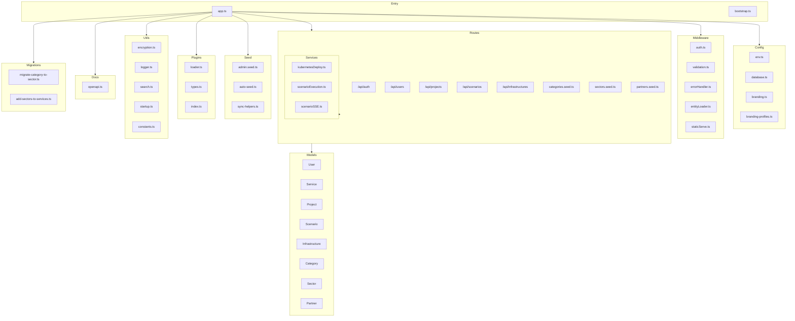
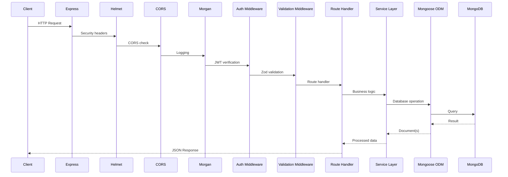
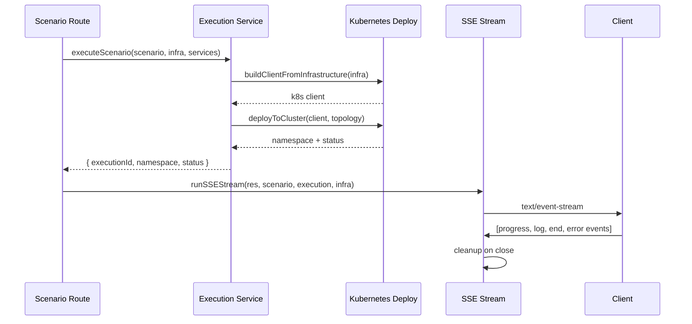

# Backend Architecture

Detailed architecture of the Express API server.

## Technology Stack

| Technology  | Version | Purpose                   |
| ----------- | ------- | ------------------------- |
| Node.js     | 20+     | JavaScript runtime        |
| Express     | 4+      | HTTP framework            |
| MongoDB     | 7+      | Document database         |
| Mongoose    | 8+      | ODM for MongoDB           |
| Zod         | 3+      | Schema validation         |
| JWT         | Latest  | Authentication tokens     |
| bcrypt      | Latest  | Password hashing          |
| compression | Latest  | gzip response compression |
| helmet      | Latest  | Security headers          |
| morgan      | Latest  | HTTP request logging      |

## Application Structure



## Directory Structure

```
server/src/
 app.ts                  # Application entry point
 bootstrap.ts            # Bootstrap utilities
 ci/                     # CI/CD integration tests

 config/
   database.ts           # MongoDB connection (mongoose)
   env.ts                # Environment variables (zod validation)
   branding.ts           # Branding configuration
   branding-profiles.ts  # Branding profiles

 middleware/
   auth.ts               # JWT authentication middleware
   validation.ts         # Zod validation middleware
   errorHandler.ts       # Global error handler
   entityLoader.ts       # Async handler + findById utilities
   staticServe.ts        # Static file serving for client build

 models/
   User.ts               # User schema
   Service.ts            # Service schema
   Project.ts            # Project schema
   Scenario.ts           # Scenario schema
   Infrastructure.ts     # Infrastructure schema
   Category.ts           # Category schema
   Sector.ts             # Sector schema
   Partner.ts            # Partner schema

 routes/
   auth.routes.ts        # Authentication endpoints
   users.routes.ts       # User management
   services.routes.ts    # Service CRUD
   projects.routes.ts    # Project CRUD
   scenarios.routes.ts   # Scenario CRUD + execution
   infrastructures.routes.ts  # Infrastructure CRUD
   categories.routes.ts  # Category endpoints
   sectors.routes.ts     # Sector endpoints
   partners.routes.ts    # Partner endpoints

 seed/
   index.ts              # Seed entry point
   admin.seed.ts         # Seed admin user
   categories.seed.ts    # Seed categories
   services.seed.ts      # Seed sample services
   partners.seed.ts      # Seed partners
   sectors.seed.ts       # Seed sectors
   auto-seed.ts          # Auto-seed if database is empty
   sync-helpers.ts       # Seed sync utilities

 services/
   kubernetesDeploy.ts   # Kubernetes deployment service
   scenarioExecution.ts  # Scenario execution service
   scenarioSSE.ts        # Server-sent events streaming

 plugins/
   types.ts              # Plugin type definitions
   loader.ts             # Plugin loader
   index.ts              # Plugin registry

 utils/
   encryption.ts         # AES-256-GCM encryption
   logger.ts             # Structured logging
   search.ts             # Search utilities
   startup.ts            # Startup checks and health
   constants.ts          # Application constants

 docs/
   openapi.ts            # OpenAPI 3.0 specification generator

 migrations/
   migrate-category-to-sector.ts  # Category → Sector migration
   add-sectors-to-services.ts     # Add sectors to services

 __tests__/              # Unit tests co-located with source
```

## Request Lifecycle



## API Routes

### Authentication (`/api/auth`)

| Method | Endpoint  | Description       |
| ------ | --------- | ----------------- |
| POST   | `/login`  | Authenticate user |
| GET    | `/me`     | Get current user  |
| POST   | `/logout` | Clear session     |

### Users (`/api/users`)

| Method | Endpoint        | Description                 |
| ------ | --------------- | --------------------------- |
| GET    | `/`             | List all users              |
| POST   | `/`             | Create user                 |
| PUT    | `/:id`          | Update user (admin only)    |
| PUT    | `/:id/password` | Change password             |
| PATCH  | `/:id/password` | Reset password (admin only) |
| DELETE | `/:id`          | Delete user (admin only)    |

### Services (`/api/services`)

| Method | Endpoint | Description                  |
| ------ | -------- | ---------------------------- |
| GET    | `/`      | List services (with filters) |
| GET    | `/:id`   | Get service details          |
| POST   | `/`      | Create service               |
| PUT    | `/:id`   | Update service               |
| DELETE | `/:id`   | Delete service               |

### Projects (`/api/projects`)

| Method | Endpoint | Description                |
| ------ | -------- | -------------------------- |
| GET    | `/`      | List projects              |
| GET    | `/:id`   | Get project with scenarios |
| POST   | `/`      | Create project             |
| PUT    | `/:id`   | Update project             |
| DELETE | `/:id`   | Delete project             |

### Scenarios (`/api/scenarios`)

| Method | Endpoint                                  | Description                   |
| ------ | ----------------------------------------- | ----------------------------- |
| GET    | `/projects/:projectId/scenarios`          | List project scenarios        |
| POST   | `/projects/:projectId/scenarios`          | Create scenario               |
| GET    | `/:id`                                    | Get scenario details          |
| PUT    | `/:id`                                    | Update scenario               |
| DELETE | `/:id`                                    | Delete scenario               |
| POST   | `/:id/execute`                            | Execute scenario (deploy)     |
| GET    | `/:id/executions/:executionId/events`     | Stream execution events (SSE) |
| PUT    | `/:id/executions/:executionId/status`     | Update execution status       |
| POST   | `/:id/executions/:executionId/conclusion` | Add execution conclusion      |
| DELETE | `/:id/executions/:executionId`            | Tear down deployment          |

### Infrastructures (`/api/infrastructures`)

| Method | Endpoint    | Description           |
| ------ | ----------- | --------------------- |
| GET    | `/`         | List infrastructures  |
| GET    | `/:id`      | Get infrastructure    |
| POST   | `/`         | Create infrastructure |
| PUT    | `/:id`      | Update infrastructure |
| DELETE | `/:id`      | Delete infrastructure |
| POST   | `/:id/test` | Test connection       |

### Categories (`/api/categories`)

| Method | Endpoint | Description     |
| ------ | -------- | --------------- |
| GET    | `/`      | List categories |
| GET    | `/:id`   | Get category    |
| POST   | `/`      | Create category |
| PUT    | `/:id`   | Update category |
| DELETE | `/:id`   | Delete category |

### Sectors (`/api/sectors`)

| Method | Endpoint | Description      |
| ------ | -------- | ---------------- |
| GET    | `/`      | List all sectors |

### Partners (`/api/partners`)

| Method | Endpoint | Description                         |
| ------ | -------- | ----------------------------------- |
| GET    | `/`      | List partners (deprecated excluded) |

## Middleware Chain

### Authentication Middleware

```typescript
// Verify JWT and attach user to request
const authMiddleware = async (req, res, next) => {
  const token = req.headers.authorization?.split(' ')[1];
  if (!token) return res.status(401).json({ error: 'Unauthorized' });

  const decoded = jwt.verify(token, process.env.JWT_SECRET);
  req.user = await User.findById(decoded.userId);
  next();
};
```

### Validation Middleware

```typescript
// Validate request body against Zod schema
const validate = (schema: ZodSchema) => (req, res, next) => {
  const result = schema.safeParse(req.body);
  if (!result.success) {
    return res.status(400).json({ errors: result.error.errors });
  }
  req.body = result.data;
  next();
};
```

### Error Handler

```typescript
// Global error handler
const errorHandler = (err, req, res, next) => {
  console.error(err);

  if (err.name === 'ValidationError') {
    return res.status(400).json({ error: err.message });
  }
  if (err.name === 'JsonWebTokenError') {
    return res.status(401).json({ error: 'Invalid token' });
  }

  res.status(500).json({ error: 'Internal server error' });
};
```

### Entity Loader

```typescript
// Async wrapper that catches and converts errors to HTTP responses
const asyncHandler = (fn: Function) => async (req, res, next) => {
  try {
    await fn(req, res, next);
  } catch (err) {
    next(err);
  }
};

// Find and return document or throw 404
const findById = async (Model, id, populate?) => {
  const doc = await Model.findById(id).populate(populate);
  if (!doc) throw new AppError('Not found', 404);
  return doc;
};
```

## Security Implementation

### Password Hashing

```typescript
// Using bcrypt with cost factor 12
const hashedPassword = await bcrypt.hash(password, 12);
const isValid = await bcrypt.compare(password, hashedPassword);
```

### JWT Tokens

```typescript
// Token generation
const token = jwt.sign({ userId: user._id }, process.env.JWT_SECRET, { expiresIn: '24h' });
```

### Credential Encryption

```typescript
// AES-256-GCM for infrastructure credentials
const encrypted = encrypt(sensitiveData, process.env.ENCRYPTION_KEY);
const decrypted = decrypt(encrypted, process.env.ENCRYPTION_KEY);
```

### Helmet Configuration

```typescript
// Security headers with relaxed CSP for frontend assets
app.use(
  helmet({
    contentSecurityPolicy: {
      useDefaults: false,
      directives: {
        defaultSrc: ["'self'"],
        scriptSrc: ["'self'", "'unsafe-inline'", "'unsafe-eval'", 'cdn.jsdelivr.net'],
        styleSrc: ["'self'", "'unsafe-inline'", 'cdn.jsdelivr.net', 'fonts.googleapis.com'],
        fontSrc: ["'self'", 'fonts.gstatic.com', 'cdn.jsdelivr.net'],
        imgSrc: ["'self'", 'data:', 'blob:'],
        connectSrc: ["'self'", 'cdn.jsdelivr.net'],
        workerSrc: ["'self'", 'blob:'],
        frameSrc: ["'self'"],
      },
    },
  })
);
```

## Database Connection

```typescript
// config/database.ts
mongoose.connect(process.env.MONGODB_URI, {
  serverSelectionTimeoutMS: 5000,
  socketTimeoutMS: 45000,
});

mongoose.connection.on('connected', () => {
  console.log('MongoDB connected');
});

mongoose.connection.on('error', (err) => {
  console.error('MongoDB error:', err);
});
```

## Startup Sequence

1. **Environment validation** — validates required env vars via Zod
2. **MongoDB connection test** — verifies connectivity before listening
3. **Database connection** — establishes persistent mongoose connection
4. **Auto-seed** — seeds database if empty (for cloud deployments)
5. **Listen** — starts HTTP server

```typescript
// utils/startup.ts
const runStartupChecks = async () => {
  const envOk = validateEnv(); // Zod validation
  const dbOk = await testDbConnection(); // MongoDB ping
  return envOk && dbOk;
};
```

## Graceful Shutdown

```typescript
// Handle shutdown signals
const gracefulShutdown = async (signal: string): Promise<void> => {
  console.info(`${signal} received. Shutting down gracefully...`);

  try {
    await disconnectDatabase();
    console.info('Closed all connections');
    process.exit(0);
  } catch (error) {
    console.error('Error during shutdown:', error);
    process.exit(1);
  }
};

process.on('SIGTERM', () => gracefulShutdown('SIGTERM'));
process.on('SIGINT', () => gracefulShutdown('SIGINT'));
```

## Scenario Execution Flow



## Related Documentation

- [Architecture Overview](overview.md)
- [Database Schema](../database/schema.md)
- [Data Flow](data-flow.md)
- [Kubernetes Execution](../integration/kubernetes-execution.md)
