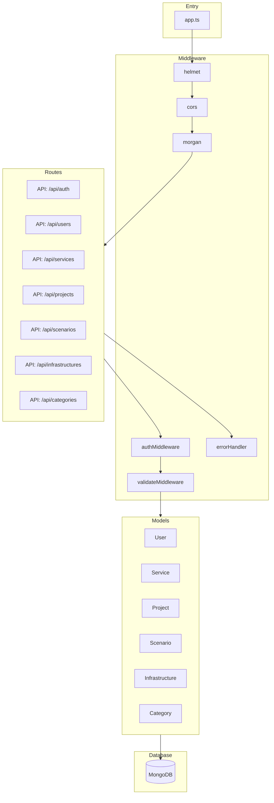
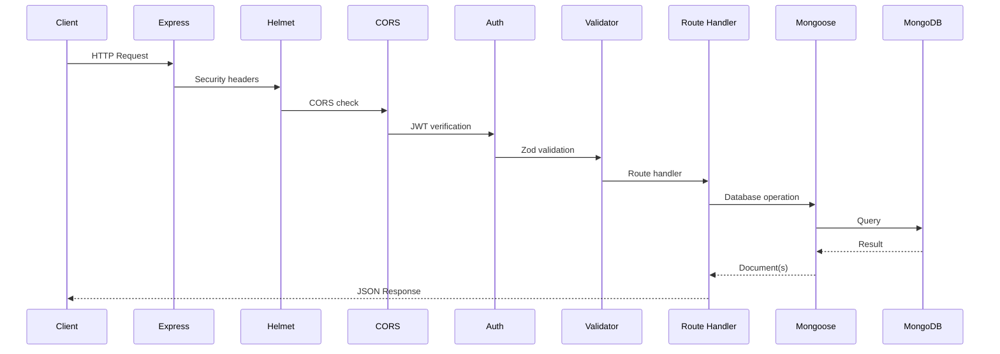

# Backend Architecture

Detailed architecture of the Express API server.

## Technology Stack

| Technology | Version | Purpose               |
| ---------- | ------- | --------------------- |
| Bun        | 1.0+    | JavaScript runtime    |
| Express    | 4+      | HTTP framework        |
| MongoDB    | 7+      | Document database     |
| Mongoose   | 8+      | ODM for MongoDB       |
| Zod        | 3+      | Schema validation     |
| JWT        | Latest  | Authentication tokens |
| bcrypt     | Latest  | Password hashing      |

## Application Structure



## Directory Structure

```
server/src/
 config/
 database.ts # MongoDB connection
 env.ts # Environment variables

 middleware/
 auth.ts # JWT authentication
 validate.ts # Zod validation
 errorHandler.ts # Error handling

 models/
 User.ts # User schema
 Service.ts # Service schema
 Project.ts # Project schema
 Scenario.ts # Scenario schema
 Infrastructure.ts # Infrastructure schema
 Category.ts # Category schema
 Sector.ts # Sector schema

 routes/
 auth.ts # Authentication endpoints
 users.ts # User management
 services.ts # Service CRUD
 projects.ts # Project CRUD
 scenarios.ts # Scenario CRUD
 infrastructures.ts # Infrastructure CRUD
 categories.ts # Category endpoints

 validators/
 *.ts # Zod schemas per route

 seed/
 index.ts # Seed entry point
 users.ts # Seed admin user
 categories.ts # Seed categories
 services.ts # Seed sample services

 utils/
 encryption.ts # AES-256-GCM encryption

 app.ts # Application entry
```

## Request Lifecycle



## API Routes

### Authentication (`/api/auth`)

| Method | Endpoint  | Description       |
| ------ | --------- | ----------------- |
| POST   | `/login`  | Authenticate user |
| GET    | `/me`     | Get current user  |
| POST   | `/logout` | Clear session     |

### Users (`/api/users`)

| Method | Endpoint        | Description    |
| ------ | --------------- | -------------- |
| GET    | `/`             | List all users |
| POST   | `/`             | Create user    |
| DELETE | `/:id`          | Delete user    |
| PATCH  | `/:id/password` | Reset password |

### Services (`/api/services`)

| Method | Endpoint        | Description                  |
| ------ | --------------- | ---------------------------- |
| GET    | `/`             | List services (with filters) |
| GET    | `/:id`          | Get service details          |
| POST   | `/`             | Create service               |
| PUT    | `/:id`          | Update service               |
| DELETE | `/:id`          | Delete service               |
| POST   | `/:id/versions` | Add version                  |

### Projects (`/api/projects`)

| Method | Endpoint | Description                |
| ------ | -------- | -------------------------- |
| GET    | `/`      | List projects              |
| GET    | `/:id`   | Get project with scenarios |
| POST   | `/`      | Create project             |
| PUT    | `/:id`   | Update project             |
| DELETE | `/:id`   | Delete project             |

### Scenarios (`/api/scenarios`)

| Method | Endpoint                         | Description            |
| ------ | -------------------------------- | ---------------------- |
| GET    | `/projects/:projectId/scenarios` | List project scenarios |
| POST   | `/projects/:projectId/scenarios` | Create scenario        |
| GET    | `/:id`                           | Get scenario details   |
| PUT    | `/:id`                           | Update scenario        |
| DELETE | `/:id`                           | Delete scenario        |
| POST   | `/:id/execute`                   | Execute scenario       |

## Middleware Chain

### Authentication Middleware

```typescript
// Verify JWT and attach user to request
const authMiddleware = async (req, res, next) => {
  const token = req.headers.authorization?.split(' ')[1];
  if (!token) return res.status(401).json({ error: 'Unauthorized' });

  const decoded = jwt.verify(token, process.env.JWT_SECRET);
  req.user = await User.findById(decoded.userId);
  next();
};
```

### Validation Middleware

```typescript
// Validate request body against Zod schema
const validate = (schema: ZodSchema) => (req, res, next) => {
  const result = schema.safeParse(req.body);
  if (!result.success) {
    return res.status(400).json({ errors: result.error.errors });
  }
  req.body = result.data;
  next();
};
```

### Error Handler

```typescript
// Global error handler
const errorHandler = (err, req, res, next) => {
  console.error(err);

  if (err.name === 'ValidationError') {
    return res.status(400).json({ error: err.message });
  }
  if (err.name === 'JsonWebTokenError') {
    return res.status(401).json({ error: 'Invalid token' });
  }

  res.status(500).json({ error: 'Internal server error' });
};
```

## Security Implementation

### Password Hashing

```typescript
// Using bcrypt with cost factor 12
const hashedPassword = await bcrypt.hash(password, 12);
const isValid = await bcrypt.compare(password, hashedPassword);
```

### JWT Tokens

```typescript
// Token generation
const token = jwt.sign({ userId: user._id }, process.env.JWT_SECRET, { expiresIn: '24h' });
```

### Credential Encryption

```typescript
// AES-256-GCM for infrastructure credentials
const encrypted = encrypt(sensitiveData, process.env.ENCRYPTION_KEY);
const decrypted = decrypt(encrypted, process.env.ENCRYPTION_KEY);
```

## Database Connection

```typescript
// config/database.ts
mongoose.connect(process.env.MONGODB_URI, {
  serverSelectionTimeoutMS: 5000,
  socketTimeoutMS: 45000,
});

mongoose.connection.on('connected', () => {
  console.log('MongoDB connected');
});

mongoose.connection.on('error', (err) => {
  console.error('MongoDB error:', err);
});
```

## Graceful Shutdown

```typescript
// Handle shutdown signals
const shutdown = async () => {
  console.log('Shutting down...');
  await mongoose.connection.close();
  process.exit(0);
};

process.on('SIGTERM', shutdown);
process.on('SIGINT', shutdown);
```

## Related Documentation

- [Architecture Overview](overview.md)
- [Database Schema](../database/schema.md)
- [Data Flow](data-flow.md)
