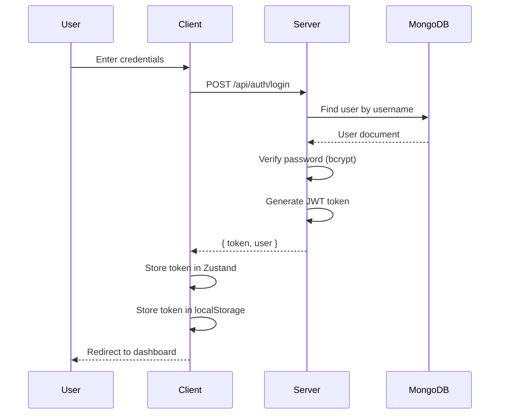
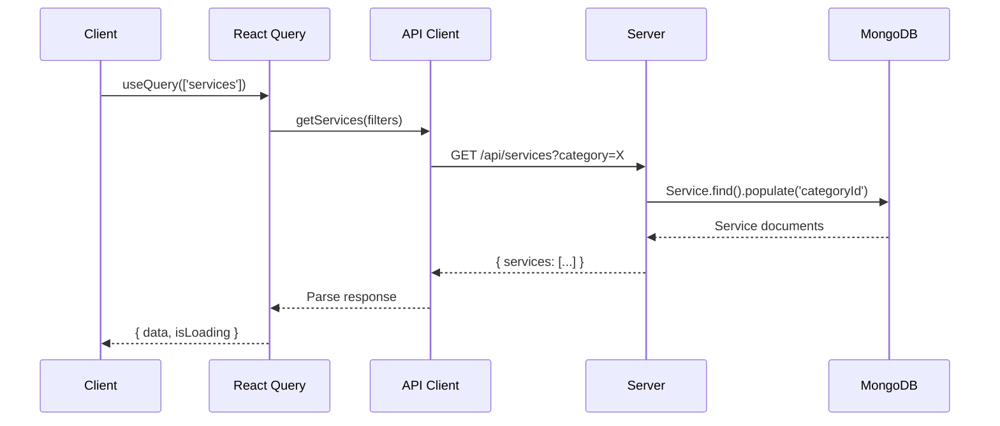
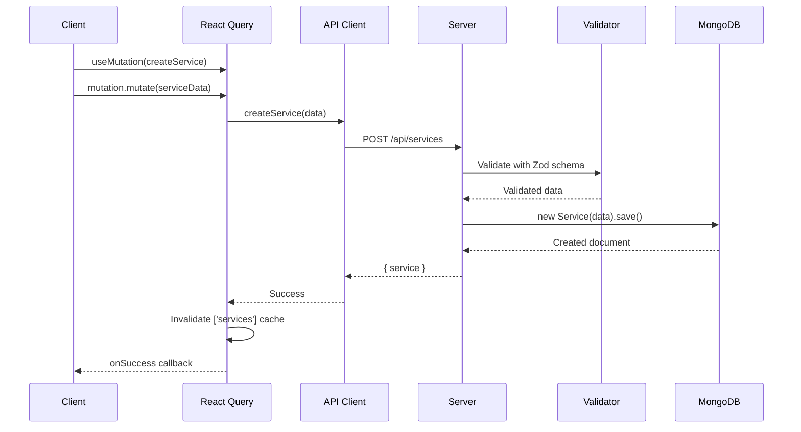
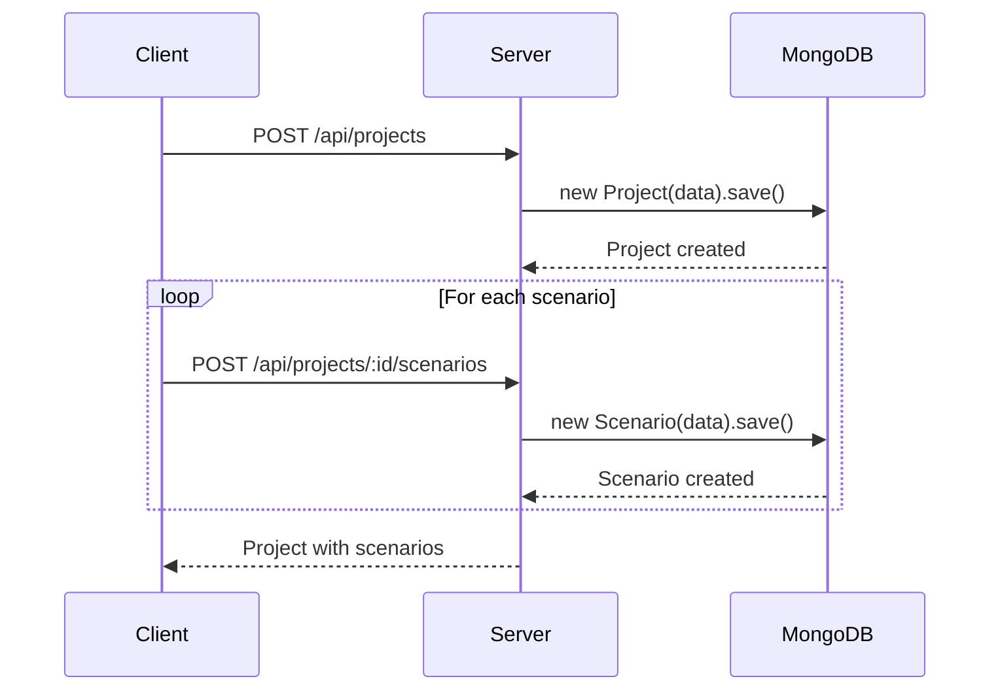
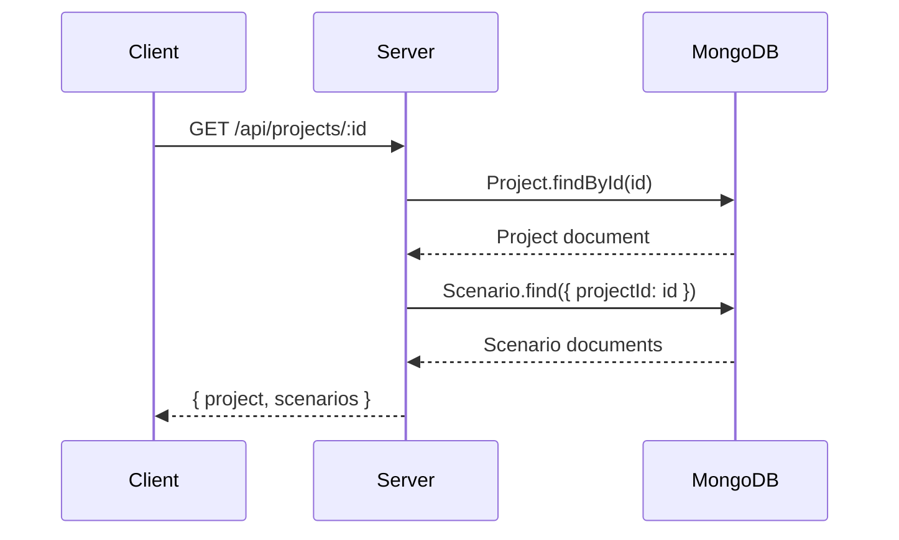
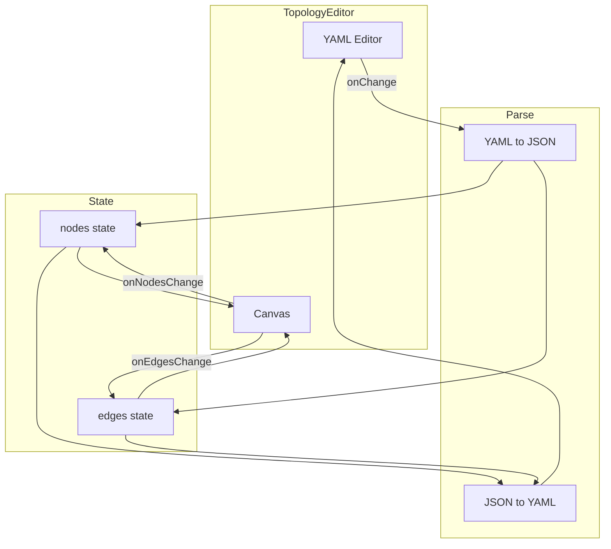
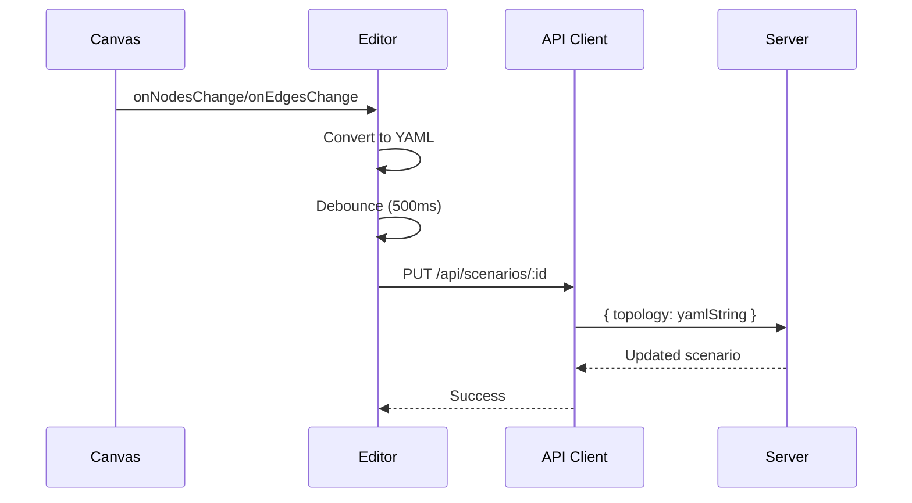
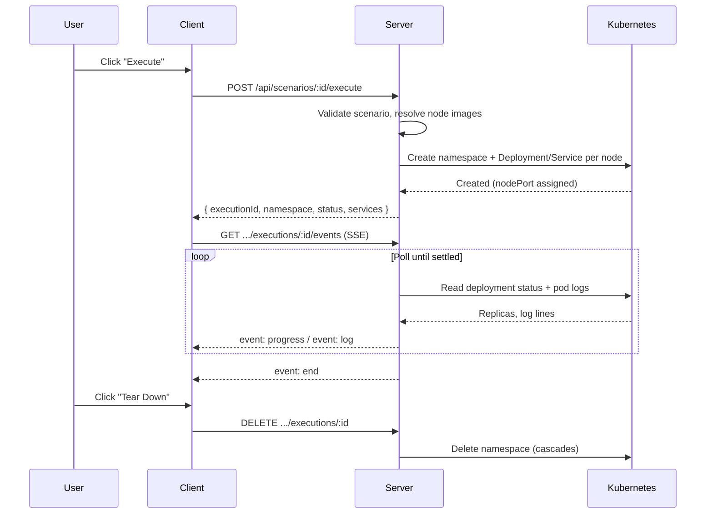
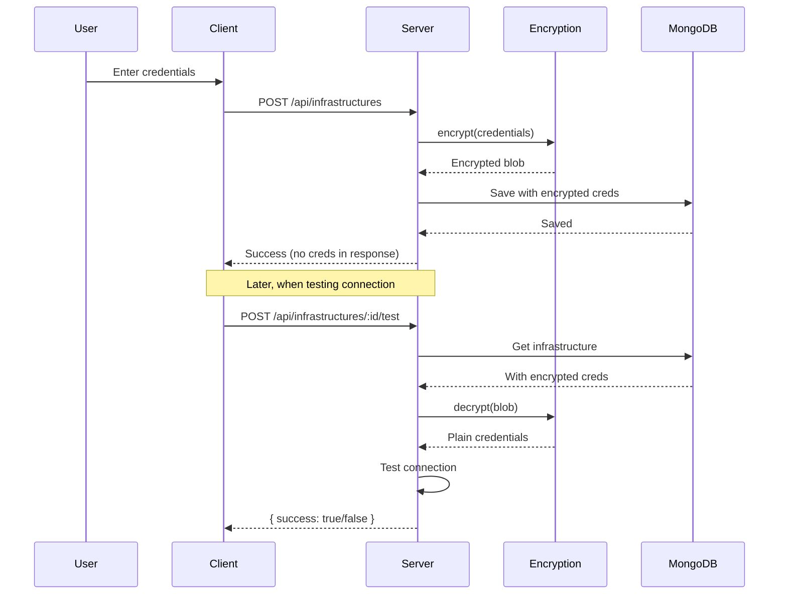
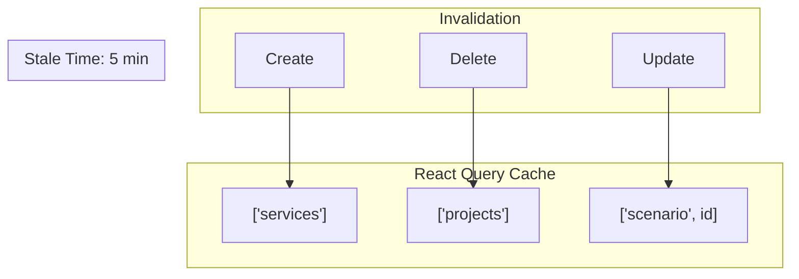

# Data Flow

Request/response flows and data transformation patterns in the application.

## Authentication Flow



## Service CRUD Flow

### List Services



### Create Service



## Project & Scenario Flow

### Create Project with Scenarios



### Load Project Detail



## Topology Data Flow

### Sync YAML and Canvas



### Save Topology



## Scenario Execution Flow



See [Kubernetes Execution](../integration/kubernetes-execution.md) for the full
resource model and SSE event payloads.

## Infrastructure Credential Flow



## Data Transformation Patterns

### API Response Format

```typescript
// Success response
{
 "data": { ... },
 "meta": {
 "total": 100,
 "page": 1,
 "limit": 20
 }
}

// Error response
{
 "error": "Error message",
 "details": [...]
}
```

### Query Parameter Mapping

| Client Filter | API Parameter    | MongoDB Query                  |
| ------------- | ---------------- | ------------------------------ |
| `category`    | `?category=id`   | `{ categoryId: id }`           |
| `search`      | `?search=term`   | `{ $text: { $search: term } }` |
| `status`      | `?status=active` | `{ status: 'active' }`         |
| `page`        | `?page=2`        | `.skip(20)`                    |
| `limit`       | `?limit=20`      | `.limit(20)`                   |

## Caching Strategy



## Related Documentation

- [Architecture Overview](overview.md)
- [Frontend Architecture](frontend.md)
- [Backend Architecture](backend.md)
