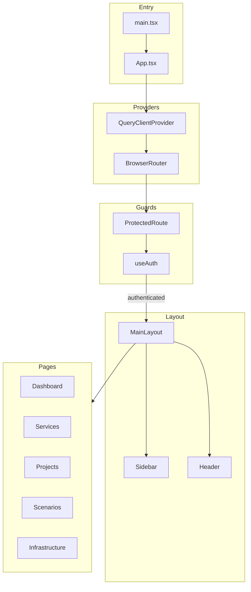
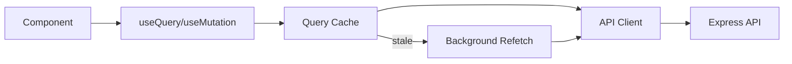
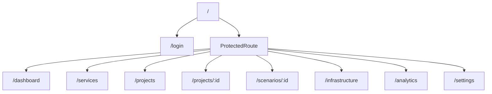
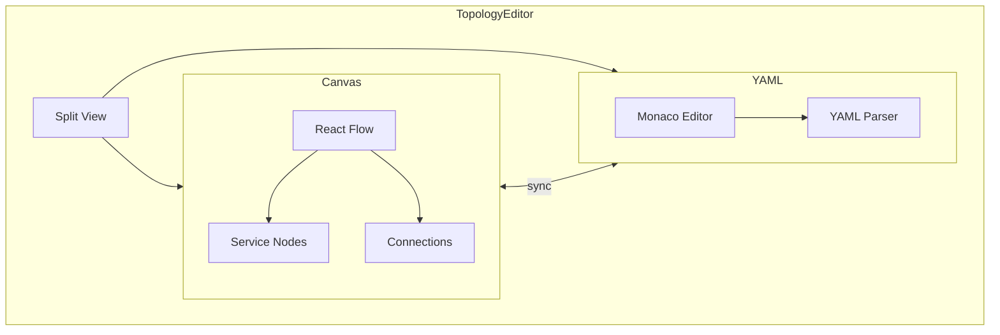

# Frontend Architecture

Detailed architecture of the React client application.

## Technology Stack

| Technology    | Version | Purpose                   |
| ------------- | ------- | ------------------------- |
| React         | 18+     | UI framework              |
| TypeScript    | 5+      | Type safety               |
| Vite          | 5+      | Build tool and dev server |
| Tailwind CSS  | 3+      | Utility-first styling     |
| shadcn/ui     | Latest  | Component library         |
| React Query   | 5+      | Server state management   |
| Zustand       | 4+      | Client state management   |
| React Router  | 6+      | Client-side routing       |
| React Flow    | 12+     | Node-based canvas         |
| Monaco Editor | Latest  | Code/YAML editing         |

## Application Structure



## Directory Structure

```
client/src/
├── components/
│   ├── ui/              # shadcn/ui primitives
│   │   ├── button.tsx
│   │   ├── dialog.tsx
│   │   ├── form.tsx
│   │   └── ...
│   ├── layout/          # Application layout
│   │   ├── MainLayout.tsx
│   │   ├── Sidebar.tsx
│   │   └── ProtectedRoute.tsx
│   ├── topology/        # Topology editor
│   │   ├── TopologyEditor.tsx
│   │   ├── TopologyCanvas.tsx
│   │   └── YamlEditor.tsx
│   ├── services/        # Service components
│   ├── projects/        # Project components
│   └── scenarios/       # Scenario components
│
├── pages/               # Route pages
│   ├── Dashboard.tsx
│   ├── Services.tsx
│   ├── Projects.tsx
│   ├── ProjectDetail.tsx
│   ├── ScenarioDetail.tsx
│   ├── Infrastructure.tsx
│   ├── Analytics.tsx
│   ├── Settings.tsx
│   └── Login.tsx
│
├── lib/
│   ├── api.ts           # API client (axios)
│   ├── utils.ts         # Utility functions
│   └── pdf-export.ts    # PDF generation
│
├── store/
│   ├── auth-store.ts    # Authentication state
│   └── workspace-store.ts # Tab/workspace state
│
├── hooks/               # Custom React hooks
│   └── use-*.ts
│
├── types/               # TypeScript definitions
│   └── index.ts
│
├── App.tsx              # Root component
├── main.tsx             # Entry point
└── index.css            # Global styles
```

## State Management

### Server State (React Query)



Configuration:

```typescript
const queryClient = new QueryClient({
  defaultOptions: {
    queries: {
      staleTime: 5 * 60 * 1000, // 5 minutes
      retry: 1,
    },
  },
});
```

Usage patterns:

```typescript
// Fetching data
const { data, isLoading } = useQuery({
  queryKey: ['services'],
  queryFn: () => api.getServices(),
});

// Mutations with cache invalidation
const mutation = useMutation({
  mutationFn: api.createService,
  onSuccess: () => {
    queryClient.invalidateQueries({ queryKey: ['services'] });
  },
});
```

### Client State (Zustand)

```typescript
// auth-store.ts
interface AuthState {
  user: User | null;
  token: string | null;
  login: (credentials) => Promise<void>;
  logout: () => void;
}

// workspace-store.ts
interface WorkspaceState {
  openTabs: Tab[];
  activeTab: string | null;
  openTab: (tab: Tab) => void;
  closeTab: (id: string) => void;
}
```

## Routing Structure



## Component Patterns

### Page Components

Pages are lazy-loaded route components:

```typescript
const Dashboard = lazy(() => import('./pages/Dashboard'));
```

### Feature Components

Organized by domain (services, projects, scenarios):

```typescript
// components/services/
├── ServiceCard.tsx
├── ServiceForm.tsx
├── ServiceTable.tsx
└── ServiceDrawer.tsx
```

### UI Components

shadcn/ui primitives in `components/ui/`:

- Built on Radix UI
- Styled with Tailwind
- Fully customizable

## Styling Approach

### Tailwind Configuration

```typescript
// tailwind.config.js
{
  theme: {
    extend: {
      colors: {
        border: "hsl(var(--border))",
        background: "hsl(var(--background))",
        foreground: "hsl(var(--foreground))",
        // ... shadcn color tokens
      },
    },
  },
}
```

### Component Styling

```tsx
// Using cn() utility for conditional classes
<Button className={cn('base-styles', variant === 'primary' && 'primary-styles', className)} />
```

## Topology Editor



Features:

- Drag-and-drop service nodes
- Visual connection creation
- Split-screen YAML/visual editing
- Real-time synchronization

## Performance Considerations

| Technique      | Implementation             |
| -------------- | -------------------------- |
| Code Splitting | Lazy-loaded routes         |
| Query Caching  | 5-minute stale time        |
| Memoization    | React.memo for lists       |
| Virtual Lists  | For large service catalogs |
| Debouncing     | Search inputs              |

## Related Documentation

- [Architecture Overview](overview.md)
- [UI Patterns](../design/ui-patterns.md)
- [Styling Guide](../design/styling.md)
