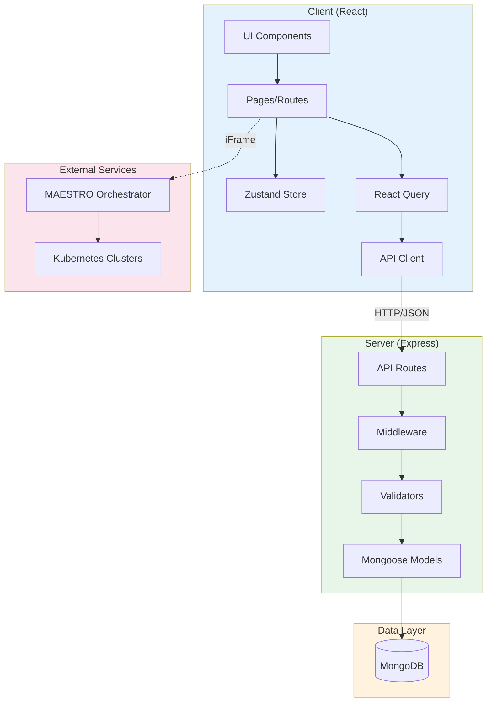
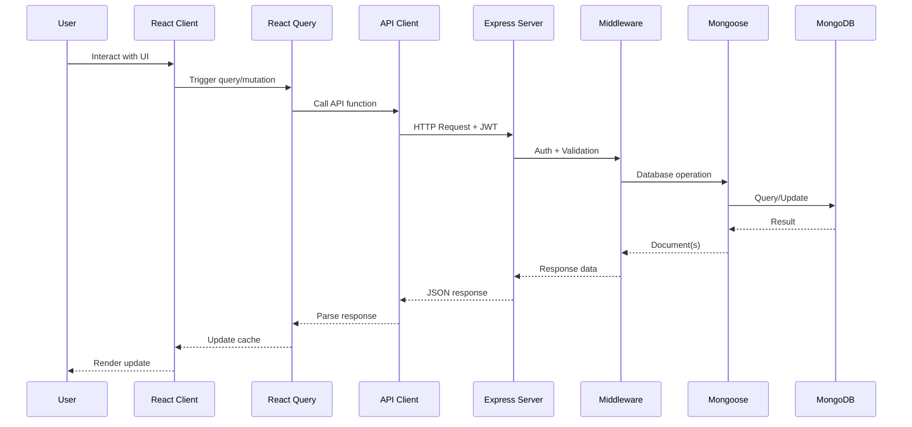
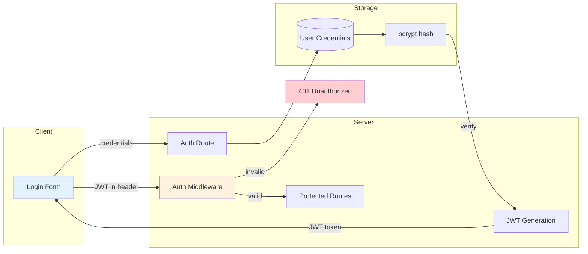

# Architecture Overview

High-level system architecture of the INTACT Digital Twin Management Platform.

## System Architecture



## Component Overview

### Frontend (Client)

| Component      | Technology               | Purpose                       |
| -------------- | ------------------------ | ----------------------------- |
| UI Framework   | React 18                 | Component-based UI            |
| Build Tool     | Vite                     | Fast development and bundling |
| Styling        | Tailwind CSS + shadcn/ui | Utility-first styling         |
| State (Server) | React Query              | API data fetching and caching |
| State (Client) | Zustand                  | Local UI state                |
| Routing        | React Router v6          | SPA navigation                |
| Editor         | Monaco Editor            | YAML topology editing         |
| Canvas         | React Flow               | Visual topology designer      |

### Backend (Server)

| Component      | Technology         | Purpose                  |
| -------------- | ------------------ | ------------------------ |
| Runtime        | Bun                | Fast JavaScript runtime  |
| Framework      | Express.js         | HTTP server and routing  |
| Database       | MongoDB + Mongoose | Document storage and ODM |
| Validation     | Zod                | Schema validation        |
| Authentication | JWT                | Stateless auth tokens    |
| Encryption     | AES-256-GCM        | Credential encryption    |

## Request Flow



## Directory Structure

```
/
├── client/                 # React frontend
│   └── src/
│       ├── components/     # UI components
│       │   ├── ui/         # shadcn/ui primitives
│       │   ├── layout/     # Layout components
│       │   ├── topology/   # Topology editor
│       │   └── ...         # Feature components
│       ├── pages/          # Route pages
│       ├── lib/            # Utilities and API client
│       ├── store/          # Zustand stores
│       ├── hooks/          # Custom React hooks
│       └── types/          # TypeScript types
│
├── server/                 # Express backend
│   └── src/
│       ├── routes/         # API endpoints
│       ├── models/         # Mongoose schemas
│       ├── middleware/     # Auth, validation, errors
│       ├── validators/     # Zod schemas
│       ├── config/         # Environment, database
│       ├── seed/           # Database seeding
│       └── utils/          # Encryption, helpers
│
└── docs/                   # Technical documentation
```

## Key Design Decisions

### Monorepo Structure

The project uses a simple monorepo with `client/` and `server/` workspaces, enabling:

- Shared development workflow
- Coordinated deployments
- Simplified CI/CD

### Bun Runtime

Bun provides:

- Faster package installation
- Native TypeScript execution
- Compatible with npm ecosystem

### MongoDB Document Model

MongoDB suits this application because:

- Flexible schema for varied service metadata
- Document references for relationships
- Native JSON API compatibility

### React Query for Server State

Separates concerns:

- Server state (API data) in React Query
- Client state (UI) in Zustand
- Automatic cache invalidation and refetching

## Security Architecture



### Security Measures

| Layer          | Measure                          |
| -------------- | -------------------------------- |
| Passwords      | bcrypt hashing (cost 12)         |
| Authentication | JWT tokens (24h expiry)          |
| Credentials    | AES-256-GCM encryption           |
| API            | Zod validation on all inputs     |
| Transport      | HTTPS in production              |
| CORS           | Restricted to application domain |

## Related Documentation

- [Frontend Architecture](frontend.md)
- [Backend Architecture](backend.md)
- [Data Flow](data-flow.md)
- [Database Schema](../database/schema.md)
