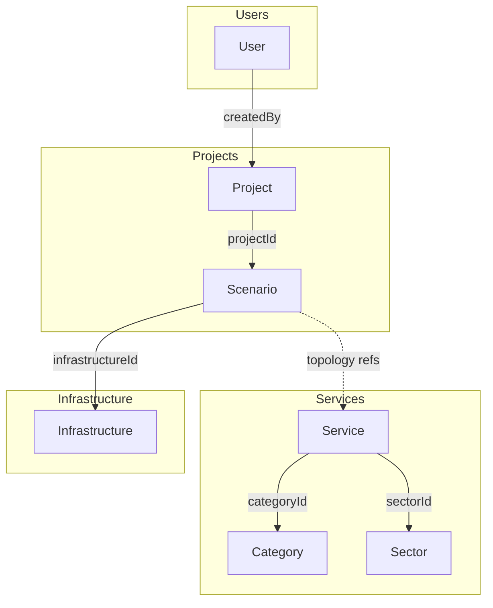

# Database Relationships

Document reference patterns and relationship management in MongoDB.

## Relationship Overview



## Reference Patterns

### ObjectId References

MongoDB uses ObjectId references for document relationships:

```typescript
// Service referencing Category
const serviceSchema = new Schema({
  categoryId: {
    type: Schema.Types.ObjectId,
    ref: 'Category',
    required: true,
  },
});

// Scenario referencing Project
const scenarioSchema = new Schema({
  projectId: {
    type: Schema.Types.ObjectId,
    ref: 'Project',
    required: true,
  },
});
```

### Population

Use Mongoose `.populate()` to resolve references:

```typescript
// Single reference
const service = await Service.findById(id).populate('categoryId');

// Multiple references
const scenario = await Scenario.findById(id).populate('projectId').populate('infrastructureId');

// Selective population
const service = await Service.findById(id).populate('categoryId', 'name color');
```

## Relationship Details

### User → Project (One-to-Many)

A user can create multiple projects.

```typescript
// Project schema
{
  createdBy: {
    type: Schema.Types.ObjectId,
    ref: 'User',
    required: true
  }
}

// Query projects by user
const userProjects = await Project.find({ createdBy: userId });
```

### Project → Scenario (One-to-Many)

A project contains multiple scenarios.

```typescript
// Scenario schema
{
  projectId: {
    type: Schema.Types.ObjectId,
    ref: 'Project',
    required: true
  }
}

// Query scenarios by project
const projectScenarios = await Scenario.find({ projectId });

// Get project with scenario count
const project = await Project.findById(id);
const scenarioCount = await Scenario.countDocuments({ projectId: id });
```

### Service → Category (Many-to-One)

Services are grouped by categories.

```typescript
// Service schema
{
  categoryId: {
    type: Schema.Types.ObjectId,
    ref: 'Category',
    required: true
  }
}

// Query services by category
const categoryServices = await Service.find({ categoryId });

// Get services with category details
const services = await Service.find()
  .populate('categoryId', 'name description color');
```

### Service → Sector (Many-to-One, Optional)

Services may belong to a specific sector.

```typescript
// Service schema
{
  sectorId: {
    type: Schema.Types.ObjectId,
    ref: 'Sector',
    required: false
  }
}

// Query services by sector
const sectorServices = await Service.find({ sectorId });
```

### Scenario → Infrastructure (Many-to-One)

Scenarios target a deployment infrastructure.

```typescript
// Scenario schema
{
  infrastructureId: {
    type: Schema.Types.ObjectId,
    ref: 'Infrastructure'
  }
}

// Get scenario with infrastructure details
const scenario = await Scenario.findById(id)
  .populate('infrastructureId', 'name type endpoint status');
```

### Scenario ↔ Service (Embedded Reference)

Scenarios reference services via the topology YAML:

```yaml
# Topology structure
nodes:
  - id: node-1
    type: service
    data:
      serviceId: '507f1f77bcf86cd799439013'
      label: 'MMT Probe'
```

Resolving service references:

```typescript
// Parse topology and populate services
const scenario = await Scenario.findById(id);
const topology = yaml.parse(scenario.topology);

const serviceIds = topology.nodes.filter((n) => n.type === 'service').map((n) => n.data.serviceId);

const services = await Service.find({
  _id: { $in: serviceIds },
});
```

## Cascade Behaviors

### Delete Cascade

Manual cascade on project deletion:

```typescript
// Delete project and associated scenarios
app.delete('/api/projects/:id', async (req, res) => {
  const { id } = req.params;

  // Delete all scenarios first
  await Scenario.deleteMany({ projectId: id });

  // Then delete project
  await Project.findByIdAndDelete(id);

  res.json({ success: true });
});
```

### Orphan Prevention

Check references before deletion:

```typescript
// Prevent category deletion if services exist
app.delete('/api/categories/:id', async (req, res) => {
  const serviceCount = await Service.countDocuments({
    categoryId: req.params.id,
  });

  if (serviceCount > 0) {
    return res.status(400).json({
      error: 'Cannot delete category with existing services',
    });
  }

  await Category.findByIdAndDelete(req.params.id);
  res.json({ success: true });
});
```

## Query Patterns

### Aggregation with Lookup

```typescript
// Get projects with scenario count
const projects = await Project.aggregate([
  {
    $lookup: {
      from: 'scenarios',
      localField: '_id',
      foreignField: 'projectId',
      as: 'scenarios',
    },
  },
  {
    $addFields: {
      scenarioCount: { $size: '$scenarios' },
    },
  },
  {
    $project: {
      name: 1,
      description: 1,
      sector: 1,
      scenarioCount: 1,
    },
  },
]);
```

### Filtering with Population

```typescript
// Get services filtered by category name
const services = await Service.find()
  .populate({
    path: 'categoryId',
    match: { name: 'Predictive Threat Intelligence' },
  })
  .then((services) => services.filter((s) => s.categoryId !== null));
```

## Indexing Strategy

| Collection | Index                | Purpose                 |
| ---------- | -------------------- | ----------------------- |
| services   | `categoryId`         | Fast category filtering |
| services   | `sectorId`           | Fast sector filtering   |
| services   | `shortName` (unique) | Unique constraint       |
| scenarios  | `projectId`          | Fast project lookup     |
| projects   | `createdBy`          | User's projects         |
| users      | `username` (unique)  | Authentication          |

```typescript
// Index definitions
serviceSchema.index({ categoryId: 1 });
serviceSchema.index({ sectorId: 1 });
serviceSchema.index({ shortName: 1 }, { unique: true });
scenarioSchema.index({ projectId: 1 });
projectSchema.index({ createdBy: 1 });
```

## Related Documentation

- [Database Schema](schema.md)
- [Backend Architecture](../architecture/backend.md)
- [Data Flow](../architecture/data-flow.md)
