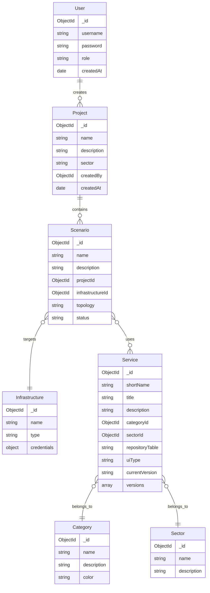

# Database Schema

MongoDB collections and Mongoose schema definitions.

## Overview



## Collections

### users

Stores user accounts and authentication data.

```typescript
{
  _id: ObjectId,
  username: string,          // Unique username
  password: string,          // bcrypt hashed
  role: 'admin' | 'user',    // User role
  createdAt: Date,
  updatedAt: Date
}
```

**Indexes:**

- `username`: unique

**Example:**

```json
{
  "_id": "507f1f77bcf86cd799439011",
  "username": "admin",
  "password": "$2b$12$...",
  "role": "admin",
  "createdAt": "2024-01-15T10:00:00Z"
}
```

### categories

Service category classification.

```typescript
{
  _id: ObjectId,
  name: string,              // Category name
  description: string,       // Category description
  color: string              // Hex color for UI
}
```

**Example:**

```json
{
  "_id": "507f1f77bcf86cd799439012",
  "name": "Predictive Threat Intelligence",
  "description": "Tools for predictive security analysis",
  "color": "#4CAF50"
}
```

### sectors

Critical infrastructure sectors.

```typescript
{
  _id: ObjectId,
  name: string,              // Sector name
  description: string        // Sector description
}
```

**Predefined Sectors:**

- Telecommunications
- Healthcare
- Transportation
- Nuclear
- Energy

### services

Cybersecurity service catalog.

```typescript
{
  _id: ObjectId,
  shortName: string,         // Unique short identifier
  title: string,             // Display title
  description: string,       // Full description
  categoryId: ObjectId,      // Reference to categories
  sectorId: ObjectId,        // Reference to sectors (optional)
  repositoryTable: 'INTACT_TOOLBOX' | 'OTHER_SERVICES',
  uiType: 'web' | 'cli' | 'api',
  currentVersion: string,    // Latest version number
  versions: [{
    version: string,
    changelog: string,
    releaseNotes: string,
    releasedAt: Date
  }],
  createdAt: Date,
  updatedAt: Date
}
```

**Indexes:**

- `shortName`: unique
- `categoryId`: regular

**Example:**

```json
{
  "_id": "507f1f77bcf86cd799439013",
  "shortName": "mmt-probe",
  "title": "MMT Network Probe",
  "description": "Deep packet inspection tool",
  "categoryId": "507f1f77bcf86cd799439012",
  "sectorId": "507f1f77bcf86cd799439020",
  "repositoryTable": "INTACT_TOOLBOX",
  "uiType": "web",
  "currentVersion": "1.2.0",
  "versions": [
    {
      "version": "1.2.0",
      "changelog": "Added new protocols",
      "releasedAt": "2024-01-10T00:00:00Z"
    }
  ]
}
```

### projects

Digital twin project containers.

```typescript
{
  _id: ObjectId,
  name: string,              // Project name
  description: string,       // Project description
  sector: string,            // Target sector
  createdBy: ObjectId,       // Reference to users
  createdAt: Date,
  updatedAt: Date
}
```

**Indexes:**

- `createdBy`: regular

**Example:**

```json
{
  "_id": "507f1f77bcf86cd799439014",
  "name": "Telecom Security Assessment",
  "description": "Security evaluation for 5G network",
  "sector": "Telecommunications",
  "createdBy": "507f1f77bcf86cd799439011"
}
```

### scenarios

Test scenarios within projects.

```typescript
{
  _id: ObjectId,
  name: string,              // Scenario name
  description: string,       // Scenario description
  projectId: ObjectId,       // Reference to projects
  infrastructureId: ObjectId, // Reference to infrastructures
  topology: string,          // YAML topology definition
  status: 'draft' | 'ready' | 'executed',
  executionHistory: [{
    executedAt: Date,
    status: string,
    result: object
  }],
  createdAt: Date,
  updatedAt: Date
}
```

**Indexes:**

- `projectId`: regular

**Topology YAML Structure:**

```yaml
nodes:
  - id: node-1
    type: service
    serviceId: '507f1f77bcf86cd799439013'
    position: { x: 100, y: 100 }
edges:
  - id: edge-1
    source: node-1
    target: node-2
```

### infrastructures

Target deployment infrastructure.

```typescript
{
  _id: ObjectId,
  name: string,              // Infrastructure name
  type: 'kubernetes' | 'docker' | 'vm',
  endpoint: string,          // API endpoint
  credentials: {             // Encrypted with AES-256-GCM
    iv: string,
    encryptedData: string,
    authTag: string
  },
  status: 'active' | 'inactive',
  lastTested: Date,
  createdAt: Date,
  updatedAt: Date
}
```

**Example (credentials decrypted for illustration):**

```json
{
  "_id": "507f1f77bcf86cd799439015",
  "name": "Production K8s",
  "type": "kubernetes",
  "endpoint": "https://k8s.example.com",
  "credentials": {
    "kubeconfig": "...",
    "token": "..."
  },
  "status": "active"
}
```

## Relationships

| Relationship              | Type        | Description                          |
| ------------------------- | ----------- | ------------------------------------ |
| Service → Category        | Many-to-One | Each service belongs to one category |
| Service → Sector          | Many-to-One | Services may belong to a sector      |
| Project → User            | Many-to-One | Projects are created by users        |
| Scenario → Project        | Many-to-One | Scenarios belong to projects         |
| Scenario → Infrastructure | Many-to-One | Scenarios target an infrastructure   |

## Population Patterns

```typescript
// Populate service with category
Service.find().populate('categoryId');

// Populate scenario with project and infrastructure
Scenario.findById(id).populate('projectId').populate('infrastructureId');

// Populate project with scenarios
Project.findById(id);
// Then separately:
Scenario.find({ projectId: id });
```

## Related Documentation

- [Relationships](relationships.md)
- [Backend Architecture](../architecture/backend.md)
