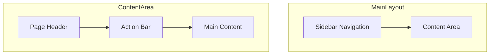

# UI Patterns

Common UI patterns and component usage guidelines.

## Component Library

The application uses [shadcn/ui](https://ui.shadcn.com/) components built on Radix UI primitives.

### Core Components

| Component | Usage                               |
| --------- | ----------------------------------- |
| Button    | Primary actions, form submissions   |
| Dialog    | Modal windows, confirmations        |
| Form      | Form handling with react-hook-form  |
| Table     | Data display with sorting/filtering |
| Card      | Content containers                  |
| Tabs      | Content organization                |
| Toast     | Notifications                       |
| Dropdown  | Context menus, actions              |

## Layout Patterns

### Page Layout



```tsx
// Standard page structure
function PageComponent() {
  return (
    <div className="space-y-6">
      {/* Page header */}
      <div className="flex items-center justify-between">
        <h1 className="text-2xl font-bold">Page Title</h1>
        <Button>Primary Action</Button>
      </div>

      {/* Main content */}
      <Card>
        <CardContent>{/* Content here */}</CardContent>
      </Card>
    </div>
  );
}
```

### Split View (Topology Editor)

```tsx
// Split view with resizable panels
<ResizablePanelGroup direction="horizontal">
  <ResizablePanel defaultSize={50}>
    <TopologyCanvas />
  </ResizablePanel>
  <ResizableHandle />
  <ResizablePanel defaultSize={50}>
    <YamlEditor />
  </ResizablePanel>
</ResizablePanelGroup>
```

## Form Patterns

### Standard Form

```tsx
import { useForm } from 'react-hook-form';
import { zodResolver } from '@hookform/resolvers/zod';

function ServiceForm() {
  const form = useForm({
    resolver: zodResolver(serviceSchema),
    defaultValues: {
      shortName: '',
      title: '',
      description: '',
    },
  });

  return (
    <Form {...form}>
      <form onSubmit={form.handleSubmit(onSubmit)}>
        <FormField
          control={form.control}
          name="shortName"
          render={({ field }) => (
            <FormItem>
              <FormLabel>Short Name</FormLabel>
              <FormControl>
                <Input {...field} />
              </FormControl>
              <FormMessage />
            </FormItem>
          )}
        />
        {/* More fields */}
        <Button type="submit">Save</Button>
      </form>
    </Form>
  );
}
```

### Form in Dialog

```tsx
function CreateServiceDialog() {
  const [open, setOpen] = useState(false);

  return (
    <Dialog open={open} onOpenChange={setOpen}>
      <DialogTrigger asChild>
        <Button>Create Service</Button>
      </DialogTrigger>
      <DialogContent>
        <DialogHeader>
          <DialogTitle>Create Service</DialogTitle>
          <DialogDescription>Add a new service to the repository.</DialogDescription>
        </DialogHeader>
        <ServiceForm onSuccess={() => setOpen(false)} />
      </DialogContent>
    </Dialog>
  );
}
```

## Data Display Patterns

### Table with Actions

```tsx
function ServiceTable({ services }) {
  return (
    <Table>
      <TableHeader>
        <TableRow>
          <TableHead>Name</TableHead>
          <TableHead>Category</TableHead>
          <TableHead className="text-right">Actions</TableHead>
        </TableRow>
      </TableHeader>
      <TableBody>
        {services.map((service) => (
          <TableRow key={service._id}>
            <TableCell>{service.title}</TableCell>
            <TableCell>
              <Badge>{service.categoryId?.name}</Badge>
            </TableCell>
            <TableCell className="text-right">
              <DropdownMenu>
                <DropdownMenuTrigger asChild>
                  <Button variant="ghost" size="icon">
                    <MoreHorizontal />
                  </Button>
                </DropdownMenuTrigger>
                <DropdownMenuContent>
                  <DropdownMenuItem>Edit</DropdownMenuItem>
                  <DropdownMenuItem className="text-destructive">Delete</DropdownMenuItem>
                </DropdownMenuContent>
              </DropdownMenu>
            </TableCell>
          </TableRow>
        ))}
      </TableBody>
    </Table>
  );
}
```

### Card Grid

```tsx
function ProjectGrid({ projects }) {
  return (
    <div className="grid grid-cols-1 md:grid-cols-2 lg:grid-cols-3 gap-4">
      {projects.map((project) => (
        <Card key={project._id} className="hover:shadow-md transition-shadow">
          <CardHeader>
            <CardTitle>{project.name}</CardTitle>
            <CardDescription>{project.sector}</CardDescription>
          </CardHeader>
          <CardContent>
            <p className="text-sm text-muted-foreground">{project.description}</p>
          </CardContent>
          <CardFooter>
            <Button variant="outline" asChild>
              <Link to={`/projects/${project._id}`}>View</Link>
            </Button>
          </CardFooter>
        </Card>
      ))}
    </div>
  );
}
```

## Loading States

### Skeleton Loading

```tsx
function ServiceTableSkeleton() {
  return (
    <Table>
      <TableBody>
        {Array.from({ length: 5 }).map((_, i) => (
          <TableRow key={i}>
            <TableCell>
              <Skeleton className="h-4 w-32" />
            </TableCell>
            <TableCell>
              <Skeleton className="h-4 w-24" />
            </TableCell>
            <TableCell>
              <Skeleton className="h-4 w-16" />
            </TableCell>
          </TableRow>
        ))}
      </TableBody>
    </Table>
  );
}
```

### Query Loading Pattern

```tsx
function ServiceList() {
  const { data, isLoading, error } = useQuery({
    queryKey: ['services'],
    queryFn: getServices,
  });

  if (isLoading) return <ServiceTableSkeleton />;
  if (error) return <ErrorMessage error={error} />;
  if (!data?.length) return <EmptyState />;

  return <ServiceTable services={data} />;
}
```

## Feedback Patterns

### Toast Notifications

```tsx
import { toast } from 'sonner';

// Success
toast.success('Service created successfully');

// Error
toast.error('Failed to create service');

// With action
toast('Service created', {
  action: {
    label: 'View',
    onClick: () => navigate(`/services/${id}`),
  },
});
```

### Confirmation Dialog

```tsx
function DeleteConfirmation({ onConfirm }) {
  return (
    <AlertDialog>
      <AlertDialogTrigger asChild>
        <Button variant="destructive">Delete</Button>
      </AlertDialogTrigger>
      <AlertDialogContent>
        <AlertDialogHeader>
          <AlertDialogTitle>Are you sure?</AlertDialogTitle>
          <AlertDialogDescription>This action cannot be undone.</AlertDialogDescription>
        </AlertDialogHeader>
        <AlertDialogFooter>
          <AlertDialogCancel>Cancel</AlertDialogCancel>
          <AlertDialogAction onClick={onConfirm}>Delete</AlertDialogAction>
        </AlertDialogFooter>
      </AlertDialogContent>
    </AlertDialog>
  );
}
```

## Navigation Patterns

### Sidebar Navigation

```tsx
const navItems = [
  { icon: LayoutDashboard, label: 'Dashboard', href: '/dashboard' },
  { icon: Package, label: 'Services', href: '/services' },
  { icon: FolderOpen, label: 'Projects', href: '/projects' },
  { icon: Server, label: 'Infrastructure', href: '/infrastructure' },
];

function Sidebar() {
  const location = useLocation();

  return (
    <nav className="space-y-1">
      {navItems.map((item) => (
        <Link
          key={item.href}
          to={item.href}
          className={cn(
            'flex items-center gap-3 px-3 py-2 rounded-md',
            location.pathname === item.href
              ? 'bg-primary text-primary-foreground'
              : 'hover:bg-muted'
          )}
        >
          <item.icon className="h-4 w-4" />
          {item.label}
        </Link>
      ))}
    </nav>
  );
}
```

### Breadcrumbs

```tsx
function Breadcrumbs({ items }) {
  return (
    <nav className="flex items-center gap-2 text-sm">
      {items.map((item, index) => (
        <Fragment key={item.href}>
          {index > 0 && <ChevronRight className="h-4 w-4" />}
          {item.current ? (
            <span className="text-foreground">{item.label}</span>
          ) : (
            <Link to={item.href} className="text-muted-foreground hover:text-foreground">
              {item.label}
            </Link>
          )}
        </Fragment>
      ))}
    </nav>
  );
}
```

## Related Documentation

- [Styling Guide](styling.md)
- [Frontend Architecture](../architecture/frontend.md)
