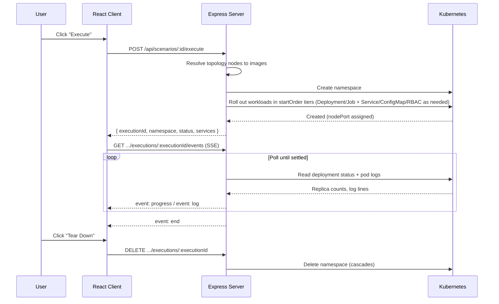

# Kubernetes Execution

Direct deployment of a scenario topology to a Kubernetes cluster.

## Overview

Executing a scenario deploys its topology **directly** to the Kubernetes cluster
of the scenario's assigned infrastructure. The platform talks to the cluster API
itself (via `@kubernetes/client-node`) — there is no external orchestrator in the
path.

Each execution gets its own namespace. Every topology node becomes a workload —
an `apps/v1` `Deployment`, or a `batch/v1` `Job` for finite runs — plus a
`NodePort` `Service` when it exposes a port, with `ConfigMap`s, a
`ServiceAccount`/`Role`/`RoleBinding` triple and egress `NetworkPolicy`s added
as the topology requires. Progress and live pod logs stream back to the browser
over Server-Sent Events (SSE), and a teardown deletes the namespace to reclaim
everything.

The deploy engine lives in
[`server/src/services/kubernetesDeploy.ts`](../../server/src/services/kubernetesDeploy.ts);
the HTTP surface is in
[`server/src/routes/scenarios.routes.ts`](../../server/src/routes/scenarios.routes.ts).



## Execution Flow

When a user clicks **Execute** on a scenario:

1. The server loads the scenario and its assigned infrastructure. A scenario with
   no `infrastructureId` is rejected (`400`).
2. It resolves the services referenced by the topology nodes' `data.serviceId`
   and picks a concrete `dockerImage` from each service's `versions[]` (matching
   the node's requested `version`, else `currentVersion`, else the newest
   version). A node with no service or no deployable image is rejected (`400`).
3. An execution record is appended to the scenario (`status: pending`) so it has
   an `_id` before anything reaches the cluster. The namespace name is derived
   from the scenario and execution ids.
4. The topology is deployed (see below). On success the execution flips to
   `running` and stores the namespace and per-service records; on failure it is
   persisted as `failed` and the error is surfaced.

### Endpoint

- **POST** `/api/scenarios/:id/execute`
- **Auth:** Required
- **Response:**

  ```json
  {
    "executionId": "665f…",
    "namespace": "secsim-<scenario>-<execution>",
    "status": "running",
    "services": [
      {
        "nodeId": "mmt-probe",
        "serviceId": "662a…",
        "name": "mmt-probe",
        "uiType": "web",
        "status": "pending",
        "nodePort": 31840,
        "dashboardUrl": "http://cluster-host:31840"
      }
    ]
  }
  ```

## Kubernetes Resource Model

The engine is intentionally thin. `resolveTopologyNodes` resolves each node's
deployment spec (the service's `deployment` catalog spec merged with
`node.data.config` `env`/`args` overrides, defaulting to a standalone
`Deployment` on port `80`) and its typed-edge context (`attacks`, `monitors`,
`notifies`, `acts-on`); the manifest builders consume those fields to emit
the resources in the table below.

| Topology concept       | Kubernetes resource                       | Notes                                                                                                                                 |
| ---------------------- | ----------------------------------------- | ------------------------------------------------------------------------------------------------------------------------------------- |
| Execution              | `Namespace`                               | One per execution, named `secsim-<scenario>-<execution>` (DNS-1123, ≤63 chars). Deleting it cascades to everything below.             |
| Topology node          | `Deployment` (`apps/v1`)                  | `replicas: 1`, image resolved from the service version; the pod also carries one container per attached `attachMode: 'sidecar'` node. |
| Topology node (finite) | `Job` (`batch/v1`)                        | `kind: 'Job'` specs (e.g. an attack profile) deploy as a finite Job with `restartPolicy: Never` and no Service.                       |
| Topology node          | `Service` (`v1`, `NodePort`)              | Same name as the workload, selects it by `app` label, exposes the container port. Not created for Jobs or `exposePort: false`.        |
| Node `configFiles`     | `ConfigMap` (`v1`)                        | `<node>-config`; each file mounts at its `mountPath` via `subPath`.                                                                   |
| Node `rbac` rules      | `ServiceAccount` + `Role` + `RoleBinding` | One namespaced triple per pod (sidecar rules fold into the host's Role). The engine never creates `ClusterRole`/`ClusterRoleBinding`. |
| `role: 'attack'` node  | `NetworkPolicy` (`networking.k8s.io/v1`)  | `<node>-egress`: egress limited to the attack-edge targets' Service ports plus DNS; selects the pod the attack actually runs in.      |

- **Resource naming:** each node's `id` is normalised to an RFC-1035 label
  (lowercase, starting with a letter, ≤50 chars); the workload (Deployment or
  Job), Service and RBAC triple share that name.
- **Port:** a single port is mapped per node — `deployment.containerPort`
  when the service spec sets it, `80` otherwise — for both the container and
  the service.
- **Containers:** `deployment.securityContext` (`capabilities`,
  `privileged`) applies to the container that declares it only — a sidecar's
  `NET_ADMIN`/`NET_RAW` never leak onto the host container.
- **Command override:** `deployment.command` lands as the container
  `command` (the Kubernetes `ENTRYPOINT` override), ahead of `args`. A
  CLI-only image stays alive between runs when its spec idles on a shell
  loop — e.g. MAG seeds `['sh', '-c', 'while true; do sleep 3600; done']` so
  attacks are launched with `kubectl exec -it deploy/mag -n <exec-ns> -- sh
-c 'mag <attack> --target-ip <target> --target-port <port> 2>&1 | tee
/proc/1/fd/1'` instead of a deploy-time Job arg set (issue #233). The
  `tee /proc/1/fd/1` wrapper matters: exec output otherwise reaches only the
  user's terminal — teeing into PID 1's stdout lands it in the pod's
  container log, where the SSE stream ships it to the console.
- **Volumes:** `deployment.volumes` render as `emptyDir` volumes shared
  across every container in the pod (for example a probe reports directory
  shared between the sidecar and its host container).
- **Networking flags:** `hostNetwork: true` runs the pod on the host network
  (a sidecar `attachMode` is the preferred alternative); `readinessPath` adds
  an HTTP `GET` readiness probe on the container port.
- **PodSecurity:** when any node declares `capabilities`, `privileged` or
  `hostNetwork`, the namespace manifest carries
  `pod-security.kubernetes.io/enforce=privileged`; otherwise the namespace
  stays unlabelled.
- **Image pulls:** no `imagePullSecrets` are attached — module images must be
  pullable by the cluster's nodes (a private registry needs a node-level
  credential or an image preloaded with `kind load`).
- **Labels:** every managed object carries
  `app.kubernetes.io/managed-by: secsim`; Deployments also carry
  `secsim.io/node: <nodeId>`.
- **Service type `NodePort`** is deliberate: it makes each service reachable
  without an Ingress controller, which is what powers the per-service URLs.
- **Rollout order:** workloads go up in ascending `deployment.startOrder`
  tiers (concurrently within a tier). Before any workload carrying a
  `role: 'attack'` member is created, the engine waits — bounded by
  `readinessTimeoutMs` (default 5 min) — for every already-deployed
  workload's pods to report `Ready`, so an attack never starts ahead of the
  monitor and reaction it depends on. A timeout fails the execution with the
  names of the pods that were not Ready and tears the namespace down.

## SSE Events Protocol

Live progress and logs are streamed from a Server-Sent Events endpoint. The
server polls the cluster every 2 seconds, emitting a `progress` snapshot, any
new pod log lines and any new Kubernetes namespace events, until every service
has settled (all `running`, `completed` or `failed`) or the client
disconnects. When the execution carries a terminal-typed (`uiType:
"terminal"` or `"both"`) workload — e.g. MAG — `end` still marks deploy
settle, but the stream stays open so shell-driven (`kubectl exec`) output,
probe alerts and reaction events keep reaching an attached console until the
client disconnects or the execution is torn down (issue #233).

- **GET** `/api/scenarios/:id/executions/:executionId/events`
- **Auth:** Required
- **Content-Type:** `text/event-stream`

If nothing was deployed, or the execution already reached a terminal state, the
stream emits a single `progress` snapshot followed by `end` and closes. Bad
credentials fail as a normal JSON error _before_ the stream opens, rather than as
a half-open connection.

### Event types

| Event       | When                                                | Payload                                                                                                                                                                                                                                                                                                                                                                                                                                                                                                                     |
| ----------- | --------------------------------------------------- | --------------------------------------------------------------------------------------------------------------------------------------------------------------------------------------------------------------------------------------------------------------------------------------------------------------------------------------------------------------------------------------------------------------------------------------------------------------------------------------------------------------------------- |
| `progress`  | Each poll                                           | `{ progress: number, services: [{ name, status, containers }] }` — `progress` is the percentage of services that are `running` or `completed`; `status` is `pending` \| `running` \| `completed` \| `failed` (`completed` marks a finished Job); `containers` is the per-container breakdown `[{ name, status }]` covering host and sidecar containers alike.                                                                                                                                                               |
| `log`       | Per new pod log line                                | `{ service: string, pod: string, container?: string, line: string }` — `container` names the container the line came from, so sidecar output (e.g. `mmt-probe` alerts) stays distinguishable from the host container's logs.                                                                                                                                                                                                                                                                                                |
| `k8s-event` | Per new Kubernetes Event in the execution namespace | `{ uid?: string, reason?: string, message?: string, objectKind?: string, objectName?: string, type?: string, count?: number, timestamp?: string }` — `reason`/`message`/`objectKind`/`objectName` distil the Event's involved object (e.g. `Pod`/`svc-a-pod`), `type` is `Normal` or `Warning`, and `timestamp` is the ISO time of the most recent occurrence. Events are deduplicated across polls on `<uid>:<count>`; a recurring event re-emits when its `count` grows.                                                  |
| `alert`     | A pod log line parses as a security report          | `{ service: string, pod: string, container?: string, timestamp?: string, verdict?: string, attacker?: string, line: string }` — a typed detection distilled from a monitor's stdout security report (issue #234): `attacker` is the report's `ip.src` (the address the AI4SOAR playbook blocks, issue #235), `verdict` the detection summary, `line` the original log line. JSON reports (the seeded `output.format = "JSON"`) and plain-text `ALERT …` lines both qualify; every alert also flows as a normal `log` event. |
| `end`       | Deploy settled                                      | `{ status: "completed" \| "failed", services: [{ name, status, containers }] }` — with a terminal-typed workload in the execution the stream stays open after `end` (see above); a `failed` settle always closes it.                                                                                                                                                                                                                                                                                                        |
| `error`     | Cluster read failed mid-stream                      | `{ message: string }` (the stream then closes)                                                                                                                                                                                                                                                                                                                                                                                                                                                                              |

```text
event: progress
data: {"progress":50,"services":[{"name":"mmt-probe","status":"running","containers":[{"name":"mmt-probe","status":"running"}]},{"name":"kafka","status":"pending","containers":[]}]}

event: log
data: {"service":"http-sim","pod":"http-sim-7c9f-abcde","container":"mmt-probe","line":"ALERT syn-flood detected"}

event: k8s-event
data: {"uid":"f7a2...","reason":"Killing","message":"Killing container http-sim in pod http-sim-7c9f-abcde","objectKind":"Pod","objectName":"http-sim-7c9f-abcde","type":"Normal","count":1,"timestamp":"2026-09-07T10:00:00.000Z"}

event: alert
data: {"service":"http-sim","pod":"http-sim-7c9f-abcde","container":"mmt-probe","timestamp":"2026-09-14T10:00:00.000Z","verdict":"http-flood","attacker":"10.0.0.9","line":"{\"ip.src\":\"10.0.0.9\",\"verdict\":\"http-flood\"}"}

event: end
data: {"status":"completed","services":[{"name":"mmt-probe","status":"running","containers":[{"name":"mmt-probe","status":"running"}]},{"name":"kafka","status":"running","containers":[{"name":"kafka","status":"running"}]}]}
```

The **Execution** tab's `ExecutionConsole` component consumes this stream: a
progress bar driven by `progress`, an auto-scrolling log console driven by
`log` with one tab per container (plus a combined **All** view) that keeps the
`[service:container]` prefix on every line, a per-service status list that also
shows each workload's per-container chips (a finished Job reads `completed`),
a dedicated **Security alerts** pane fed by `alert` (timestamp, verdict and
the `src=<attacker>` address), and a dedicated **Namespace events** pane fed
by `k8s-event`.

## Per-Service URLs

There are no embedded dashboards or simulated terminals — services expose real,
clickable URLs backed by their NodePort.

- On deploy, each service's `dashboardUrl` is built from the cluster endpoint
  host and the assigned NodePort: `http://<cluster-host>:<nodePort>`.
- **Web-facing services** (`uiType: "web"` or `"both"`) render an **Open
  interface** link to that URL once the service is running.
- **Terminal-only services** (`uiType: "terminal"`) show a status badge plus a
  copyable `kubectl exec -it deploy/<name> -n <exec-ns> -- …` hint — the shell
  access contract for long-running interactive workloads like MAG (issue
  #233). No link, no fake terminal.

## Teardown

Tearing down an execution issues a single `deleteNamespace` call for the
execution's `secsim-<scenario>-<execution>` namespace. Kubernetes garbage
collection then removes **every** object the deploy created inside it —
Deployments, Jobs, Services, ConfigMaps, ServiceAccounts, Roles, RoleBindings,
NetworkPolicies and their Pods — because every manifest the engine emits is
namespaced into that namespace. The engine creates no cluster-scoped resources
at all (RBAC is strictly `Role`/`RoleBinding`; the Namespace is the only
non-namespaced object, and it is the one being deleted), so nothing survives
the delete: no orphans remain outside the namespace.

The same teardown runs on a mid-deploy failure — `deployTopology` deletes the
partially-created namespace before surfacing the error — so a failed execution
leaves no half-deployed resources behind either.

Deleting an already-gone namespace is treated as success (idempotent). The
execution record is marked `completed`.

- **DELETE** `/api/scenarios/:id/executions/:executionId`
- **Auth:** Required
- **Response:** `{ executionId, namespace, status: "completed", message }`

The cluster is only contacted when the execution actually has a namespace; a
never-deployed or already-torn-down execution short-circuits.

## Cluster Credentials

The infrastructure's encrypted `credentials` field holds either full kubeconfig
content or a bearer token:

- **Kubeconfig content** (detected by an `apiVersion:` / `{` / `clusters:`
  prefix) is loaded as-is.
- **A bearer token** is combined with the infrastructure `endpoint` into an
  in-cluster-style config (`skipTLSVerify` on).

Credentials are decrypted server-side only and never leave the backend. See the
[Connection Testing](external-services.md#connection-testing) section for the
real cluster liveness probe used by `POST /api/infrastructures/:id/test`.

## Error Handling

Kubernetes API failures surface as `502 Bad Gateway` (the cluster is an upstream
dependency); other unexpected errors become `500`. Common deploy failure causes:

- Topology node without a `serviceId` or without a deployable docker image
  (`400`, before any cluster call).
- Cluster unreachable, bad credentials, or TLS error (`502`).
- Per-pod failure reasons detected during status polling —
  `CrashLoopBackOff`, `ImagePullBackOff`, `ErrImagePull`,
  `CreateContainerError`, `CreateContainerConfigError`, `RunContainerError`,
  `InvalidImageName` — mark that service `failed`.

## Migration Note

Earlier revisions of the platform embedded the **MAESTRO** orchestrator in an
iframe and exchanged `postMessage` `DEPLOYMENT_*` events with it, while the
frontend faked progress bars and mock service dashboards. That protocol is gone:
the platform now deploys to Kubernetes directly and streams real status and logs
over SSE. Some unused orchestrator configuration keys may still linger in
environment files pending a follow-up cleanup, but nothing in the execution path
uses them.

## Related Documentation

- [External Services](external-services.md)
- [Architecture Overview](../architecture/overview.md)
- [Data Flow](../architecture/data-flow.md)
- [Deployment Playbook](../playbooks/deployment.md)
