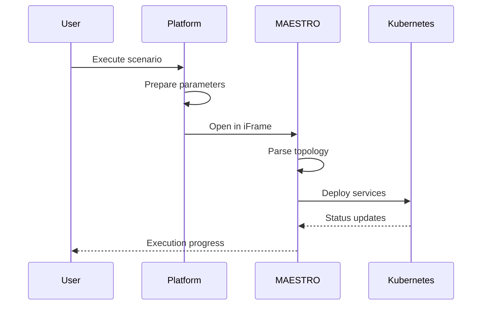
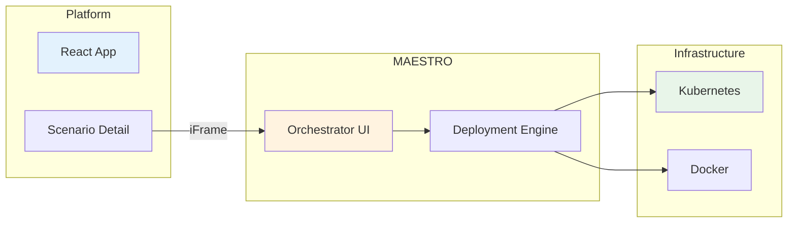

# MAESTRO Integration

Integration with the MAESTRO orchestrator for scenario deployment.

## Overview

MAESTRO is UBITECH's service orchestrator that handles the actual deployment and execution of scenarios on Kubernetes clusters.



## Architecture



## Configuration

### Environment Variables

```bash
# client/.env
VITE_MAESTRO_URL=https://maestro.intact-project.eu
```

### CORS Configuration

MAESTRO must allow embedding from the platform domain:

```
X-Frame-Options: ALLOW-FROM https://platform.intact-project.eu
Content-Security-Policy: frame-ancestors 'self' https://platform.intact-project.eu
```

## Integration Points

### Scenario Execution

When a user clicks "Execute" on a scenario:

1. **Platform prepares parameters:**

   ```typescript
   const executionParams = {
     scenarioId: scenario._id,
     topology: scenario.topology,
     infrastructureId: scenario.infrastructureId,
     services: extractServices(scenario.topology),
   };
   ```

2. **Open MAESTRO in iFrame:**

   ```tsx
   <iframe
     src={`${MAESTRO_URL}/deploy?${params}`}
     title="MAESTRO Orchestrator"
     className="w-full h-[600px] border-0"
   />
   ```

3. **Pass execution context:**
   - Scenario topology (YAML)
   - Target infrastructure details
   - Service configurations

### Message Passing

Communication between platform and MAESTRO iFrame:

```typescript
// Listen for messages from MAESTRO
useEffect(() => {
  const handleMessage = (event: MessageEvent) => {
    if (event.origin !== MAESTRO_URL) return;

    const { type, payload } = event.data;

    switch (type) {
      case 'DEPLOYMENT_STARTED':
        updateScenarioStatus('executing');
        break;
      case 'DEPLOYMENT_COMPLETE':
        updateScenarioStatus('executed');
        recordExecution(payload);
        break;
      case 'DEPLOYMENT_FAILED':
        updateScenarioStatus('failed');
        showError(payload.error);
        break;
    }
  };

  window.addEventListener('message', handleMessage);
  return () => window.removeEventListener('message', handleMessage);
}, []);
```

### Sending Messages to MAESTRO

```typescript
// Send scenario data to MAESTRO
const sendToMAESTRO = (data: object) => {
  const iframe = document.getElementById('maestro-frame') as HTMLIFrameElement;
  iframe?.contentWindow?.postMessage({ type: 'SCENARIO_DATA', payload: data }, MAESTRO_URL);
};
```

## Topology Format

MAESTRO expects topology in YAML format:

```yaml
# Scenario topology
apiVersion: v1
kind: ScenarioTopology

metadata:
  name: security-assessment
  project: telecom-dt

nodes:
  - id: mmt-probe
    service: mmt-probe
    version: '1.2.0'
    config:
      interface: eth0
      rulesPath: /etc/mmt/rules

  - id: kafka-broker
    service: kafka
    version: '3.5.0'
    config:
      topics:
        - security-events
        - alerts

edges:
  - source: mmt-probe
    target: kafka-broker
    protocol: kafka
    topic: security-events
```

## Service Dashboard Integration

For services with web interfaces, embed their dashboards:

```tsx
function ServiceDashboard({ service }) {
  if (service.uiType !== 'web') {
    return <TerminalEmulator service={service} />;
  }

  return (
    <iframe
      src={service.dashboardUrl}
      title={`${service.title} Dashboard`}
      className="w-full h-full border-0"
    />
  );
}
```

## Error Handling

### Connection Errors

```typescript
const handleMAESTROError = (error: Error) => {
  if (error.message.includes('Failed to connect')) {
    toast.error('Unable to connect to MAESTRO. Check network connectivity.');
  } else if (error.message.includes('timeout')) {
    toast.error('MAESTRO connection timed out. Please try again.');
  } else {
    toast.error(`MAESTRO error: ${error.message}`);
  }
};
```

### Deployment Failures

Common deployment failure reasons:

- Invalid topology YAML
- Infrastructure connectivity issues
- Insufficient resources on target cluster
- Service image pull failures

## Execution History

Record execution results for reporting:

```typescript
interface ExecutionRecord {
  executedAt: Date;
  status: 'success' | 'failed' | 'partial';
  duration: number;
  deployedServices: string[];
  failedServices: string[];
  logs: string;
}

// Store in scenario
const recordExecution = async (result: ExecutionResult) => {
  await api.patch(`/scenarios/${scenarioId}`, {
    $push: {
      executionHistory: {
        executedAt: new Date(),
        status: result.status,
        duration: result.duration,
        result: result.data,
      },
    },
  });
};
```

## Security Considerations

1. **Token passing:** Never pass sensitive credentials to MAESTRO via URL
2. **Origin validation:** Always verify message origins
3. **Credential encryption:** Infrastructure credentials are decrypted server-side only
4. **iFrame sandboxing:** Consider `sandbox` attribute restrictions

```tsx
<iframe src={maestroUrl} sandbox="allow-scripts allow-same-origin allow-forms" />
```

## Troubleshooting

### iFrame Not Loading

1. Check CORS/CSP headers on MAESTRO
2. Verify `VITE_MAESTRO_URL` is correct
3. Check browser console for blocking errors

### Deployment Hangs

1. Check MAESTRO logs
2. Verify Kubernetes cluster connectivity
3. Check service image availability

### Message Not Received

1. Verify origin URLs match exactly
2. Check for HTTPS/HTTP mismatch
3. Ensure messages are JSON serializable

## Related Documentation

- [External Services](external-services.md)
- [Architecture Overview](../architecture/overview.md)
- [Deployment Playbook](../playbooks/deployment.md)
