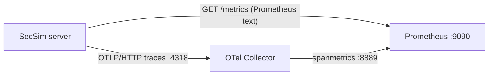
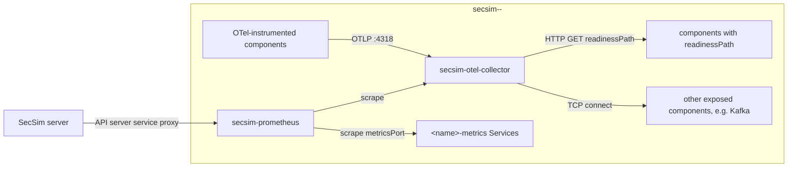

# Observability

SecSim runs Prometheus and OpenTelemetry in two places:

- **The platform stack** watches the SecSim server itself: request rate, error
  rate and latency of the API, Node.js process metrics, and the number of
  live executions.
- **The scenario stack** is deployed with each run of a scenario that has the
  `observability` option on (the default). It reports health and traffic for
  every component of that run.

## Platform stack



| Piece          | Where                                              | What it does                                                                                                                                                                                  |
| -------------- | -------------------------------------------------- | --------------------------------------------------------------------------------------------------------------------------------------------------------------------------------------------- |
| `GET /metrics` | `server/src/telemetry/metrics.ts`                  | `http_requests_total` and `http_request_duration_seconds`, labelled by method, route template (never the raw URL) and status code. Also Node.js process metrics and `secsim_live_executions`. |
| Tracing        | `server/src/telemetry/tracing.ts`                  | OpenTelemetry SDK with HTTP and Express instrumentation. It starts only when `OTEL_EXPORTER_OTLP_ENDPOINT` is set, before the app is imported.                                                |
| OTel Collector | `k8s/components/observability/otel-collector.yaml` | Receives the traces. Its `spanmetrics` connector turns them into request, error and latency series.                                                                                           |
| Prometheus     | `k8s/components/observability/prometheus.yml`      | Scrapes `app:3000/metrics` and the collector.                                                                                                                                                 |

**Kubernetes:** the `dev` and `prod` overlays include
`k8s/components/observability`. That component adds the collector and
Prometheus Deployments and Services, and sets `OTEL_EXPORTER_OTLP_ENDPOINT` in
`app-config`. The `atlas` overlay leaves it out. Prometheus keeps 7 days in an
`emptyDir`; mount a PVC instead to keep history across reschedules.

```bash
kubectl -n montimage-prod port-forward svc/prometheus 9090:9090
# then open http://localhost:9090 and query e.g.
#   sum by (route) (rate(http_requests_total[5m]))
```

**Docker Compose:** `docker-compose.prod.yml` runs `otel-collector` and
`prometheus` from the same config files. Prometheus listens on loopback only
(`127.0.0.1:${PROMETHEUS_PORT:-9090}`) because it has no authentication.

| Variable                      | Default                                                        | Effect                                                                                                                                                                                                |
| ----------------------------- | -------------------------------------------------------------- | ----------------------------------------------------------------------------------------------------------------------------------------------------------------------------------------------------- |
| `METRICS_ENABLED`             | `true`                                                         | Serve `GET /metrics`.                                                                                                                                                                                 |
| `METRICS_TOKEN`               | unset                                                          | When set (16 or more characters), scrapes must send `Authorization: Bearer <token>`. Set it when the server is reachable from outside the cluster, and add the token to the Prometheus scrape config. |
| `OTEL_EXPORTER_OTLP_ENDPOINT` | unset (Compose and kustomize set `http://otel-collector:4318`) | Turns tracing on. Set it to an empty value to turn tracing off.                                                                                                                                       |
| `OTEL_SERVICE_NAME`           | `secsim-server`                                                | Service name on the spans.                                                                                                                                                                            |

## Scenario stack

When a scenario's **Collect observability data** option is on, each
execution namespace gets two extra Deployments next to the topology:
`secsim-otel-collector` and `secsim-prometheus`.



What is collected for each component:

| Reading                                                             | Source                                                                       | Applies to                                                                                       |
| ------------------------------------------------------------------- | ---------------------------------------------------------------------------- | ------------------------------------------------------------------------------------------------ |
| Up / down, availability (share of successful probes), probe latency | Collector `httpcheck` (HTTP 2xx/3xx counts as up) or `tcpcheck`, every 15 s  | Every component with a Service. HTTP when the catalog declares a `readinessPath`, TCP otherwise. |
| Request rate, error rate (5xx), p95 latency                         | Prometheus scrape of `http_requests_total` / `http_request_duration_seconds` | Components whose catalog `deployment` declares `metricsPort` (and optionally `metricsPath`)      |
| Request rate, error rate, p95 latency                               | Collector `spanmetrics` over spans pushed via OTLP                           | Components with the OpenTelemetry SDK                                                            |

Every container of an observed run gets `OTEL_EXPORTER_OTLP_ENDPOINT` set to
`http://secsim-otel-collector:4318` and `OTEL_SERVICE_NAME` set to its node
name, unless its spec already sets them. An OTel-instrumented image therefore
reports without extra configuration.

**Probes are not user traffic.** Availability and probe latency describe the
collector's checks. Request rate, error rate and p95 latency appear only for
components that expose metrics or send traces. None of the seeded Montimage
images do this today. The probes themselves are light (one request every 15
s from the collector's own pod IP) and do not trip per-source rate limits
such as CI-SIM's.

Where the data shows up:

- **Monitoring page:** a Health column, a Traffic column, a **Components up**
  card, and alert rules on `availability_pct`, `probe_latency_ms`,
  `request_rate`, `error_rate_pct` and `latency_p95_ms`. Readings cover the
  last 5 minutes.
- **Execution report:** a **Component health** table over the whole run. It is
  read at teardown, before the namespace is deleted.

### Design constraints

- **Best-effort:** creating the stack never fails a deploy. It stays out of
  `deployedServices`, readiness gating, SSE progress and the run outcome. The
  execution records whether it was created (`execution.observability`).
- **No RBAC and no cluster-scoped objects:** targets are rendered statically
  from the resolved topology, so namespace deletion removes everything.
- **Restricted PodSecurity:** both pods run as non-root with all capabilities
  dropped, a read-only root filesystem and no service-account token.
- **Pinned images:** `otel/opentelemetry-collector-contrib:0.161.0` and
  `prom/prometheus:v3.14.0`. The kind E2E pre-loads both. Air-gapped
  clusters must mirror them.

### Prerequisites and failure reasons

The server reads the stack through the API server's service proxy, so the
infrastructure credentials need `get` on `services/proxy` in execution
namespaces. When a read fails, the service shows a fixed reason instead of
readings:

| Reason                                                                                          | Usual cause                                           |
| ----------------------------------------------------------------------------------------------- | ----------------------------------------------------- |
| `the infrastructure credentials cannot proxy to the observability stack (needs services/proxy)` | RBAC                                                  |
| `the observability stack is not running in this namespace yet`                                  | Pods still pulling or starting, or images unavailable |
| `the observability stack did not answer in time`                                                | Slow cluster or network                               |

Turn the option off on a scenario to run it without the stack. This suits
very small clusters and scenarios whose images cannot be pulled.
