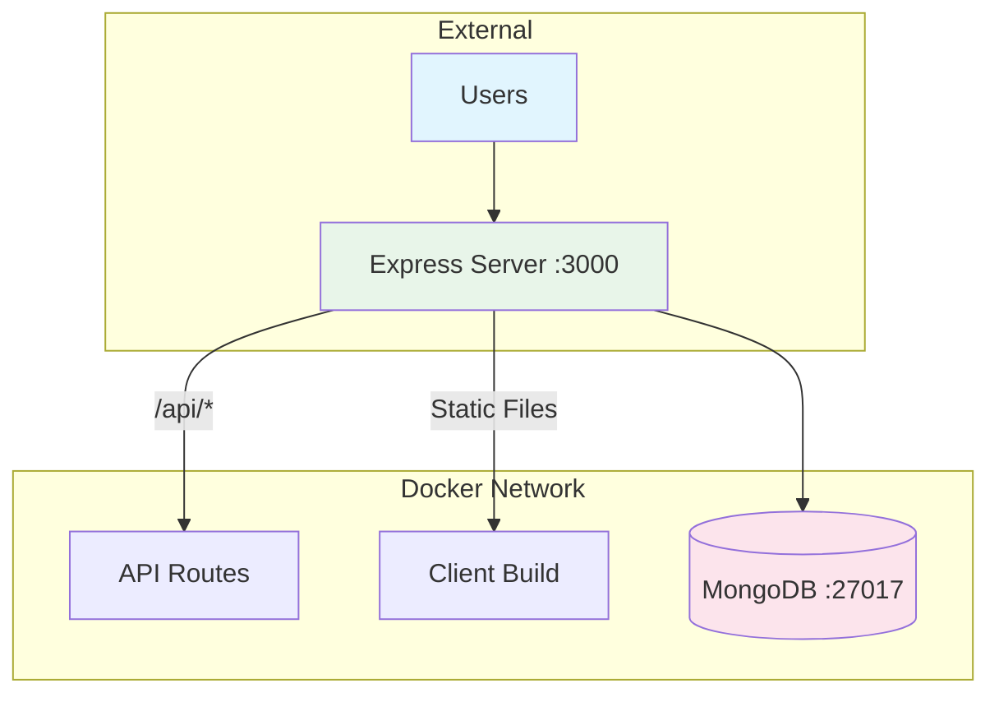
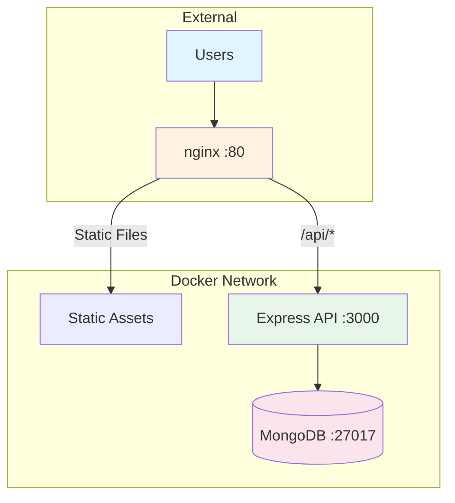

# Deployment Playbook

Complete guide for deploying the INTACT Digital Twin Management Platform to production.

## Overview

This playbook covers Docker-based deployment of the full service stack. Two deployment options are available:

| Option          | Containers                   | Best For                      |
| --------------- | ---------------------------- | ----------------------------- |
| **Unified**     | 2 (app + MongoDB)            | Demos, staging, single-server |
| **nginx-based** | 3 (nginx + server + MongoDB) | High-traffic production       |

Components served:

- React frontend
- Express API server
- MongoDB database

## Prerequisites

Before deploying, ensure you have:

- Docker 24.0+ and Docker Compose 2.0+
- Domain name (optional, for HTTPS)
- Minimum 2GB RAM, 10GB disk space
- Access to the repository

For detailed prerequisites, see [Prerequisites](../installation/prerequisites.md).

## Architecture

### Unified Deployment



### nginx-based Deployment



## Step 1: Clone and Configure

```bash
# Clone the repository
git clone <repository-url>
cd service-repository-digitaltwin-management-platform

# Create production environment file
cp .env.example .env.prod
```

## Step 2: Configure Environment Variables

Edit `.env.prod` with your production values:

```bash
# Required - Generate secure keys
JWT_SECRET=<generate-with-openssl-rand-base64-48>
ENCRYPTION_KEY=<generate-with-openssl-rand-hex-16>

# Optional overrides
PORT=80
CORS_ORIGIN=https://your-domain.com
NODE_ENV=production
```

### Generating Secure Keys

```bash
# Generate JWT_SECRET (48 bytes, base64 encoded)
openssl rand -base64 48

# Generate ENCRYPTION_KEY (32 hex characters)
openssl rand -hex 16
```

## Step 3: Build and Deploy

Choose your deployment option:

### Option A: Unified Deployment (Recommended for Simplicity)

```bash
# Build and start unified container
docker compose -f docker-compose.unified.yml up -d --build

# View logs
docker compose -f docker-compose.unified.yml logs -f
```

The application will be available at `http://localhost:3000`.

### Option B: nginx-based Deployment (Recommended for Scale)

```bash
# Build and start all services
docker compose -f docker-compose.prod.yml up -d --build

# View logs
docker compose -f docker-compose.prod.yml logs -f
```

The application will be available at `http://localhost:80`.

## Step 4: Initialize Database

On first deployment only:

```bash
# For unified deployment:
docker compose -f docker-compose.unified.yml exec app bun src/seed/index.ts

# For nginx-based deployment:
docker compose -f docker-compose.prod.yml exec server bun src/seed/index.ts
```

Default credentials after seeding:

- Username: `admin`
- Password: `intact2025`

**Important**: Change the admin password immediately after first login.

## Step 5: Verify Deployment

```bash
# Check all containers are running
docker compose -f docker-compose.prod.yml ps

# Test health endpoints
curl http://localhost/health          # Client health
curl http://localhost/api/health      # API health

# Verify MongoDB connection
docker compose -f docker-compose.prod.yml exec mongodb \
  mongosh --eval "db.adminCommand('ping')"
```

## Updating the Application

```bash
# Pull latest changes
git pull origin main

# Rebuild and restart
docker compose -f docker-compose.prod.yml up -d --build

# Verify health after update
curl http://localhost/api/health
```

## Backup and Restore

### Creating Backups

```bash
# Create MongoDB backup
docker compose -f docker-compose.prod.yml exec mongodb \
  mongodump --db intact --out /data/db/backup

# Copy backup from container
docker cp intact-mongodb:/data/db/backup ./backup-$(date +%Y%m%d)

# Compress for storage
tar -czvf backup-$(date +%Y%m%d).tar.gz ./backup-$(date +%Y%m%d)
```

### Restoring from Backup

```bash
# Copy backup to container
docker cp ./backup-YYYYMMDD intact-mongodb:/data/db/restore

# Restore database
docker compose -f docker-compose.prod.yml exec mongodb \
  mongorestore --db intact /data/db/restore/intact
```

## Rollback Procedure

If a deployment fails:

```bash
# Stop current containers
docker compose -f docker-compose.prod.yml down

# Checkout previous working version
git checkout <previous-commit-hash>

# Rebuild and restart
docker compose -f docker-compose.prod.yml up -d --build

# Restore database if needed
# (follow restore procedure above)
```

## Troubleshooting

### Container Won't Start

```bash
# Check container logs
docker compose -f docker-compose.prod.yml logs -f <service-name>

# Common issues:
# - Port conflicts: Check if ports 80, 3000, 27017 are in use
# - Memory: Ensure sufficient RAM available
# - Disk space: Check available disk space
```

### Database Connection Issues

```bash
# Verify MongoDB is healthy
docker compose -f docker-compose.prod.yml exec mongodb \
  mongosh --eval "db.adminCommand('ping')"

# Check network connectivity
docker compose -f docker-compose.prod.yml exec server \
  ping mongodb
```

### API Returns 500 Errors

```bash
# Check server logs
docker compose -f docker-compose.prod.yml logs server

# Verify environment variables
docker compose -f docker-compose.prod.yml exec server \
  env | grep -E 'JWT|MONGO|ENCRYPTION'

# Common causes:
# - Missing JWT_SECRET or ENCRYPTION_KEY
# - Invalid MongoDB connection string
# - Database not seeded
```

### Reset Admin Password

```bash
# Re-run seed script (resets to default credentials)
docker compose -f docker-compose.prod.yml exec server bun src/seed/index.ts
```

## Security Recommendations

1. **Use HTTPS**: Configure nginx SSL termination or use a reverse proxy
2. **Rotate Secrets**: Change JWT_SECRET and ENCRYPTION_KEY periodically
3. **Enable Auth**: Enable MongoDB authentication in production
4. **Firewall**: Restrict access to MongoDB port (27017)
5. **Updates**: Keep Docker images updated for security patches
6. **Backups**: Schedule regular automated backups

## Scaling Considerations

For high-availability deployments:

| Component     | Scaling Strategy                        |
| ------------- | --------------------------------------- |
| Database      | MongoDB replica set or MongoDB Atlas    |
| API Server    | Multiple instances behind load balancer |
| Static Assets | CDN for global distribution             |
| Monitoring    | Prometheus + Grafana for metrics        |

## Related Documentation

- [Prerequisites](../installation/prerequisites.md)
- [Configuration](../installation/configuration.md)
- [Troubleshooting](../troubleshooting/common-issues.md)
- [Development Playbook](development.md)
