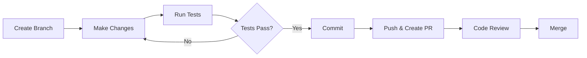

# Development Playbook

Complete guide for setting up a local development environment for the MI Digital Twin Management Service.

## Overview

This playbook will help you:

- Set up the development environment
- Run the application locally
- Understand the development workflow
- Debug and test your changes

## Prerequisites

Ensure you have these tools installed:

| Tool                          | Version | Purpose                                |
| ----------------------------- | ------- | -------------------------------------- |
| [Bun](https://bun.sh/)        | 1.0+    | JavaScript runtime and package manager |
| [Docker](https://docker.com/) | 24.0+   | Container runtime for MongoDB          |
| [Git](https://git-scm.com/)   | 2.0+    | Version control                        |
| Node.js                       | 18+     | Optional fallback runtime              |

For detailed prerequisites, see [Prerequisites](../installation/prerequisites.md).

## Quick Start

```bash
# Clone and enter repository
git clone <repository-url>
cd service-repository-digitaltwin-management-platform

# Start MongoDB
docker-compose up -d mongodb

# Setup and start server (terminal 1)
cd server
cp .env.example .env
bun install
bun run seed
bun run dev

# Setup and start client (terminal 2)
cd client
cp .env.example .env
bun install
bun run dev
```

Access the application:

- Frontend: http://localhost:5173
- API: http://localhost:3000
- Login: `admin` / `intact2025`

## Detailed Setup

### Step 1: Start Database

```bash
# Start MongoDB in background
docker-compose up -d mongodb

# Verify MongoDB is running
docker-compose logs mongodb
```

### Step 2: Configure Server

```bash
cd server

# Copy environment template
cp .env.example .env

# Install dependencies
bun install

# Seed initial data (creates admin user and sample data)
bun run seed

# Start development server with hot reload
bun run dev
```

The API will be available at `http://localhost:3000`.

### Step 3: Configure Client

```bash
cd client

# Copy environment template
cp .env.example .env

# Install dependencies
bun install

# Start Vite development server
bun run dev
```

The frontend will be available at `http://localhost:5173`.

## Development Workflow



### Branch Naming

```bash
# Feature branches
git checkout -b feature/add-user-roles

# Bug fixes
git checkout -b fix/login-validation

# Documentation
git checkout -b docs/update-api-guide
```

### Commit Messages

Use conventional commit format:

```bash
git commit -m "feat: add user role management"
git commit -m "fix: resolve login validation error"
git commit -m "docs: update API documentation"
```

## Available Scripts

### Server Commands

| Command          | Description             |
| ---------------- | ----------------------- |
| `bun run dev`    | Start with hot reload   |
| `bun run start`  | Start production server |
| `bun run seed`   | Seed database           |
| `bun run lint`   | Run ESLint              |
| `bun run format` | Format with Prettier    |

### Client Commands

| Command           | Description              |
| ----------------- | ------------------------ |
| `bun run dev`     | Start Vite dev server    |
| `bun run build`   | Build for production     |
| `bun run preview` | Preview production build |
| `bun run lint`    | Run ESLint               |

### Root Commands

| Command             | Description                  |
| ------------------- | ---------------------------- |
| `bun run dev`       | Start both client and server |
| `bun run build`     | Build both modules           |
| `bun run lint`      | Lint both modules            |
| `bun run format`    | Format all code              |
| `bun run typecheck` | Type-check both modules      |

## Debugging

### Server Debugging

#### Using VS Code

Add to `.vscode/launch.json`:

```json
{
  "version": "0.2.0",
  "configurations": [
    {
      "type": "node",
      "request": "launch",
      "name": "Debug Server",
      "runtimeExecutable": "bun",
      "runtimeArgs": ["run", "--inspect", "src/app.ts"],
      "cwd": "${workspaceFolder}/server",
      "restart": true,
      "console": "integratedTerminal"
    }
  ]
}
```

#### Using Console Logs

```typescript
// Add structured logging
console.log('[DEBUG]', { endpoint, params, body });
```

### Client Debugging

#### React DevTools

Install the [React DevTools](https://react.dev/learn/react-developer-tools) browser extension for component inspection.

#### React Query DevTools

Already included in development mode. Access via the floating icon in the bottom-right corner.

#### Network Debugging

Use browser DevTools Network tab to inspect API calls.

## Testing

### Running Tests

```bash
# Server tests
cd server
bun test

# Client tests
cd client
bun test

# Run all tests
bun run test
```

### Test Coverage

```bash
# Generate coverage report
bun test --coverage
```

## Code Quality

### Pre-commit Hooks

The project uses Husky for pre-commit hooks:

```bash
# Runs automatically on commit:
# 1. Prettier formatting
# 2. ESLint checks
# 3. TypeScript type checking
```

### Manual Checks

```bash
# Format code
bun run format

# Fix lint issues
bun run lint:fix

# Type check
bun run typecheck
```

## Database Operations

### Access MongoDB Shell

```bash
docker-compose exec mongodb mongosh intact
```

### Common Operations

```javascript
// List collections
show collections

// View users
db.users.find().pretty()

// View services
db.services.find().limit(5).pretty()

// Clear and reseed
// (exit shell, then run)
// bun run seed
```

### Reset Database

```bash
# Stop MongoDB
docker-compose down

# Remove volume (deletes all data)
docker volume rm service-repository-digitaltwin-management-platform_mongodb_data

# Restart and reseed
docker-compose up -d mongodb
cd server && bun run seed
```

## Common Issues

### Port Already in Use

```bash
# Find process using port 3000
lsof -i :3000

# Kill process
kill -9 <PID>
```

### MongoDB Connection Failed

```bash
# Verify MongoDB is running
docker-compose ps

# Check MongoDB logs
docker-compose logs mongodb

# Restart MongoDB
docker-compose restart mongodb
```

### Module Not Found Errors

```bash
# Clean install dependencies
rm -rf node_modules bun.lock
bun install
```

For more troubleshooting, see [Common Issues](../troubleshooting/common-issues.md).

## IDE Setup

### VS Code Extensions

Recommended extensions:

- ESLint
- Prettier
- Tailwind CSS IntelliSense
- MongoDB for VS Code
- Thunder Client (API testing)

### Settings

Add to `.vscode/settings.json`:

```json
{
  "editor.formatOnSave": true,
  "editor.defaultFormatter": "esbenp.prettier-vscode",
  "editor.codeActionsOnSave": {
    "source.fixAll.eslint": "explicit"
  },
  "typescript.preferences.importModuleSpecifier": "relative"
}
```

## Related Documentation

- [Architecture Overview](../architecture/overview.md)
- [Database Schema](../database/schema.md)
- [UI Patterns](../design/ui-patterns.md)
- [Deployment Playbook](deployment.md)
