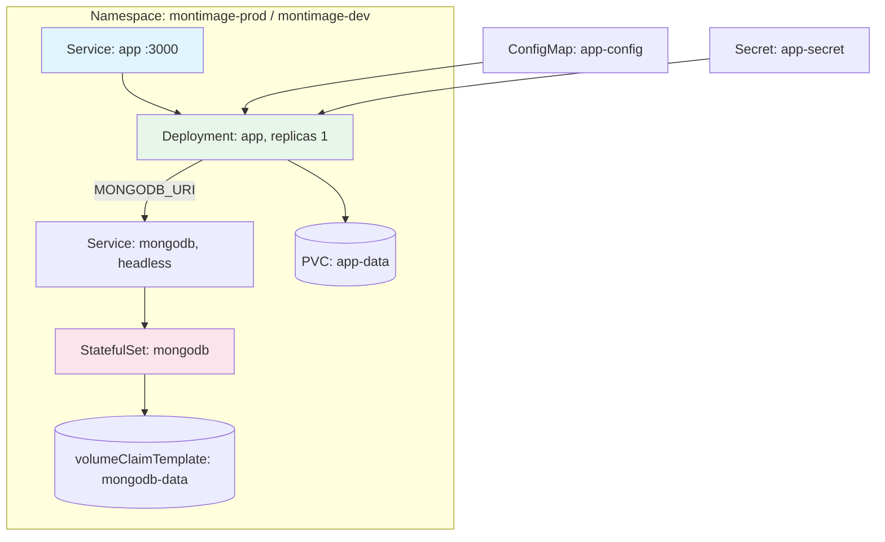

# Kubernetes Deployment Playbook

Complete guide for deploying the MI Digital Twin Management Service to
Kubernetes using [Kustomize](https://kustomize.io/) — no Helm required. This
is the recommended deployment path for new deployments. Docker Compose
remains fully supported; see [Migrating from Docker Compose](#migrating-from-docker-compose)
below and the [Docker Compose playbook](deployment.md) if you're staying on
Compose.

## Overview

| Overlay              | MongoDB                        | Namespace         | Use case                                      |
| -------------------- | ------------------------------ | ----------------- | --------------------------------------------- |
| `k8s/overlays/dev`   | In-cluster (mongodb component) | `montimage-dev`   | Local/dev clusters (kind, minikube, k3d, ...) |
| `k8s/overlays/prod`  | In-cluster (mongodb component) | `montimage-prod`  | Production, self-hosted MongoDB               |
| `k8s/overlays/atlas` | External (MongoDB Atlas)       | `montimage-atlas` | Production, managed MongoDB Atlas             |

Manifests live under [`k8s/`](../../k8s/README.md):

```
k8s/base/                 Deployment, Service, ConfigMap, PVC, secret.example.yaml
k8s/components/mongodb/   Optional Component: in-cluster MongoDB StatefulSet + Service
k8s/overlays/{dev,prod,atlas}/   Namespace + overlay-specific patches
```

`atlas` uses `resources: ../../base` only — it does **not** include the
`mongodb` component, since MongoDB Atlas is external. `dev` and `prod` both
include the `mongodb` component and patch the app's `MONGODB_URI` to point at
the in-cluster MongoDB Service instead.

## Prerequisites

- A Kubernetes cluster (self-managed, EKS, GKE, AKS, or a local cluster like
  kind/minikube/k3d for the `dev` overlay) with `kubectl` configured against it
- `kubectl` 1.24+ (Kustomize support is built in — no separate `kustomize`
  binary needed, though one works too)
- A container registry you can push to (Docker Hub, GHCR, ECR, ...) — there is
  no CI pipeline in this repo that builds/pushes images yet, so you build and
  push it yourself (see Step 1)
- For `prod`/`dev`: nothing extra — MongoDB runs in-cluster via the bundled
  component
- For `atlas`: a [MongoDB Atlas](https://www.mongodb.com/cloud/atlas) cluster
  and its connection string

## Architecture



For the `atlas` overlay, the `mongodb` Service/StatefulSet do not exist — the
Deployment's `MONGODB_URI` (from the Secret) points at the external Atlas
cluster instead.

**Why replicas: 1.** `server/docker-entrypoint.sh` (the container's
ENTRYPOINT) seeds the database once on first startup, gated by a `.seeded`
marker file on the `app-data` PVC — the same approach Docker Compose already
uses. That gating is per-Pod, so this first increment ships with a single
app replica. See [Scaling Considerations](#scaling-considerations).

## Step 1: Build and Push the Image

Reuse the same `server/Dockerfile.unified` build Docker Compose users already
run, tagged for your own registry:

```bash
docker build -f server/Dockerfile.unified -t <your-registry>/<image>:<tag> .
docker push <your-registry>/<image>:<tag>
```

Then edit `k8s/base/deployment.yaml` and replace the placeholder image
reference (marked `# TODO: replace with your built/pushed image`) with
`<your-registry>/<image>:<tag>`.

## Step 2: Create the Namespace and Configure the Secret

Pick an overlay (`dev`, `prod`, or `atlas`) and create its namespace first —
the Secret must be applied into a namespace that already exists:

```bash
kubectl apply -f k8s/overlays/prod/namespace.yaml   # or overlays/dev, overlays/atlas
```

Copy the secret template and fill in real values (never commit the result —
`k8s/**/secret.yaml` is git-ignored):

```bash
cp k8s/base/secret.example.yaml k8s/base/secret.yaml

# Generate secure values
openssl rand -base64 48   # -> JWT_SECRET
openssl rand -hex 16      # -> ENCRYPTION_KEY

$EDITOR k8s/base/secret.yaml
```

- `dev` / `prod` (in-cluster MongoDB): leave `MONGODB_URI` as the placeholder —
  the overlay patches it to the in-cluster value automatically.
- `atlas` (external MongoDB): set `MONGODB_URI` to your real Atlas connection
  string, e.g. `mongodb+srv://<user>:<password>@<cluster>.mongodb.net/intact?retryWrites=true&w=majority`.

Apply the secret directly (not through `kubectl apply -k` — it is
deliberately not listed in any `kustomization.yaml`):

```bash
kubectl apply -f k8s/base/secret.yaml -n montimage-prod   # match the namespace you created above
```

Prefer your own secret-management tooling in real deployments instead, e.g.
`kubectl create secret generic app-secret --from-literal=... -n <namespace>`,
or a sealed-secrets / external-secrets operator.

## Step 3: Deploy

```bash
kubectl apply -k k8s/overlays/prod    # or overlays/dev, overlays/atlas
```

## Step 4: Verify

```bash
kubectl get pods -n montimage-prod
kubectl logs -f deployment/app -n montimage-prod

# Port-forward and hit the health endpoint (same one the Dockerfile's own
# HEALTHCHECK and the Deployment's probes use)
kubectl port-forward svc/app 3000:3000 -n montimage-prod &
curl http://localhost:3000/api/health
```

**Important:** Change the seeded admin password immediately after first
login (default seeded credentials mirror the Compose path: `admin` /
whatever `ADMIN_PASSWORD` you set in the Secret).

## Updating the Application

```bash
# Build and push a new tag, then:
kubectl set image deployment/app app=<your-registry>/<image>:<new-tag> -n montimage-prod

# Or re-apply the overlay after editing the image reference in
# k8s/base/deployment.yaml:
kubectl apply -k k8s/overlays/prod

kubectl rollout status deployment/app -n montimage-prod
```

## Re-seeding the Database

```bash
# Find the pod, remove the marker, and let it restart
POD=$(kubectl get pod -l app=app -n montimage-prod -o jsonpath='{.items[0].metadata.name}')
kubectl exec "$POD" -n montimage-prod -- rm /app/server/data/.seeded
kubectl delete pod "$POD" -n montimage-prod   # Deployment recreates it, entrypoint re-seeds
```

Or run the seed script directly without removing the marker:

```bash
kubectl exec "$POD" -n montimage-prod -- bun src/seed/index.ts
```

## Backup and Restore

Same `mongodump`/`mongorestore` approach as the
[Docker Compose playbook](deployment.md#backup-and-restore), adapted to
`kubectl exec` against the `mongodb-0` StatefulSet Pod:

### Creating Backups

```bash
kubectl exec mongodb-0 -n montimage-prod -- mongodump --db intact --out /data/db/backup

kubectl cp montimage-prod/mongodb-0:/data/db/backup ./backup-$(date +%Y%m%d)

tar -czvf backup-$(date +%Y%m%d).tar.gz ./backup-$(date +%Y%m%d)
```

### Restoring from Backup

```bash
kubectl cp ./backup-YYYYMMDD montimage-prod/mongodb-0:/data/db/restore

kubectl exec mongodb-0 -n montimage-prod -- mongorestore --db intact /data/db/restore/intact
```

For the `atlas` overlay, there is no in-cluster `mongodb-0` Pod — use MongoDB
Atlas's own backup features (continuous backups on M10+ clusters, cloud
provider snapshots, point-in-time recovery) from the Atlas dashboard instead.

## Rollback Procedure

```bash
# Roll back to the previous ReplicaSet
kubectl rollout undo deployment/app -n montimage-prod

# Or to a specific revision
kubectl rollout history deployment/app -n montimage-prod
kubectl rollout undo deployment/app -n montimage-prod --to-revision=<N>

# Restore the database if the rollback also needs a data restore
# (follow the restore procedure above)
```

## Troubleshooting

### Pod Won't Start

```bash
kubectl describe pod -l app=app -n montimage-prod
kubectl logs -f deployment/app -n montimage-prod --previous

# Common causes:
# - ImagePullBackOff: the placeholder image in k8s/base/deployment.yaml was
#   never replaced with a real, pushed image (see Step 1)
# - CrashLoopBackOff on first boot: check JWT_SECRET/ENCRYPTION_KEY length
#   requirements (32+ / 16+ chars) in your Secret
# - Pending: PVC not bound — check your cluster has a default StorageClass
```

### Database Connection Issues

```bash
# In-cluster MongoDB (dev/prod)
kubectl exec -it mongodb-0 -n montimage-prod -- mongosh --eval "db.adminCommand('ping')"
kubectl exec -it deployment/app -n montimage-prod -- sh -c 'echo $MONGODB_URI'

# Atlas
kubectl exec -it deployment/app -n montimage-atlas -- sh -c 'echo $MONGODB_URI'
# Verify: Atlas Network Access allows your cluster's egress IPs, and the
# connection string's credentials/db name are correct.
```

### Readiness/Liveness Probe Failures

```bash
kubectl describe pod -l app=app -n montimage-prod
# Look for "Readiness probe failed" / "Liveness probe failed" events —
# both probes hit GET /api/health, the same endpoint the container's own
# HEALTHCHECK uses, so a healthy Compose deployment should behave the same.
```

### Seed Marker / Permissions Issues

```bash
# Confirm the PVC is mounted and writable by the non-root `intact` user (uid
# 1001) the Deployment's securityContext runs as:
kubectl exec -it deployment/app -n montimage-prod -- ls -la /app/server/data
```

## Scaling Considerations

The app Deployment ships with `replicas: 1` in this first increment because
`server/docker-entrypoint.sh`'s seed-once gating uses a marker file on a
single PVC (`ReadWriteOnce`) — multiple replicas racing to seed against the
same marker file is not a supported configuration today.

To scale horizontally, decouple seeding from the per-replica Pod lifecycle
first, for example:

- Move seeding into a Kubernetes `Job` or `initContainer` that runs once
  before the Deployment scales up, independent of any individual Pod's PVC
- Or gate seeding with a distributed lock (e.g. a MongoDB document or lease)
  instead of a local marker file

This is legitimate, explicitly out-of-scope follow-up work — not part of
this change.

For MongoDB itself, the bundled StatefulSet is a single replica too; a
production-grade in-cluster deployment would use a proper MongoDB replica
set (or the MongoDB Kubernetes Operator), or simply use the `atlas` overlay
and let MongoDB Atlas handle replication/scaling.

| Component     | Scaling strategy                                               |
| ------------- | -------------------------------------------------------------- |
| App           | Decouple seeding (see above), then increase `replicas`         |
| Database      | MongoDB replica set / MongoDB Operator, or the `atlas` overlay |
| Static assets | CDN for global distribution (same as the Compose playbook)     |

## Migrating from Docker Compose

Docker Compose remains fully supported — this is an additional deployment
path, not a replacement. You do not need to migrate to keep running
`docker-compose*.yml` in production.

If you do want to move an existing deployment to Kubernetes:

| Compose file               | Kubernetes equivalent | Notes                                                                                                                      |
| -------------------------- | --------------------- | -------------------------------------------------------------------------------------------------------------------------- |
| `docker-compose.yml`       | `k8s/overlays/dev`    | Dev-only in the Compose file too (MongoDB + admin UI, app runs locally); the `dev` overlay instead runs the app in-cluster |
| `docker-compose.prod.yml`  | `k8s/overlays/prod`   | Both use `mongo:7` in-cluster/in-container and `server/Dockerfile.unified`                                                 |
| `docker-compose.atlas.yml` | `k8s/overlays/atlas`  | Both connect to an external MongoDB Atlas cluster via `MONGODB_URI`                                                        |

Environment variable parity: every variable Compose passes to the `app`
container (`server/src/config/env.ts`'s schema, plus `SERVE_STATIC` and
`SEED_ON_STARTUP`) is reproduced across `k8s/base/configmap.yaml` (non-secret)
and `k8s/base/secret.example.yaml` (secret) — see
[Env var contract](#step-2-create-the-namespace-and-configure-the-secret)
above. Nothing needs to be renamed or reworked; the same values you have in
your `.env` / `.env.prod` file today go directly into the new ConfigMap/Secret.

Data migration: use `mongodump`/`mongorestore` to move data from your
Compose MongoDB volume into the new environment —
[Docker Compose backup/restore](deployment.md#backup-and-restore) to export,
then [Kubernetes restore](#backup-and-restore) above to import (or point the
`atlas` overlay at the same Atlas cluster your Compose Atlas deployment
already uses, with no data migration needed at all).

## Related Documentation

- [Docker Compose Deployment Playbook](deployment.md) — still fully supported
- [k8s/README.md](../../k8s/README.md) — manifest layout quick reference
- [Prerequisites](../installation/prerequisites.md)
- [Configuration](../installation/configuration.md)
- [Troubleshooting](../troubleshooting/common-issues.md)
