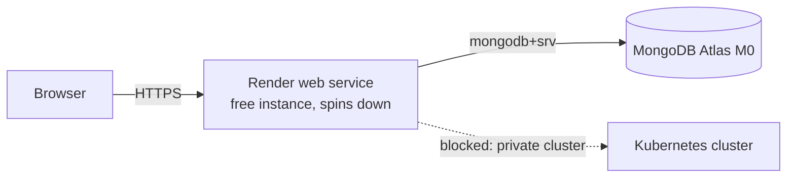

# Render Demo Deployment Playbook

Deploying the MI Digital Twin Management Service to [Render](https://render.com)
on the **Free** instance type, backed by a **MongoDB Atlas M0** cluster, for a
publicly reachable demo at zero cost.

This is a demo/showcase path, not a production one. The service spins down
after 15 minutes of inactivity and takes about a minute to wake up. For
production use, see the [Kubernetes playbook](kubernetes-deployment.md)
(recommended) or the [Docker Compose playbook](deployment.md).

## Overview

| Piece    | What runs there                                  | Cost |
| -------- | ------------------------------------------------ | ---- |
| Render   | One web service from `server/Dockerfile.unified` | Free |
| Atlas M0 | The `intact` database                            | Free |

The unified image serves the built React client **and** the Express API from
the same origin (`SERVE_STATIC=true`), so this is a single container with no
separate frontend deployment and no CORS in play.



## Prerequisites

- A Render account, and the [Render CLI](https://render.com/docs/cli)
  (`brew install render`) logged in via `render login`
- A MongoDB Atlas account
- For a **private** repository, Render's GitHub App connected to it (one-time
  browser grant). Public repositories can be selected directly.

## Step 1: Create the Atlas M0 Cluster

1. Create a free **M0** cluster and a database user.
2. **Security → Network Access → IP Access List → `+ ADD IP ADDRESS` →
   `ALLOW ACCESS FROM ANYWHERE`** (`0.0.0.0/0`). Wait for the entry to reach
   **Active**.

   This is mandatory, not a shortcut. Render's free instances have **no static
   outbound IPs** — egress comes from a shared, rotating pool, so there is no
   narrower range to allowlist. (Paid Render instances expose static outbound
   IPs; Atlas private endpoints need M10+.)

3. Grant the database user read/write on the `intact` database.

**The connection string Atlas hands you has no database name.** Append
`/intact` or Mongoose silently writes to a database called `test` and the app
comes up empty:

```
mongodb+srv://<user>:<pass>@<cluster>.mongodb.net/intact?retryWrites=true&w=majority
```

## Step 2: Deploy the Blueprint

[`render.yaml`](../../render.yaml) at the repo root defines the service. It
must be committed to the branch Render reads (`main`).

In the Render dashboard, use the **`New +` button (top-right) → Blueprint**.

> Blueprint is **not** in the first-run onboarding wizard ("Create a new Static
> Site" → Static Sites / Web Services / Private Services / …). Click `Skip` on
> that wizard first, or go straight to `dashboard.render.com/blueprints`.

Select the repository, branch `main`, and confirm the instance type shows
**Free**.

### Values Render prompts for

These are the `sync: false` entries in `render.yaml` — they are never committed:

| Variable         | Value                                                      |
| ---------------- | ---------------------------------------------------------- |
| `MONGODB_URI`    | The full Atlas string from Step 1, including `/intact?...` |
| `ADMIN_USERNAME` | Demo admin login — **see the warning below**               |
| `ADMIN_PASSWORD` | Demo admin password — **see the warning below**            |
| `CORS_ORIGIN`    | Any non-`localhost` placeholder; corrected in Step 4       |

`JWT_SECRET` and `ENCRYPTION_KEY` use `generateValue: true` — Render generates
them once and keeps them stable across deploys. Never rotate `ENCRYPTION_KEY`
after the fact: credentials already stored by the app become undecryptable.

> **The admin credentials are frozen after the first seed.**
> [`server/src/seed/admin.seed.ts:7`](../../server/src/seed/admin.seed.ts)
> looks up the username and skips if it exists — it never updates the password.
> Changing `ADMIN_PASSWORD` in Render later has no effect. Pick the final
> values before the first deploy, and do not ship the `.env.example` defaults
> (`admin` / `intact2025`) on a public URL. See
> [Resetting the admin password](#resetting-the-admin-password) if you need to
> recover.

`CORS_ORIGIN` barely matters here — client and API share an origin, so
`cors()` is never exercised. Its only effect is
[`server/src/utils/startup.ts:114`](../../server/src/utils/startup.ts), which
warns when `NODE_ENV=production` and the value contains `localhost`.

## Step 3: Verify the Seed — Do Not Skip This

A deploy can go **green with an empty database**. The entrypoint logs a warning
and starts the server anyway when seeding fails
([`server/docker-entrypoint.sh`](../../server/docker-entrypoint.sh):
`"Warning: Database seeding failed, but continuing startup..."`), and
`/api/health` never touches MongoDB. Render's health check passes either way,
and nothing in the dashboard tells you.

**Query Atlas directly — this is the check that actually settles it:**

```bash
mongosh "mongodb+srv://<user>:<pass>@<cluster>.mongodb.net/intact" \
  --eval 'db.getCollectionNames()' \
  --eval 'db.users.find({}, {username: 1, role: 1})'
```

A healthy first seed leaves `categories`, `services`, `sectors`, `partners`,
and `users` in the `intact` database — roughly 10 categories, 26 services, 18
sectors, and 19 partners, plus exactly one admin user.

Two supporting checks:

```bash
# The service answers, and reports whether it reached MongoDB
curl -s https://<service>.onrender.com/api/health
# {"status":"ok","database":"connected","environment":"production"}

# The entrypoint's seed output, if it is still in the log buffer
render services -o json                      # grab the srv-... id
render logs -r <srv-id> --limit 200 | grep -i seed
# want: "Database seeding completed successfully!"
# bad:  "MongoDB not ready yet (attempt N/30)" → Atlas is blocking Render
```

`"database":"connected"` does prove the app reached Atlas, so it rules out the
allowlist failure — but it says nothing about whether seeding wrote anything.

Free instances keep only a short log buffer, and the seed runs before the
server starts listening. Minutes after a deploy, the startup lines have often
scrolled past behind ordinary HTTP request logs, so an empty `grep` means
"cannot tell" — not "seed failed". Trust the Atlas query.

## Step 4: Finalize from the CLI

```bash
render services update <srv-id> \
  --env-var CORS_ORIGIN=https://<service>.onrender.com \
  --env-var SEED_ON_STARTUP=false --confirm

render deploys create <srv-id> --confirm
```

Turn `SEED_ON_STARTUP` off only after Step 3 passes. It re-runs on every cold
start otherwise: the entrypoint's marker file lands in `/app/data` while the
Dockerfile creates `/app/server/data`, and free instances have no persistent
disk regardless. Seeds are idempotent upserts
([`server/src/seed/sync-helpers.ts`](../../server/src/seed/sync-helpers.ts)),
so re-seeding is safe — just slow.

## What the Render CLI Can and Cannot Do

Service **creation** requires the browser. Everything after it is scriptable.

| Task                            | CLI support                                                         |
| ------------------------------- | ------------------------------------------------------------------- |
| Validate `render.yaml`          | `render blueprints validate ./render.yaml`                          |
| **Apply** a Blueprint           | **No** — `render blueprints` only has `validate`                    |
| Create a Docker service         | **Partially** — see below                                           |
| Update env vars, redeploy, logs | Yes — `services update`, `deploys create`, `logs`, `restart`, `ssh` |

`render services create` exposes no `--dockerfile-path` or `--docker-context`
flag, and defaults to `./Dockerfile` — which this repo does not have at its
root. So the CLI cannot create this service correctly.

The REST API (`POST /v1/services`) _does_ expose `dockerfilePath` and
`dockerContext` under `serviceDetails.envSpecificDetails`, so a fully scripted
creation is possible with an API key — the GitHub App grant is still a
one-time browser step for private repos.

### Manual fallback (no Blueprint)

`New + → Web Service`, then:

| Field                          | Value                         |
| ------------------------------ | ----------------------------- |
| Language / Runtime             | Docker                        |
| Branch                         | `main`                        |
| Dockerfile Path                | `./server/Dockerfile.unified` |
| Docker Build Context Directory | `.`                           |
| Instance Type                  | Free                          |
| Health Check Path              | `/api/health`                 |
| Build Command / Start Command  | **leave empty**               |

A start command overrides the Dockerfile `ENTRYPOINT` and skips seeding
entirely. Add every environment variable from `render.yaml` by hand, and
generate the two secrets yourself:

```bash
openssl rand -base64 48   # JWT_SECRET (must be >= 32 chars)
openssl rand -hex 16      # ENCRYPTION_KEY
```

## Resetting the Admin Password

The seed cannot do this — it skips existing users, and passwords are bcrypt
hashed at cost 12 ([`server/src/models/User.ts:46`](../../server/src/models/User.ts)),
so there is nothing readable in Atlas. Delete the user and let the seed
recreate it:

```bash
# 1. Delete the admin document from the `users` collection in Atlas
#    (Atlas UI → Browse Collections → intact.users, or mongosh)
# 2. Set the new password and re-enable seeding
render services update <srv-id> \
  --env-var ADMIN_PASSWORD=<new-password> \
  --env-var SEED_ON_STARTUP=true --confirm
# 3. Redeploy, verify per Step 3, then turn SEED_ON_STARTUP back off
render deploys create <srv-id> --confirm
```

Log in with the **username, not an email** —
[`admin.seed.ts:11`](../../server/src/seed/admin.seed.ts) lowercases it at
creation. If `ADMIN_USERNAME` was set in Render, the seeded account uses that
value, **not** the `admin` default from `.env.example`. A `401` here is almost
always this: check what the `users` collection actually holds before assuming
the password is wrong.

## Known Limitations

- **Cold start.** Free instances spin down after 15 minutes idle and take
  about a minute to return. For a demo after a long gap, that stacks with an
  Atlas M0 unpause and the entrypoint's `wait_for_mongodb` loop (up to 30
  attempts, 2s apart) — **open the URL ~5 minutes before presenting.**
- **750 free instance hours per month**, workspace-wide. Past that, free
  services suspend until the next month.
- **No persistent disk** on free instances. Nothing outside Atlas survives a
  restart.
- **Kubernetes scenario deployment does not work.**
  [`server/src/services/kubernetesDeploy.ts:233`](../../server/src/services/kubernetesDeploy.ts)
  builds a `KubeConfig` per infrastructure at request time, so nothing breaks
  at boot — but Render cannot reach a private cluster, so deploys and their SSE
  streaming fail. The demo covers authoring, catalog, and UI.
- **`0.0.0.0/0` on Atlas** means anyone holding the connection string reaches
  the cluster. Rotate the database password after a demo if the string has been
  shared.

## Troubleshooting

| Symptom                                          | Cause                                                        |
| ------------------------------------------------ | ------------------------------------------------------------ |
| Health green, app empty, login fails             | Seeding failed silently — see Step 3                         |
| Logs loop `MongoDB not ready yet (attempt N/30)` | Atlas is not allowlisting Render — set `0.0.0.0/0` (Step 1)  |
| App loads but has no data                        | `MONGODB_URI` is missing `/intact`; Mongoose wrote to `test` |
| `401` on `POST /api/auth/login`                  | Wrong credentials; check the seeded name in `intact.users`   |
| Build fails on `vite build`                      | Free builder memory — build in CI, deploy an amd64 image     |
| `exec format error` on a prebuilt image          | Image built for arm64; rebuild with `--platform linux/amd64` |
| First Blueprint sync ends `update_failed`        | Observed on first creation; recover with a manual deploy     |

A first `blueprint_sync` deploy coming back `update_failed` has been seen on
initial service creation. The recovery is a manual redeploy:

```bash
render deploys create <srv-id> --confirm
```

Then verify per Step 3. The root cause was not diagnosed, so treat this as a
known retry rather than a fault to chase.

## Related Documentation

- [Deployment Guide](../DEPLOYMENT.md) — all deployment options
- [Kubernetes Deployment Playbook](kubernetes-deployment.md) — recommended for production
- [Docker Compose Playbook](deployment.md) — single-server production
- [Configuration](../installation/configuration.md) — environment variables
