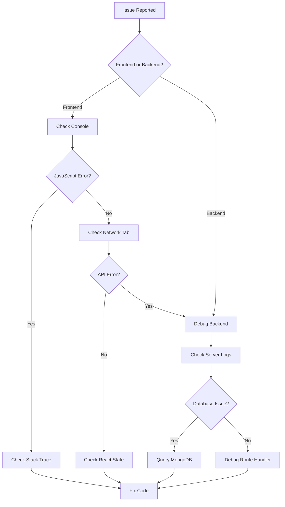

# Debugging Guide

Strategies and tools for debugging the application.

## Frontend Debugging

### Browser DevTools

#### Console

```javascript
// Log structured data
console.log({ user, permissions, state });

// Log with labels
console.log('[Auth]', 'Login attempt', { username });

// Table view for arrays
console.table(services);

// Group related logs
console.group('API Call');
console.log('Request:', request);
console.log('Response:', response);
console.groupEnd();
```

#### Network Tab

Monitor API requests:

1. Filter by `XHR` or `Fetch`
2. Check request headers (Authorization token)
3. Inspect response body and status codes
4. Look for CORS errors

#### React DevTools

Install [React DevTools](https://react.dev/learn/react-developer-tools):

- Inspect component tree
- View props and state
- Profile performance
- Highlight re-renders

#### React Query DevTools

Built into the application in development:

- View query cache
- Check query status
- Inspect stale/fresh state
- Trigger refetches manually

### Source Maps

Source maps are enabled in development for debugging TypeScript:

```typescript
// vite.config.ts
export default defineConfig({
  build: {
    sourcemap: true, // Enable in production if needed
  },
});
```

### VS Code Debugging

```json
// .vscode/launch.json
{
  "version": "0.2.0",
  "configurations": [
    {
      "type": "chrome",
      "request": "launch",
      "name": "Debug Client",
      "url": "http://localhost:5173",
      "webRoot": "${workspaceFolder}/client/src"
    }
  ]
}
```

## Backend Debugging

### Console Logging

```typescript
// Structured logging
console.log('[API]', 'Request received', {
  method: req.method,
  path: req.path,
  body: req.body,
});

// Error logging
console.error('[Error]', error.message, error.stack);
```

### Request Logging

Morgan middleware logs all requests:

```typescript
// app.ts
app.use(morgan('dev'));
// Output: GET /api/services 200 12.345 ms
```

### VS Code Server Debugging

```json
// .vscode/launch.json
{
  "version": "0.2.0",
  "configurations": [
    {
      "type": "node",
      "request": "launch",
      "name": "Debug Server",
      "runtimeExecutable": "bun",
      "runtimeArgs": ["run", "--inspect", "src/app.ts"],
      "cwd": "${workspaceFolder}/server",
      "restart": true,
      "console": "integratedTerminal"
    }
  ]
}
```

### Database Queries

Debug Mongoose queries:

```typescript
// Enable query logging
mongoose.set('debug', true);

// Log specific query
const services = await Service.find({ categoryId }).explain('executionStats');
console.log(services.executionStats);
```

### MongoDB Shell

```bash
# Access MongoDB shell
docker-compose exec mongodb mongosh intact

# Query examples
db.services.find().limit(5).pretty()
db.users.findOne({ username: 'admin' })
db.scenarios.countDocuments({ projectId: ObjectId('...') })

# Explain query
db.services.find({ categoryId: ObjectId('...') }).explain()
```

## API Debugging

### Thunder Client (VS Code)

1. Install Thunder Client extension
2. Create requests to test endpoints
3. Save collections for common operations

### cURL Commands

```bash
# Login
curl -X POST http://localhost:3000/api/auth/login \
 -H "Content-Type: application/json" \
 -d '{"username":"admin","password":"intact2025"}'

# Get services (with auth)
curl http://localhost:3000/api/services \
 -H "Authorization: Bearer <token>"

# Create service
curl -X POST http://localhost:3000/api/services \
 -H "Authorization: Bearer <token>" \
 -H "Content-Type: application/json" \
 -d '{"shortName":"test","title":"Test Service"}'
```

## Error Tracking

### Error Boundaries

```tsx
// ErrorBoundary.tsx
class ErrorBoundary extends React.Component {
  state = { hasError: false, error: null };

  static getDerivedStateFromError(error) {
    return { hasError: true, error };
  }

  componentDidCatch(error, errorInfo) {
    console.error('Error caught:', error, errorInfo);
  }

  render() {
    if (this.state.hasError) {
      return <ErrorFallback error={this.state.error} />;
    }
    return this.props.children;
  }
}
```

### API Error Handling

```typescript
// lib/api.ts
api.interceptors.response.use(
  (response) => response,
  (error) => {
    console.error('[API Error]', {
      status: error.response?.status,
      message: error.response?.data?.error,
      url: error.config?.url,
    });
    return Promise.reject(error);
  }
);
```

## Performance Debugging

### React Profiler

1. Open React DevTools
2. Go to "Profiler" tab
3. Click "Record"
4. Perform actions
5. Analyze flame graph

### Network Waterfall

1. Open DevTools Network tab
2. Reload page
3. Analyze:

- Total load time
- Largest requests
- Blocking resources

### Bundle Analysis

```bash
# Analyze client bundle
cd client
npx vite-bundle-visualizer

# Check bundle size
bun run build
ls -la dist/assets
```

## Debugging Workflow



## Common Debugging Patterns

### Isolate the Problem

1. Reproduce consistently
2. Identify minimum steps
3. Check browser/environment differences

### Binary Search

1. Comment out half the code
2. Does issue persist?
3. Narrow down to specific line

### Rubber Duck Debugging

Explain the problem out loud:

- What should happen?
- What actually happens?
- What changed recently?

## Related Documentation

- [Common Issues](common-issues.md)
- [Development Playbook](../playbooks/development.md)
