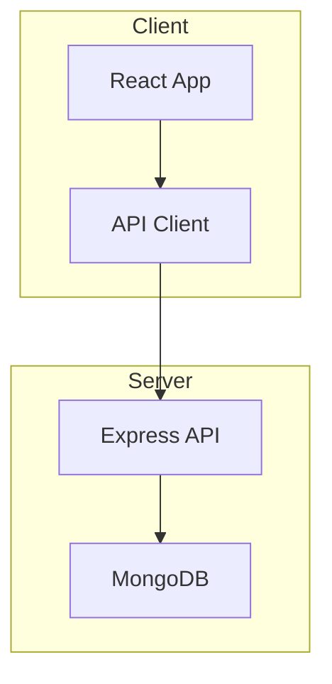

# Design: Documentation Structure

## Context

The INTACT Digital Twin Management Platform currently has documentation distributed across:

- Root `README.md` (comprehensive but overloaded)
- `DEPLOYMENT.md` (deployment-specific content)
- `dev-docs/` (planning documents: PRD, TAD, UX design, brainstorm, brand kit)
- `CLAUDE.md` (AI assistant instructions)
- `openspec/` (spec-driven development)

This distribution makes it difficult to find specific technical information and lacks clear navigation paths.

## Goals / Non-Goals

### Goals

- Establish `docs/` as the single source of truth for technical documentation
- Keep root `README.md` concise as an index/entry point
- Ensure each module (`client/`, `server/`) has self-contained setup documentation
- Standardize on Mermaid for all diagrams
- Create actionable playbooks for deployment and development

### Non-Goals

- Migrating `dev-docs/` planning documents (PRD, brainstorm, etc.) - these are project inception artifacts
- Changing `openspec/` structure - it has its own conventions
- Creating user-facing documentation (this is developer documentation)
- Automated documentation generation from code

## Decisions

### Directory Structure

```
/
├── README.md                    # Project index only
├── CLAUDE.md                    # AI assistant config (unchanged)
├── docs/
│   ├── README.md                # Documentation index with navigation
│   ├── architecture/
│   │   ├── overview.md          # High-level system architecture
│   │   ├── frontend.md          # Client architecture details
│   │   ├── backend.md           # Server architecture details
│   │   └── data-flow.md         # Request/response flows
│   ├── database/
│   │   ├── schema.md            # MongoDB collections and models
│   │   └── relationships.md     # Document references and patterns
│   ├── design/
│   │   ├── ui-patterns.md       # Component usage patterns
│   │   └── styling.md           # Tailwind/shadcn conventions
│   ├── troubleshooting/
│   │   ├── common-issues.md     # Frequent problems and solutions
│   │   └── debugging.md         # Debugging strategies
│   ├── integration/
│   │   ├── maestro.md           # MAESTRO orchestrator integration
│   │   └── external-services.md # Third-party service connections
│   ├── installation/
│   │   ├── prerequisites.md     # Required software and versions
│   │   └── configuration.md     # Environment variables guide
│   └── playbooks/
│       ├── deployment.md        # Full deployment guide
│       └── development.md       # Development environment setup
├── client/
│   └── README.md                # Client module quick reference
├── server/
│   └── README.md                # Server module quick reference
└── dev-docs/                    # (unchanged - inception artifacts)
```

### Root README.md Content

The root README.md SHALL contain only:

1. Project title and one-sentence description
2. Quick links to documentation sections
3. Module descriptions (client/server) with links to their READMEs
4. License information
5. Contact/maintainer information

### Module README Content

Each module README SHALL contain:

1. Module purpose (2-3 sentences)
2. Prerequisites for this module
3. Installation/setup commands
4. Available scripts/commands
5. Testing instructions
6. Link to detailed docs in `docs/`

### Mermaid Diagram Standards

All diagrams SHALL use Mermaid syntax with these conventions:

- Architecture diagrams: `graph TD` (top-down) or `graph LR` (left-right)
- Sequence diagrams: `sequenceDiagram`
- Data flow: `flowchart`
- Entity relationships: `erDiagram`

Example architecture diagram:



### Cross-Reference Conventions

Internal links SHALL use relative paths:

- From root: `[Architecture](docs/architecture/overview.md)`
- From docs: `[Deployment](playbooks/deployment.md)`
- To root: `[Back to README](../README.md)`

## Risks / Trade-offs

| Risk                          | Mitigation                                         |
| ----------------------------- | -------------------------------------------------- |
| Broken links during migration | Validate all links post-migration                  |
| Documentation drift from code | Include documentation updates in PR checklist      |
| Over-documentation            | Focus on high-value content; keep sections concise |
| Mermaid rendering issues      | Test diagrams in GitHub preview before committing  |

## Migration Plan

1. Create `docs/` directory structure (empty files with headers)
2. Migrate `DEPLOYMENT.md` content to `docs/playbooks/deployment.md`
3. Extract architecture content from current `README.md` to `docs/architecture/`
4. Simplify root `README.md` to index format
5. Create module READMEs for `client/` and `server/`
6. Convert ASCII diagrams to Mermaid
7. Add cross-references between documents
8. Validate all internal links

## Open Questions

1. Should `dev-docs/` be archived or remain for reference?
   - **Recommendation**: Keep as-is; these are inception artifacts, not runtime documentation

2. Should API documentation (endpoint details) move to `docs/api/`?
   - **Recommendation**: Keep API details in root README for now; consider OpenAPI/Swagger later
