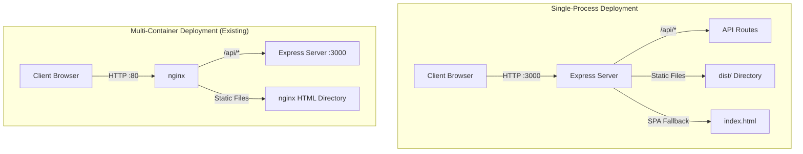
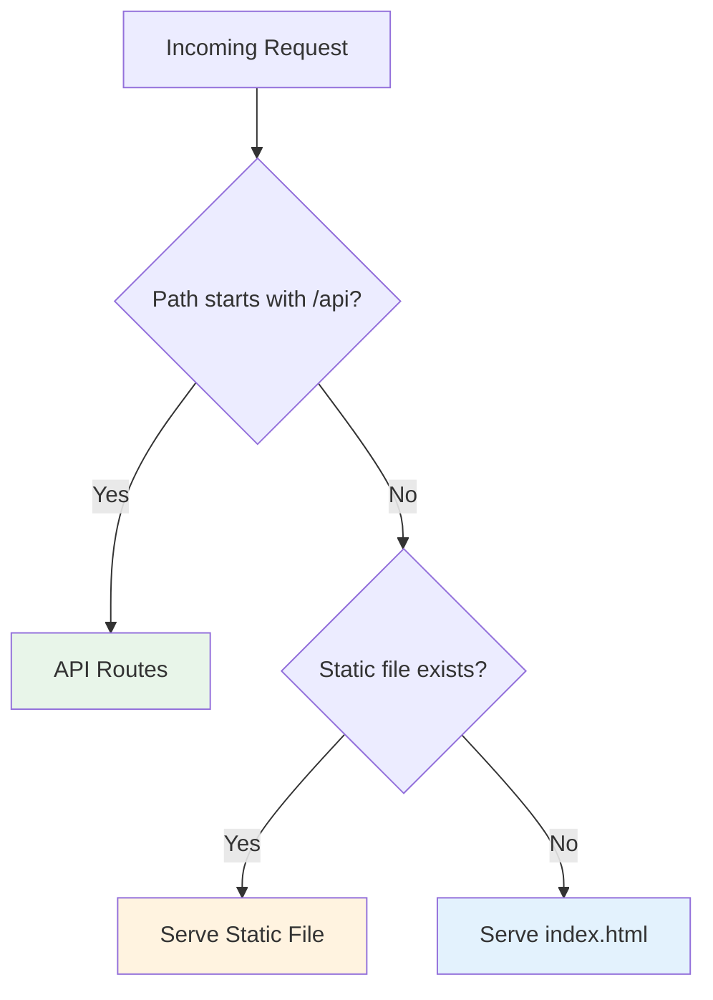

# Design: Serve Static Client Bundle from Server

## Architecture Overview



## Implementation Strategy

### 1. Static File Middleware

Express will serve files from the client's `dist/` directory using `express.static()`:

```
server/
  src/
    app.ts           # Add static serving logic here
../client/
  dist/              # Built client assets served from here
    index.html
    assets/
      *.js
      *.css
```

Path resolution: `path.join(__dirname, '../../client/dist')`

### 2. Request Routing Order



Order of middleware in `app.ts`:

1. Compression, helmet, CORS, morgan, JSON parsing (existing)
2. API routes at `/api/*` (existing)
3. **NEW**: Static file middleware for `../client/dist`
4. **NEW**: SPA fallback handler (serve index.html for unmatched routes)
5. Error handlers (existing, but adjusted position)

### 3. Configuration

New environment variable in `env.ts`:

| Variable       | Type    | Default | Description                |
| -------------- | ------- | ------- | -------------------------- |
| `SERVE_STATIC` | boolean | `false` | Enable static file serving |

Behavior:

- `SERVE_STATIC=true` + `dist/` exists → Serve static files
- `SERVE_STATIC=true` + `dist/` missing → Warning log, API-only mode
- `SERVE_STATIC=false` (default) → API-only mode (use Vite dev server or nginx)

### 4. SPA Fallback Logic

For client-side routing to work, any request that:

1. Does NOT match an API route
2. Does NOT match a static file
3. Is NOT a direct file request (no extension OR ends with `.html`)

Should receive `index.html`.

```typescript
// Pseudocode
app.get('*', (req, res) => {
  // Skip if already handled or is API
  if (req.path.startsWith('/api')) return next();

  // Serve index.html for SPA routes
  res.sendFile(path.join(staticDir, 'index.html'));
});
```

### 5. Compression and Caching

Leverage existing `compression()` middleware. Add cache headers for static assets:

| Path Pattern             | Cache-Control                         |
| ------------------------ | ------------------------------------- |
| `*.js`, `*.css` (hashed) | `public, max-age=31536000, immutable` |
| `index.html`             | `no-cache, must-revalidate`           |
| Images, fonts            | `public, max-age=86400`               |

### 6. Directory Structure Considerations

The server needs to locate the client dist relative to its own location:

```
Development:
  /project/server/src/app.ts   → /project/client/dist

Production (Docker unified):
  /app/server/src/app.ts       → /app/client/dist

Production (standalone):
  /app/dist/server/app.js      → /app/dist/client (adjust path)
```

Use `process.cwd()` or `__dirname` based path resolution with fallback.

## Trade-offs

| Aspect      | Express Static            | nginx (existing)            |
| ----------- | ------------------------- | --------------------------- |
| Simplicity  | Single process            | Requires nginx container    |
| Performance | Good for moderate traffic | Better for high traffic     |
| Caching     | Manual configuration      | Built-in optimization       |
| Flexibility | Easy to modify            | Requires nginx.conf changes |
| Use Case    | Dev/staging/demos         | Production at scale         |

## Testing Strategy

1. **Unit**: Verify environment parsing for `SERVE_STATIC`
2. **Integration**: Test static file serving and SPA fallback
3. **Manual**: Build client, start server, verify all routes work
